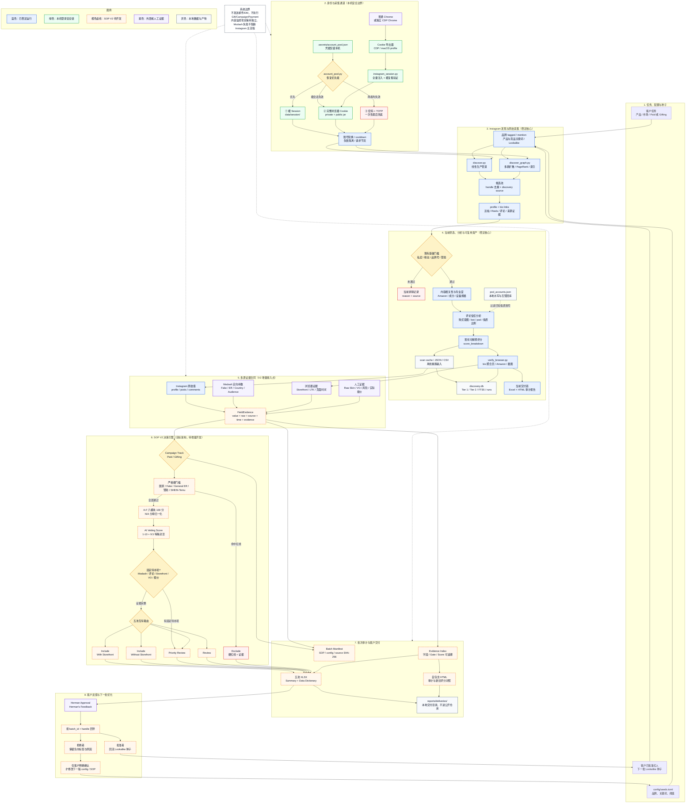
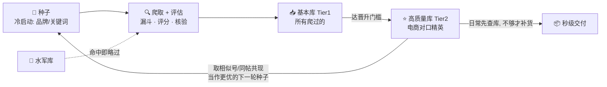

# Instagram 红人筛选与交付系统

**一句话**：你告诉我们要推什么（护肤 / 美容仪 + 想上 Amazon），系统就从全网"海选"出一批真正合适的带货红人 —— 每个都带**赛道对口度、Amazon 橱窗核验、评论真实性、评分依据、现场截图证据**，产出一份**可直接验收的 Excel**。

当前仓库只有一个生产入口。早期“演示功能”已经整理为仓库根目录的稳定主项目，历史 MVP 和内容监控不再作为并列运行时依赖。后续需求采用增量模块接入，不搬动已验证的采集、账号池、漏斗、评分和交付脚本。

## 它解决的痛点

- **大网红又贵又假** —— 性价比与信任度最优的是 **1万–15万粉的"腰部红人"**：像朋友推荐，不像恰饭。
- **难辨"真带货型"** —— 很多发护肤的只是晒生活，并没有 Amazon 橱窗、也不会真导购。
- **数据可能是刷的** —— 互赞团 / 水军让数据好看，却没人真买。

→ 系统专门把**又对口、又真实、又能带货**的红人挑出来，并把**证据**摆给你看（不是黑箱、不是 AI 臆测）。

两个入口，共用同一账号池与漏斗 / 评分逻辑：
- **`discover.py`** —— 线性主管道（种子→回扫→漏斗→评论→评分→输出）→ 直接出 **Excel**
- **`discover_graph.py`** —— 复合引擎（图谱扩散 + 多跳滚雪球 + 社区中心性）→ **两层索引库**，可秒查复用

> ⚠️ **这是公开代码仓库，不是数据备份仓库**。账号凭证、Cookie、暖 Session、
> 真实数据库、日志、截图和客户交付件均不入库。克隆后使用
> `scripts/import_pool.py` 导入本机账号，并按
> [`docs/INSTAGRAM_LOGIN_SESSION_SOP.md`](docs/INSTAGRAM_LOGIN_SESSION_SOP.md)
> 建立本地暖 Session。

新开发者请从 [`docs/DEVELOPER_HANDOFF.md`](docs/DEVELOPER_HANDOFF.md) 开始，
再按 [`docs/sop_v2/REQUIREMENTS_CHECKLIST.md`](docs/sop_v2/REQUIREMENTS_CHECKLIST.md)
逐项开发和验收。

---

## 完整架构与端到端流程

下图同时标出**当前已经稳定运行的主链路**与**SOP V2 的增量目标**。阅读顺序从上到下：
任务与账号通道 → 发现采集 → 当前筛选 → 多源证据 → V2 决策 → 交付 → 客户反馈回流。



图中橙色虚线节点是目标能力，不代表已经完成；当前完成度以
[`docs/sop_v2/REQUIREMENTS_CHECKLIST.md`](docs/sop_v2/REQUIREMENTS_CHECKLIST.md) 的状态列为准。

| 阶段 | 主要实现 | 当前状态 | 关键产物 |
|---|---|---|---|
| 身份与采集通道 | `account_pool.py`、`instagram_session.py`、CDP/普通 Chrome Cookie 导出 | 已稳定 | 可轮换的私有 API Client、暖 Session |
| 发现与采集 | `discover.py`、`discover_graph.py` | 已稳定 | 去重候选、profile、帖子、评论、来源证据 |
| 当前筛选与评分 | 现有漏斗、评论防刷、`score_breakdown` | 已稳定 | scan cache、当前候选/排除结果 |
| 浏览器与数据资产 | `verify_browser.py`、`discovery.db`、`pod_accounts.json` | 已稳定 | Storefront 证据、两层库、水军库 |
| 多源证据合同 | Instagram + Modash + 浏览器 + 人工/报价 | 部分/待开发 | `FieldEvidence`、Evidence Index |
| SOP V2 决策 | 严格 Gates、A-F 100 分、五池互斥路由 | 待开发 | GateResult、AI Vetting Score、五池结果 |
| 交付与反馈 | 五池 XLSX、HTML、Manifest、Herman 回导 | 部分/待开发 | 可审计交付包、下一批种子与反馈标签 |

---

## 越运行越优化：三库 + 自我强化飞轮

这套系统**越跑越值钱**：每一轮把扫过的红人沉淀进库、把最优质的晋升为"金种子"，下一轮**用金种子去扩散** ——
种子越优质，发现越精准，库越大越是独家数据资产。日常逐渐从"每次全网爬"变成"先查库、不够才补货"，**越用越快、越用越准**。

**三个库各司其职：**

| 库 | 存什么 | 价值 |
|----|--------|------|
| 🚫 **水军库** `pod_accounts.json` | 互赞团 / 水军用户名，跨 run 累积 | 扫到直接略过 → 过滤提质 |
| 📥 **基本库 Tier1** `creator_index` | 所有爬过的创作者（去重累积） | 原始资产 + 图谱节点池 |
| ⭐ **高质量库 Tier2** `creator_index` | 严格门槛晋升的电商对口精英 | **价值最高**：够大够全可直接卖数据 / 建数据站 |

**晋升门槛**（全部满足才从 Tier1 → Tier2）：Amazon 橱窗已核实 · 赛道核心对口 · 粉丝 1万–15万 · 互动率达标 · 评论信任 ≥ 中 · 综合评分 ≥ 阈值。



> 现状：三库定位与字段已全部就位；**晋升自动化 + 金种子飞轮**随账号池扩大后启用（设计见 `docs/TWO_TIER_DESIGN.md`）。

---

## 目标画像

- 内容以产品推荐为主（Amazon Finds / Must Haves），非泛生活方式
- 粉丝 10K–150K，社区信任度高（评论区有真实购买意图）
- Bio 有成熟 Amazon Storefront（直链或经 Linktree/Beacons/LTK）
- 对护肤 / 美容仪器有专业认知（成分、波长、irradiance）
- 赞助内容不过度饱和（近 15 帖 ≤ 40%）

不做 TikTok；不做全 IG 穷尽搜索；不编造粉丝画像。

---

## 项目结构

```
营销/
  README.md  VERSION  CHANGELOG.md  requirements.txt  .gitignore
  config/
    seeds.toml              # 品牌/关键词/lookalike 种子与阈值
  scripts/
    discover.py             # 线性生产管道：发现→回扫→漏斗→评论→评分→交付
    discover_graph.py       # 图谱扩散、多跳发现、索引和复用
    account_pool.py         # 暖Session→完整Cookie→一次性冷登录，轮换与冷却
    instagram_session.py    # 全量Cookie注入、暖复载验证、账号池合并
    export_browser_cookies.py        # 从CDP Chrome导出Cookie
    export_chrome_profile_cookies.py # 从macOS普通Chrome本机导出Cookie
    start_instagram_cdp.zsh          # 安全启动独立Chrome/CDP
    stop_instagram_cdp.zsh           # 按profile归属安全停止
    verify_browser.py       # 真浏览器核验 Amazon / 聚合页并留证
    build_report.py         # 生成自包含 HTML 审计报告
    export_xlsx.py          # 生成客户交付 Excel
    db.py                   # 本地 SQLite 初始化、查询和去重
    import_pool.py          # 本机账号池导入
    extensions/
      sop_v2/               # 客户 SOP V2 增量开发区
      integrations/modash/  # Modash 可选补充层
    dev/                    # 账号、接口和恢复诊断工具
  docs/
    DEVELOPER_HANDOFF.md    # 新开发者接手入口
    ARCHITECTURE.md         # 稳定核心与增量改造边界
    INSTAGRAM_LOGIN_SESSION_SOP.md # 登录与暖Session最终方案
    sop_v2/                 # 完整需求、差距、验收清单和交付规范
    FLOWCHART.md  PIPELINE_LOGIC.md  REQUIREMENTS.md
    EXECUTION_PLAN.md  RESEARCH.md  TWO_TIER_DESIGN.md
  data/
    README.md               # 本地数据目录契约
    session/ runs/ modash/  # 本机生成，不提交运行内容
    source/ batches/ manual_evidence/ # 输入、批次与人工证据占位
  reports/deliveries/       # 本地最终交付目录
  samples/README.md         # 脱敏样例规则，不含真实交付
  tests/
    test_instagram_session.py
    fixtures/
  .secrets/                 # 本机凭据和浏览器状态，不进入仓库
```

---

## 环境

```bash
python3 -m venv .venv
.venv/bin/python -m pip install -r requirements.txt
.venv/bin/python -m playwright install chromium   # verify_browser 用；或用系统 Chrome(channel)
```

账号只保存在各开发者本机 `.secrets/`。首次使用时导入：
```bash
.venv/bin/python scripts/import_pool.py < accounts.txt   # username----password----totp_secret
```

---

## 运行

```bash
# 1) 发现（账号池轮换，默认；扩展种子源；全量加 --max-candidates 0 --wait-pool）
.venv/bin/python scripts/discover.py --expand-all --max-candidates 100 --wait-pool --no-proxy

# 2) 浏览器核验（对 review 候选：Amazon 穿透 + 视觉 + 截图存证）
.venv/bin/python scripts/verify_browser.py

# 3) 出交付 Excel
.venv/bin/python scripts/export_xlsx.py

# 4)（可选）出 HTML 仪表盘 / 查本地库
.venv/bin/python scripts/build_report.py
.venv/bin/python scripts/db.py list --fit 对口 --min-score 30

# 5)（复合引擎）多跳爬取建索引+图谱；查库/排序不碰账号
.venv/bin/python scripts/discover_graph.py ingest --hops 2 --budget 200 --wait-pool
.venv/bin/python scripts/discover_graph.py search --fit 对口 --amazon --min-followers 10000
.venv/bin/python scripts/discover_graph.py stats          # 索引/图统计
```

### 关键开关

| 参数 | 说明 |
|------|------|
| `--expand-all` | 启用关键词搜索(search_users) + Lookalike(fbsearch_suggested_profiles) 种子扩展 |
| `--max-candidates N` | 候选上限（0=全量） |
| `--wait-pool` | 账号池全冷却时等最早账号恢复再继续（全量必备） |
| `--from-scan FILE` | 从扫描缓存离线重跑漏斗/评分（不烧号调参） |
| `--no-comments` | 跳过评论分析（快扫只要名单） |
| `--rotate-every N` / `--cooldown M` | 单号 N 次轮换 / 冷却 M 分钟 |

种子/关键词/阈值在 `config/seeds.toml`；运行结束自动入 `data/discovery.db`。

---

## 账号池运维铁律（重要）

登录走三级：① 暖缓存 session（`data/session/`）→ ② 完整浏览器 Cookie → ③ 密码+TOTP 冷登录。
**冷登录是唯一会触发 Instagram 风控（UFAC 人工验证墙）的动作**，因此：

- **永不删 `data/session/`**。删了等于强制全员冷登录 → 群体撞验证墙（上次 19/20 个号就这么烧的）。
- **每个号一生只冷登录一次**（代码强制，`data/session/cold_attempted.json` 跨 run 持久记录）：
  成功即缓存、之后全程暖恢复；失败也消耗额度、永不重试 → 杜绝"反复冷登录"。
- **cookie / 暖恢复优先**，能不冷登录就不冷登录。
- 浏览器登录态接入、完整 Cookie 固化和故障恢复统一按
  [`docs/INSTAGRAM_LOGIN_SESSION_SOP.md`](docs/INSTAGRAM_LOGIN_SESSION_SOP.md) 执行；
  禁止只复制 `sessionid` 或为同一个账号创建重复记录。
- 单一机房 IP 下 bulk cookie 可用率偏低（实测一批 20 个 cookie 仅 3~4 个直接可用），属正常损耗，
  靠持续补**干净未挂验证**的好号解决，不靠换登录方式（密码/cookie 撞的是同一道验证墙）。

---

## 交付物

当前稳定链路以单一 Excel 为主要客户交付，运行产物写入
`reports/deliveries/`。现有版本包含四个 sheet：

1. **候选红人** —— 首列『验收建议』(重点候选/建议纳入/待人工核验/倾向排除) 直接分流；
   赛道·对口度 / Amazon橱窗 / 互动率 / 评论信任 / 评分 / **①②③④客户需求达成** /
   主页·bio·橱窗**活链接抽查** / 证据截图内链；**表底「Modash 缺口说明」**
2. **证据截图** —— 浏览器核验现场截图（嵌入）
3. **已排除** —— 含原因
4. **说明** —— 怎么用 / 字段释义 / 证据路径 / Modash 局限

SOP V2 的目标交付将升级为五个互斥决策池及 Evidence Index、Data Dictionary，
详见 [`docs/sop_v2/FINAL_DELIVERABLES.md`](docs/sop_v2/FINAL_DELIVERABLES.md)。
公开仓库不包含真实交付样例；脱敏规则见 `samples/README.md`。

---

## 已知瓶颈

organic IG 无法在扫描前按「有 Amazon 橱窗 + 护肤垂类」预筛 → 合格红人产出有限；
Save 率/DM、粉丝画像、假粉比例 IG 不公开。**这些靠 Modash bio 搜索 + 画像 API 解决**
（详见交付 Excel 底部与 `docs/FLOWCHART.md` 优化点）。
