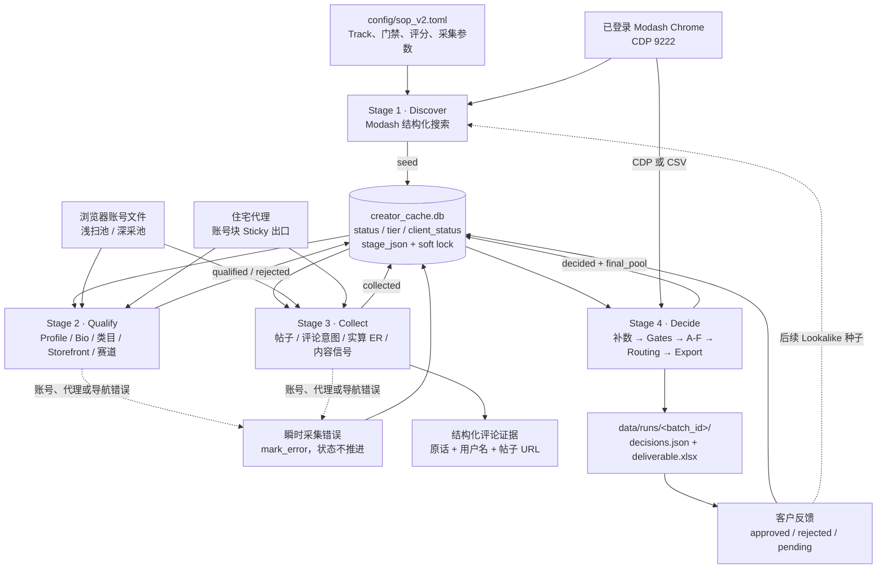
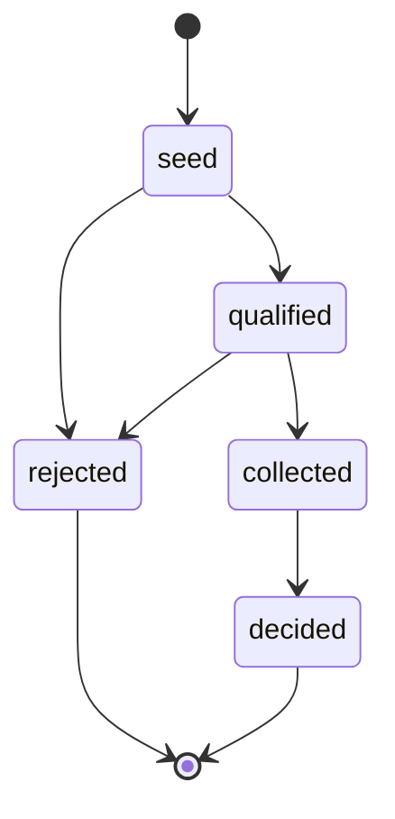

# Instagram Creator Vetting & Delivery

这是一个面向 Amazon Finds、护肤和美妆场景的 Instagram 创作者发现、采集、审核与交付系统。

当前唯一默认生产主线是 SOP V2 四阶段流水线：

```text
Modash 发现 → Instagram 浏览器浅扫 → 帖子/评论深采 → 离线决策与五池交付
```

Instagram 侧只使用 Playwright 驱动的登录态 Chrome profile。`discover.py`、
`discover_graph.py`、`account_pool.py` 和 `instagram_session.py` 属于 Legacy
instagrapi 链路，仅为历史复现和兼容保留，不是新批次的默认入口。

> 当前规则以 [`config/sop_v2.toml`](config/sop_v2.toml) 和实际代码为准；
> 状态机与模块边界见 [`docs/sop_v2/PIPELINE_SPEC.md`](docs/sop_v2/PIPELINE_SPEC.md)，
> 操作命令见 [`docs/sop_v2/RUNBOOK.md`](docs/sop_v2/RUNBOOK.md)。

## 系统范围

系统负责：

- 从 Modash 结构化搜索产生候选 Handle；
- 浏览器读取 Instagram Profile、Bio、外链、帖子和评论；
- 识别品牌号、私密号、赛道、Storefront、推广内容和评论购买意图；
- 从帖子赞评计算真实互动率，并与第三方受众数据合并；
- 执行硬门禁、A-F 可解释评分、固定 Review 和五池互斥路由；
- 输出 `decisions.json`、客户 XLSX 和可选 HTML；
- 回收客户批准/拒绝结果，沉淀金种子和负向标签。

系统不发送邮件或 DM，也不执行 Gift、Campaign、Payment。缺失数据使用
`unknown`/`N/A`/`Review` 表达，不伪造、不把缺失静默当作 0。

## 当前架构



详细组件设计见 [`docs/ARCHITECTURE.md`](docs/ARCHITECTURE.md)，账号、会话、
代理和轮换细节见
[`docs/ACCOUNT_POOL_ARCHITECTURE.md`](docs/ACCOUNT_POOL_ARCHITECTURE.md)。

## 四阶段流水线

| 阶段 | 输入 | 主要职责 | 状态输出 | 是否需要 IG 账号 |
|---|---|---|---|---|
| Stage 1 Discover | Modash CDP、SOP 配置 | 结构化搜索、分页、去重、写入候选 | `seed` | 否 |
| Stage 2 Qualify | `seed`、浅扫账号池 | Profile、宽粉丝筛选、品牌/私密、Bio、Storefront、赛道 | `qualified` / `rejected` | 是 |
| Stage 3 Collect | `qualified`、深采账号池 | 前 N 帖、推广/高评论帖评论、购买意图、真实 ER、内容信号 | `collected`；错误保持原态 | 是 |
| Stage 4 Decide | 所有有数据候选、第三方/人工补数 | 硬门禁、A-F、N/A 归一化、固定 Review、五池、导出 | `decided + final_pool` | 否 |

Stage 1 默认调用 Modash `/api/search/v2/instagram`；旧 AI Search DOM 抽取只作为
`--ai-search` 兜底。Stage 4 支持 Modash CSV 或 CDP 报告补数；缺少第三方核心字段时，
候选诚实进入 Review，不视为流水线故障。

### 状态机



数据库中的三类状态彼此正交：

- `status`：候选走到哪一阶段；
- `tier`：数据资产等级，客户批准者可晋升 Tier 2；
- `client_status`：客户侧 `approved/rejected/pending`。

`locked_at` 用于候选软锁，`stage_error` 保存最后一次瞬时错误，`stage_json`
累积各阶段事实。业务不合格进入 `rejected`；登录墙、challenge、代理和导航错误只写
`stage_error`，不应被误判为业务淘汰。

## 决策与交付

Stage 4 的决策顺序为：

```text
多源字段合并 → Hard Gates → Fixed Review → A-F Scoring → N/A 归一化 → 五池路由
```

A-F 分别覆盖内容赛道、专业表达、社区信任、商业基础、受众质量和经济性。
当前配置将 F 模块整体延期为 N/A；N/A 从适用分母移除，而不是记 0 分。

最终路由定义五个互斥池：

1. `Include-With-Storefront`
2. `Include-Without-Storefront`
3. `Priority-Review`
4. `Review`
5. `Exclude`

当前实现仍有一个已知冲突：路由支持 `Include-Without-Storefront`，但 Stage 2 会提前
淘汰 `confirmed_no`，所以该池在主流水线中基本不可达。提交新业务规则前需要统一这一口径。

主要产物：

```text
data/creator_cache.db
data/runs/<batch_id>/decisions.json
data/runs/<batch_id>/deliverable.xlsx
data/evidence/<batch_id>/<handle>/
```

当前评论证据以“用户名 + 评论原话 + 意图级别 + 帖子 URL”为主；历史文档中的评论截图
不是当前主流程的稳定承诺。

## V2 账号、会话与代理

当前 V2 不调用 `AccountPool` 类。所谓账号池实际是账号文件加顺序轮询：

```text
浅扫账号文件 → 每号默认 8 个候选 → 换 Context / Sticky 通道
深采账号文件 → 每号默认 3 个候选 → 换 Context / Sticky 通道
error         → 当前候选 mark_error → 关闭 Context → 下一账号处理下一候选
```

每个账号使用独立 persistent Chrome profile；运行时只解析并注入
`sessionid + ds_user_id`，不执行密码/TOTP 登录。每个账号处理块使用一条 Sticky 代理通道，
同时屏蔽图片、视频和字体以降低带宽与请求压力。

需要注意：

- V2 尚无持久账号 cooldown、连续错误自动停用或账号租约；
- 错误后不会在本轮用下一账号重试同一候选；
- 代理缺失时当前代码会静默直连；
- 深采账号文件缺失时会回退浅扫池；
- 健康检查报告尚未接入调度；
- 完整 Cookie/UA 实现存在于 `session_v2.py`，但主流程尚未使用。

不要把 Legacy `account_pool.py` 的 cooldown、暖 Session 和一次性冷登录能力误认为
V2 已经具备。完整分析和目标状态机见
[`docs/ACCOUNT_POOL_ARCHITECTURE.md`](docs/ACCOUNT_POOL_ARCHITECTURE.md)。

## 凭据边界

账号、密码、TOTP、Cookie、代理凭据和 Chrome profile 均不得进入 Git。它们只保留在
操作机 `.secrets/`，该目录已被 `.gitignore` 整体排除。数据库、客户输入、评论证据、
截图、日志和交付物同样只保留在本地忽略目录。

仓库只记录账号文件的格式、池角色和操作流程，不保存真实账号值。需要向另一台操作机
迁移凭据时，应使用团队密码管理器或仓库外的加密传输渠道。

## 安装

要求 Python 3.11+、Google Chrome 和 GnuPG：

```bash
python3 -m venv .venv
.venv/bin/python -m pip install -r requirements.txt
.venv/bin/python -m playwright install chromium
```

首次运行前需要：

1. 恢复或准备浅扫账号文件、深采账号文件和代理配置；
2. 确保敏感文件权限为 `0600`；
3. 使用独立的 Instagram Chrome profile，不与 Modash Chrome 混用；
4. 启动并登录用于 Modash 的 Chrome CDP 9222；
5. 人工排除已登出、challenge 或 suspended 的账号。

项目不会自动处理验证码或真人验证。

## 正确运行方式

推荐分阶段执行，便于检查漏斗和提供 Stage 4 补数：

```bash
cd scripts
BID=SKIN-YYYYMMDD

# 1. Modash 发现
PYTHONPATH=. ../.venv/bin/python -m extensions.sop_v2.pipeline.stage1_discover \
  --batch-id "$BID" --track paid

# 2. Instagram 浏览器浅扫
PYTHONPATH=. ../.venv/bin/python -m extensions.sop_v2.pipeline.stage2_qualify \
  --batch-id "$BID" --resume

# 3. 帖子与评论深采
PYTHONPATH=. ../.venv/bin/python -m extensions.sop_v2.pipeline.stage3_collect \
  --batch-id "$BID" --posts 10 --resume

# 4A. 使用 Modash CDP 补数并交付
PYTHONPATH=. ../.venv/bin/python -m extensions.sop_v2.pipeline.stage4_decide \
  --batch-id "$BID" --track paid \
  --out "../data/runs/$BID/decisions.json" \
  --modash-cdp

# 4B. 或使用已导出的 CSV
PYTHONPATH=. ../.venv/bin/python -m extensions.sop_v2.pipeline.stage4_decide \
  --batch-id "$BID" --track paid \
  --out "../data/runs/$BID/decisions.json" \
  --modash-csv "../data/source/$BID-modash.csv" \
  --manual-csv "../data/source/$BID-manual.csv"
```

快速串行入口：

```bash
PYTHONPATH=. ../.venv/bin/python -m extensions.sop_v2.pipeline.run_pipeline \
  --batch-id "$BID" --track paid --resume
```

一键入口目前不会转发 Modash/人工补数参数，完整交付优先使用分阶段命令。

查看状态：

```bash
cd ..
PYTHONPATH=scripts .venv/bin/python -m extensions.sop_v2.creator_cache stats
```

## 客户反馈回流

交互式 HTML 导出的客户选择可以回流：

```bash
PYTHONPATH=scripts .venv/bin/python \
  -m extensions.sop_v2.pipeline.ingest_client_decisions \
  --file client_decisions_<batch_id>.json
```

- `approved` / `collaborated`：晋升 Tier 2 金种子；
- `rejected`：保留客户拒绝状态和原因；
- `pending`：不改变资产等级；
- 客户反馈不会自动改写 SOP 配置。

从金种子自动发起下一轮 Modash Lookalike 仍是待接能力。

## 项目结构

```text
config/
  sop_v2.toml                         当前 V2 规则
  seeds.toml                          Legacy 发现配置
scripts/
  browser_collect_v2.py               V2 浏览器采集器
  export_v2_xlsx.py                   V2 XLSX
  export_v2_html.py                   V2 HTML
  extensions/sop_v2/
    creator_cache.py                  SQLite 状态、缓存、软锁、客户反馈
    gates.py / scoring.py / routing.py
    pipeline/
      stage1_discover.py
      stage2_qualify.py
      stage3_collect.py
      stage4_decide.py
      run_pipeline.py
  discover.py / discover_graph.py     Legacy
  account_pool.py                     Legacy instagrapi 账号池
docs/
  ARCHITECTURE.md                     当前完整架构
  ACCOUNT_POOL_ARCHITECTURE.md        账号、会话、代理与轮换专项设计
  sop_v2/PIPELINE_SPEC.md             状态机和模块边界
  sop_v2/RUNBOOK.md                   操作手册
data/
  creator_cache.db                    本地状态库，不入 Git
  runs/ / evidence/                   本地批次与证据，不入 Git
```

## Legacy 边界

以下组件可能调用 Instagram 私有 API，甚至回退到密码/TOTP 冷登录：

- `scripts/discover.py`
- `scripts/discover_graph.py`
- `scripts/account_pool.py`
- `scripts/instagram_session.py`
- `config/seeds.toml`
- `docs/INSTAGRAM_LOGIN_SESSION_SOP.md`

除非明确进行历史复现，不要将它们作为 V2 新批次入口。Legacy 账号池具有请求级轮换、
持久 cooldown 和一次性冷登录纪律，但没有接入当前浏览器流水线。

## 已知设计债务

- Storefront 双轨规则与 Stage 2 早筛冲突；
- V2 账号池没有统一健康状态、cooldown、租约和同候选换号重试；
- Sticky 代理 TTL、真实出口和失败归因缺少可观测性；
- `FieldEvidence` 与正式 Batch Manifest 尚未贯通全部 Gate/Score 输出；
- 配置、文档、代码和部分边界测试存在规则漂移；
- `run_pipeline` 的 track 传递、阶段退出码和补数参数仍需收口；
- 当前评论证据以结构化文本为主，历史截图承诺已经过期；
- 同一创作者跨批次/跨 Track 仍由全局 Handle 主键限制。

这些问题不妨碍单机串行小批次运行，但在无人值守、并发和长期资产化之前需要处理。

## 文档导航

| 文档 | 定位 |
|---|---|
| [`docs/ARCHITECTURE.md`](docs/ARCHITECTURE.md) | 当前系统完整架构与细节设计 |
| [`docs/ACCOUNT_POOL_ARCHITECTURE.md`](docs/ACCOUNT_POOL_ARCHITECTURE.md) | 账号、Cookie、Profile、代理、轮换与错误恢复 |
| [`docs/sop_v2/PIPELINE_SPEC.md`](docs/sop_v2/PIPELINE_SPEC.md) | 四阶段状态机和数据库 API |
| [`docs/sop_v2/RUNBOOK.md`](docs/sop_v2/RUNBOOK.md) | 实际运行命令 |
| [`docs/sop_v2/STRATEGY_LOCK.md`](docs/sop_v2/STRATEGY_LOCK.md) | 经实测锁定的采集策略 |
| [`docs/sop_v2/SYSTEM_STATUS.md`](docs/sop_v2/SYSTEM_STATUS.md) | 截至文档日期的完成度与延后项 |
| [`docs/sop_v2/FINAL_DELIVERABLES.md`](docs/sop_v2/FINAL_DELIVERABLES.md) | 交付字段与目标结构 |

`REQUIREMENTS_CHECKLIST.md`、根目录旧 `FLOWCHART/PIPELINE_LOGIC/EXECUTION_PLAN` 等文档
记录的是需求 Baseline 或历史设计，不应覆盖当前代码事实。
