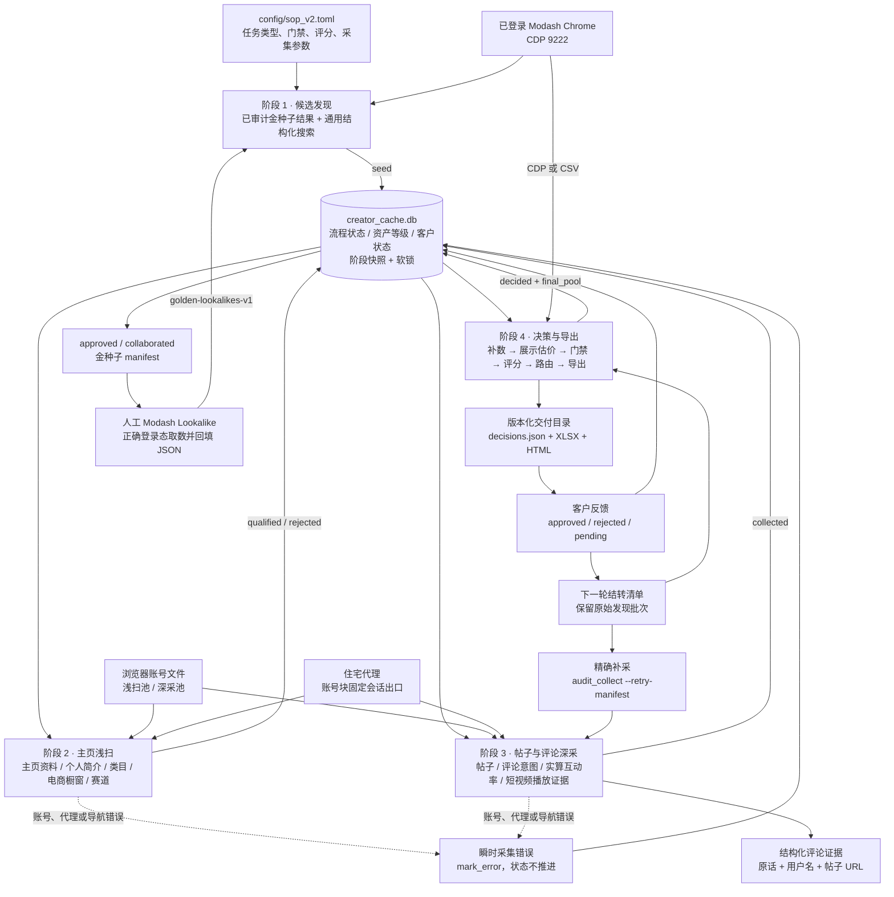
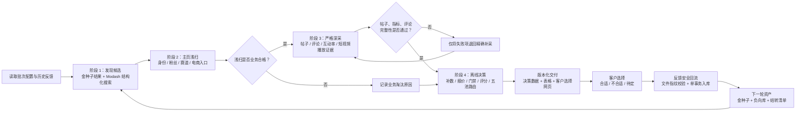
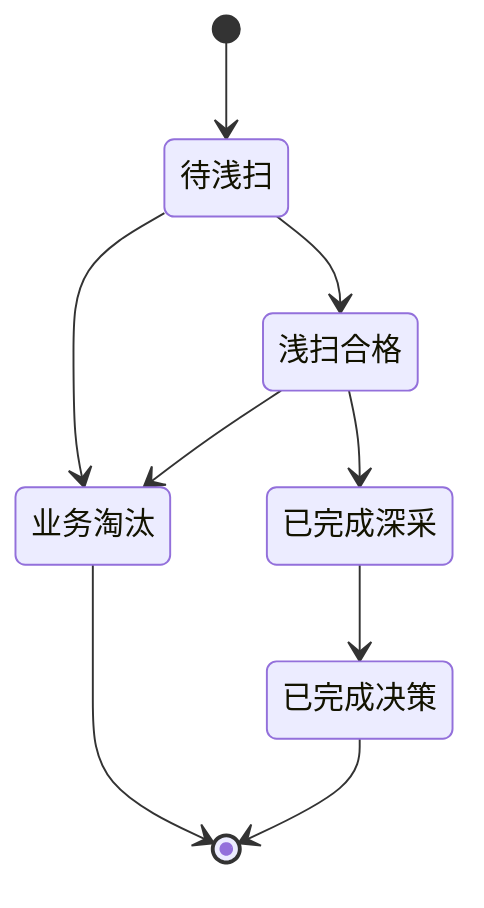

# Instagram 红人筛选、采集与交付系统

这是一个面向护肤、美妆和电商导购（含 Amazon Finds）场景的 Instagram 创作者发现、
采集、审核与交付系统。

当前唯一默认生产主线是 SOP V2 四阶段流水线：

```text
Modash 发现 → Instagram 浏览器浅扫 → 帖子/评论深采 → 离线决策与五池交付
```

Instagram 侧只使用 Playwright 驱动的登录态 Chrome profile。`discover.py`、
`discover_graph.py`、`account_pool.py` 和 `instagram_session.py` 属于历史兼容
instagrapi 链路，仅为历史复现保留，不是新批次的默认入口。

> 当前规则以 [`config/sop_v2.toml`](config/sop_v2.toml) 和实际代码为准；
> 状态机与模块边界见 [`docs/sop_v2/PIPELINE_SPEC.md`](docs/sop_v2/PIPELINE_SPEC.md)，
> 操作命令见 [`docs/sop_v2/RUNBOOK.md`](docs/sop_v2/RUNBOOK.md)。

## 系统范围

系统负责：

- 从 Modash 结构化搜索产生候选 Handle；
- 浏览器读取 Instagram Profile、Bio、外链、帖子和评论；
- 识别品牌号、私密号、赛道、通用电商橱窗、推广内容和评论购买意图；
- 从帖子赞评计算真实互动率，并与第三方受众数据合并；
- 从最近 10 条非置顶 Reels 的平均播放量生成展示型预估报价；
- 执行硬门禁、A-F 可解释评分、固定 Review 和五池互斥路由；
- 输出 `decisions.json`、客户 XLSX 和可选 HTML；
- 回收客户批准/拒绝结果，沉淀金种子和负向标签。

系统不发送邮件或 DM，也不执行 Gift、Campaign、Payment。缺失数据使用
`unknown`/`N/A`/`Review` 表达，不伪造、不把缺失静默当作 0。

## 架构图



详细组件设计见 [`docs/ARCHITECTURE.md`](docs/ARCHITECTURE.md)，账号、会话、
代理和轮换细节见
[`docs/ACCOUNT_POOL_ARCHITECTURE.md`](docs/ACCOUNT_POOL_ARCHITECTURE.md)。

## 流程图



### 四阶段职责

| 阶段 | 输入 | 主要职责 | 状态输出 | 是否需要 IG 账号 |
|---|---|---|---|---|
| 阶段 1（发现） | 客户批准/已合作金种子结果、Modash CDP、SOP 配置 | 校验金种子回流、通用结构化搜索、分页、去重、来源审计、写入候选 | `seed` | 否 |
| 阶段 2（浅扫） | `seed`、浅扫账号池 | 主页资料、宽粉丝筛选、品牌/私密、个人简介、通用电商橱窗、赛道 | `qualified` / `rejected` | 是 |
| 阶段 3（深采） | `qualified`、深采账号池 | 刷新主页最近 N 帖、逐帖核验评论、购买意图、真实互动率、内容信号；另取最近 10 条非置顶短视频播放证据 | `collected`；错误保持原态 | 是 |
| 阶段 4（决策） | 所有有数据候选、第三方/人工补数 | 展示型报价派生、硬门禁、A-F 评分、不适用项归一化、固定待复核、五池、导出 | `decided + final_pool` | 否 |

阶段 1 有两条明确区分的来源：人工从 Modash 相似账号搜索取得并通过
`golden-lookalikes-v1` 回导的金种子结果，以及默认调用
`/api/search/v2/instagram` 的通用结构化搜索。旧 AI Search DOM 抽取只作为
`--ai-search` 兜底。当前 `modash_raw` 报告只有不透明的 `lookalikesToken`，没有可离线
抽取的相似账号数组，仓库也没有经过验证的内部自动端点；因此相似账号取数仍是人工步骤，
不能把通用搜索写成“approved 已自动驱动 Lookalike”的闭环。

阶段 4 支持 Modash CSV 或 CDP 报告补数；缺少第三方核心字段时，候选诚实进入待复核池，
不视为流水线故障。

当前 CDP 兼容契约以 `https://marketer.modash.io/discovery/instagram` 的登录态页面为准。
Profile 补数先用 Creator 模式的 `filters.username` 做精确 Handle 查询，并校验精确用户名；
当前响应主键为 `serviceSdId`，同时兼容历史 `servicePlatformId`。瞬时空响应会做有限重试，
旧 bulk discovery 只作为 fallback，不能把模糊结果误配给候选。

电商橱窗是通用购物入口，不是 Amazon 专属白名单。Amazon、LTK、ShopMy、明确
自营店和已识别的购物聚合入口都可以构成 `confirmed_yes`；确认没有任何电商橱窗的
`confirmed_no` 也继续深采，并可进入 `Include-Without-Storefront`；只有证据不足的
`unknown` 进入待复核池。阶段 2 不得再以 `no_amazon_storefront` 或
`confirmed_no` 提前淘汰。

### 状态机



数据库中的三类状态彼此正交：

- `status`：候选走到哪一阶段；
- `tier`：数据资产等级，客户批准者可晋升 Tier 2；
- `client_status`：客户侧 `approved/rejected/pending`。

`locked_at` 用于候选软锁，`stage_error` 保存最后一次瞬时错误，`stage_json`
累积各阶段事实。业务不合格进入 `rejected`；登录墙、challenge、代理和导航错误只写
`stage_error`，不应被误判为业务淘汰。

## 决策与交付

阶段 4 的决策顺序为：

```text
多源字段合并 → 硬门禁 → 固定待复核 → A-F 评分 → 不适用项归一化 → 五池路由
```

A-F 分别覆盖内容赛道、专业表达、社区信任、商业基础、受众质量和经济性。
当前配置将 F 模块整体延期为 N/A；N/A 从适用分母移除，而不是记 0 分。

最终路由定义五个互斥池：

1. `Include-With-Storefront`
2. `Include-Without-Storefront`
3. `Priority-Review`
4. `Review`
5. `Exclude`

Storefront 分流采用统一三态：`confirmed_yes` 和 `confirmed_no` 都通过 Gate，最终
Include 时分别进入 With/Without 两池；`unknown` 才进入 Review。Amazon 只是可识别的
Storefront 类型之一，不是候选资格白名单。

### 展示型预估报价

客户在 2026-07-28 确认，本轮交付增加 `pricing_estimate`，按以下固定顺序计算：

1. 先识别并排除置顶 Reels；不能先取主页前 10 条再删置顶；
2. 通过登录态浏览器会话调用 Instagram 同源 media info，逐条读取播放指标；
3. 对剩余 Reels 按发布时间倒序取最近 10 条，并计算播放量平均值；
4. 定价只采用 Instagram 原生 `ig_play_count`；总 `play_count` 和 `fb_play_count`
   仅作审计证据，不得进入均播或抬高报价；
5. 默认报价 = `平均播放量 × 35 / 1000` 美元；
6. 参考区间 = `平均播放量 × 35 / 1000` 至 `平均播放量 × 40 / 1000` 美元。

报价窗口独立于主页最近 N 帖的核心深采窗口：Stage 3 另行进入 Reels Tab 取样，
不得用报价样本覆盖或替代主页帖子、互动指标和评论完整性证据。

交付必须同时显示样本数、平均播放量、排除的置顶数、数据源和状态：

- `complete`：取得 10 条 Instagram 原生非置顶 Reels；
- `partial`：只取得 1–9 条合格原生样本，仍按实际样本计算并显式标注；
- `fallback_modash`：没有合格原生样本，只能使用 Modash `avg_reels_plays`，不得表述为
  “最近 10 条非置顶 Reels”；
- `missing`：原生样本和第三方均播都没有，报价留空。

`partial`、`fallback_modash` 和 `missing` 必须原样写入 JSON/XLSX/HTML，不得伪装成
完整 10 条原生窗口。这只是给客户决策用的展示估算，不是红人或代理的实际报价。它不得
回填任何实际报价证据或 `paid_cpm`，不得触发 Gate、F 模块计分、固定 Review 或五池
路由；实际报价和 Paid CPM 仍是另一套独立证据口径。

主要产物：

```text
data/creator_cache.db
data/runs/<batch_id>/decisions.json
data/runs/<batch_id>/deliverable.xlsx
data/runs/<batch_id>/deliverable.html
data/evidence/<batch_id>/<handle>/
reports/deliveries/<batch_id>/formal-<YYYYMMDD>-r<N>/
```

当前评论证据以“用户名 + 评论原话 + 意图级别 + 帖子 URL”为主；历史文档中的评论截图
不是当前主流程的稳定承诺。

正式交付采用不可覆盖的版本目录：发给客户后的 `formal-...-rN` 视为冻结，新修订必须递增
`rN`，并保留对应 `decisions.json` 基线和 SHA-256。当前审计基线是
`SKIN4-20260723/formal-20260729-r2`：157 人，严格等于 89 个上一轮未终判账号加 68 个
本轮新账号，`retry_pending_count=0`；上一版 `formal-20260728-r1` 保持冻结。r2 的定价状态
为 156 个 `complete`、1 个诚实标记的 `fallback_modash`。

## V2 账号、会话与代理

当前 V2 不调用 `AccountPool` 类。所谓账号池实际是账号文件加顺序轮询：

```text
浅扫账号文件 → 每号默认 8 个候选 → 换 Context / Sticky 通道
深采账号文件 → 每号默认 3 个候选 → 换 Context / Sticky 通道
error         → 当前候选 mark_error → 关闭 Context → 下一账号处理下一候选
```

每个账号使用独立 persistent Chrome profile；运行时只解析并注入
`sessionid + ds_user_id`，不执行密码/TOTP 登录。每个账号处理块使用一条 Sticky 代理通道，
同时屏蔽图片、视频和字体以降低带宽与请求压力。同一次账号块内出口保持固定；每次重新启动
流水线都会加入新的匿名运行 nonce，避免 `--resume` 继续复用上次已被限流的 Sticky 出口。
导航失败会保留脱敏后的 Chromium 网络错误码（例如 `ERR_TUNNEL_CONNECTION_FAILED`），
便于区分代理隧道故障与 Instagram 页面限流。

需要注意：

- V2 尚无持久账号 cooldown、连续错误自动停用或账号租约；
- 错误后不会在本轮用下一账号重试同一候选；
- 代理缺失时当前代码会静默直连；
- 深采账号文件缺失时会回退浅扫池；
- 健康检查报告尚未接入调度；
- 完整 Cookie/UA 实现存在于 `session_v2.py`，但主流程尚未使用。

不要把 Legacy `account_pool.py` 的 cooldown、暖 Session 和一次性冷登录能力误认为
V2 已经具备。完整分析和目标状态机见
[`docs/ACCOUNT_POOL_ARCHITECTURE.md`](docs/ACCOUNT_POOL_ARCHITECTURE.md)。

## 凭据边界

账号、密码、TOTP、Cookie、代理凭据和 Chrome profile 均不得进入 Git。它们只保留在
操作机 `.secrets/`，该目录已被 `.gitignore` 整体排除。数据库、客户输入、评论证据、
截图、日志和交付物同样只保留在本地忽略目录。

仓库只记录账号文件的格式、池角色和操作流程，不保存真实账号值。需要向另一台操作机
迁移凭据时，应使用团队密码管理器或仓库外的加密传输渠道。

## 安装

要求 Python 3.11+、Google Chrome 和 GnuPG：

```bash
python3 -m venv .venv
.venv/bin/python -m pip install -r requirements.txt
.venv/bin/python -m playwright install chromium
```

首次运行前需要：

1. 恢复或准备浅扫账号文件、深采账号文件和代理配置；
2. 确保敏感文件权限为 `0600`；
3. 使用独立的 Instagram Chrome profile，不与 Modash Chrome 混用；
4. 启动并登录用于 Modash 的 Chrome CDP 9222；
5. 人工排除已登出、challenge 或 suspended 的账号。

项目不会自动处理验证码或真人验证。

## 正确运行方式

推荐分阶段执行，便于检查漏斗和提供 Stage 4 补数：

```bash
cd scripts
BID=SKIN-YYYYMMDD

# 1. 冷启动或明确接受“仅通用搜索”时的 Modash 发现
#    有上一轮客户反馈时，应先完成下方“客户反馈回流与下一轮准备”的严格金种子步骤。
PYTHONPATH=. ../.venv/bin/python -m extensions.sop_v2.pipeline.stage1_discover \
  --batch-id "$BID" --track paid

# 2. Instagram 浏览器浅扫
PYTHONPATH=. ../.venv/bin/python -m extensions.sop_v2.pipeline.stage2_qualify \
  --batch-id "$BID" --resume

# 3. 帖子与评论深采
PYTHONPATH=. ../.venv/bin/python -m extensions.sop_v2.pipeline.stage3_collect \
  --batch-id "$BID" --posts 10 --strict-completeness --resume

# 4A. 使用 Modash CDP 补数并交付
PYTHONPATH=. ../.venv/bin/python -m extensions.sop_v2.pipeline.stage4_decide \
  --batch-id "$BID" --track paid \
  --strict-completeness --full-deep-all-candidates --deep-target-posts 10 \
  --out "../data/runs/$BID/decisions.json" \
  --modash-cdp

# 4B. 或使用已导出的 CSV
PYTHONPATH=. ../.venv/bin/python -m extensions.sop_v2.pipeline.stage4_decide \
  --batch-id "$BID" --track paid \
  --strict-completeness --full-deep-all-candidates --deep-target-posts 10 \
  --out "../data/runs/$BID/decisions.json" \
  --modash-csv "../data/source/$BID-modash.csv" \
  --manual-csv "../data/source/$BID-manual.csv"
```

快速串行入口：

```bash
PYTHONPATH=. ../.venv/bin/python -m extensions.sop_v2.pipeline.run_pipeline \
  --batch-id "$BID" --track paid --resume
```

一键入口目前不会转发金种子回导、严格模式、Modash 补数或人工补数参数。它适合冷启动
或普通断点续跑；有客户反馈的下一轮不得用它代替下面的严格金种子回流步骤。

查看状态：

```bash
cd ..
PYTHONPATH=scripts .venv/bin/python -m extensions.sop_v2.creator_cache stats
```

## 客户反馈回流与下一轮准备

以下流程把“反馈入库”“未决结转”“金种子扩池”和“组合交付”拆成四个可审计步骤。普通 Modash
结构化搜索始终只是兜底，不能冒充 approved 金种子已经完成相似账号扩池。

### 1. 安全导入客户反馈

真实写入必须同时提供客户导出的 JSON 和当时生成 HTML 所使用的原始
`decisions*.json`。`--source-decisions` 用于核对批次和交付白名单，不是可选参数：

```bash
OLD_BID=SKIN3-20260717
FEEDBACK_JSON="/absolute/path/client_decisions_${OLD_BID}.json"
SOURCE_DECISIONS="reports/deliveries/${OLD_BID}/decisions_interim.json"

# 先校验文件、白名单和数据库状态；不写业务数据或 ledger
PYTHONPATH=scripts .venv/bin/python \
  -m extensions.sop_v2.pipeline.ingest_client_decisions \
  --file "$FEEDBACK_JSON" \
  --source-decisions "$SOURCE_DECISIONS" \
  --dry-run

# 校验通过后执行真实写入
PYTHONPATH=scripts .venv/bin/python \
  -m extensions.sop_v2.pipeline.ingest_client_decisions \
  --file "$FEEDBACK_JSON" \
  --source-decisions "$SOURCE_DECISIONS"
```

导入器会在单个 SQLite 事务内写入客户状态，并在
`client_feedback_imports` 保存反馈文件 SHA-256、原交付基线 SHA-256、批次和计数。
同一反馈文件再次导入会命中 SHA ledger 并幂等跳过，不会刷新 `approved_at` 或重复写入。
同一评审批次的增量导出可以重复包含此前已选账号：已批准时间保持不变，只处理新增或明确
改判的行。组合交付中的账号可以来自多个不可变 `discovery_batch`；导入器会把
`manifest.batch_id` 视为本轮评审批次，并逐行核对 `_discovery_batch` 来源，不会为了结转
改写候选的首次发现批次。反馈冗余携带的 pool/score 也会与基线核对，防止拿错 HTML 版本。

`--adopt-existing` 只用于一种迁移场景：旧版导入器已经写入客户业务状态，但当时还没有
SHA ledger。使用前必须人工核对现有状态与原反馈完全一致，并同时提供
`--source-decisions`；它不是普通重试、幂等重跑或客户改判的开关。客户明确改判时应另行
审查后使用专用的 `--allow-status-change`，不能用 `--adopt-existing` 绕过冲突保护。

状态含义：

- `approved` / `collaborated`：晋升 Tier 2 金种子；
- `rejected`：进入客户负向库并保留原因；
- `pending`：不改变资产等级，只保留待定备注；
- 客户反馈不会自动改写 SOP 配置。

### 2. 生成下一轮 carryover manifest

`discovery_batch` 是候选首次发现批次，不应为了“结转”而改写。使用
`prepare_next_round` 把上一轮未终判、待定和需要补采的候选写入独立 manifest：

```bash
NEXT_BID=SKIN4-20260723
CARRYOVER="data/batches/${NEXT_BID}/carryover_manifest.json"

PYTHONPATH=scripts .venv/bin/python \
  -m extensions.sop_v2.pipeline.prepare_next_round \
  --source-decisions "$SOURCE_DECISIONS" \
  --feedback "$FEEDBACK_JSON" \
  --next-batch "$NEXT_BID" \
  --out "$CARRYOVER"
```

manifest 保存源文件 SHA-256、评审批次、每个账号的不可变来源批次、下一轮 ID、结转集合
指纹、未决原因和 `retry_handles`。补采判定不仅检查 `seed/qualified/collected` 等非终态，
还会按严格完整性契约检查主页帖子覆盖、互动指标与逐帖评论核验；三类失败 URL
`deep_failed_posts`、`deep_metric_missing_posts`、`comment_failed_posts` 会明确指出
导航失败、指标缺失和评论核验失败。已经客户终判的账号不会重新进入结转。

历史记录可能没有新版本显式 contract 字段。此时只允许走严格 legacy-evidence 边界：
至少 10 个结构化 `sampled_posts`、`comments_analyzed > 0`、`valid_comments >= 20`、
`real_er` 非空，并且存在可观察互动指标；这不是放宽或跳过深采，任一证据不足仍必须补采。

manifest 不会自行改库。代理与账号健康后，先精确审计并只退回 manifest 中的补采集合，
再按账号原始批次续跑 Stage 3：

```bash
# 只读确认补采范围
PYTHONPATH=scripts .venv/bin/python \
  -m extensions.sop_v2.pipeline.audit_collect \
  --batch-id "$OLD_BID" \
  --retry-manifest "$CARRYOVER" \
  --strict --full-deep-all-candidates --target-posts 10

# 确认代理可用后再退回；不会把已客户终判但证据不完整的资产误退回
PYTHONPATH=scripts .venv/bin/python \
  -m extensions.sop_v2.pipeline.audit_collect \
  --batch-id "$OLD_BID" \
  --retry-manifest "$CARRYOVER" \
  --strict --full-deep-all-candidates --target-posts 10 \
  --requeue

PYTHONPATH=scripts .venv/bin/python \
  -m extensions.sop_v2.pipeline.stage3_collect \
  --batch-id "$OLD_BID" \
  --posts 10 \
  --strict-completeness \
  --resume
```

Stage 3 的进程退出码不能单独证明每个账号采集成功；结束后必须再次运行同一条只读
`audit_collect --retry-manifest --strict --full-deep-all-candidates --target-posts 10`，
确认补采集合已清空。

### 3. approved 金种子进入下一轮发现

先只导出本轮可用的 `approved/collaborated` 金种子。该命令不连接 Modash，也不写新候选：

```bash
PYTHONPATH=scripts .venv/bin/python \
  -m extensions.sop_v2.pipeline.stage1_discover \
  --batch-id "$NEXT_BID" \
  --export-golden-only
```

默认产物是：

```text
data/runs/<next_batch_id>/golden_lookalike_seeds.json
```

manifest 已带种子集合 SHA-256，并为每个种子生成可填写的
`results[].candidates`。操作员必须在**正确登录 Modash 的 Chrome 会话**中，对这些种子
人工执行 Lookalike，把候选的 `handle` 和可选 `followers`、`er_pct` 填入模板后另存，例如：

```text
data/runs/SKIN4-20260723/golden_lookalikes_completed.json
```

当前不能直接使用普通 Chrome、新标签或错误 CDP profile 代替已登录 Modash 会话，也不能
从现有 `lookalikesToken` 猜测内部端点。没有经过验证的相似账号结果文件时，闭环就停在这里。

完成取数后，用严格模式回导，并同时运行通用结构化搜索作为补充来源：

```bash
cd scripts
PYTHONPATH=. ../.venv/bin/python \
  -m extensions.sop_v2.pipeline.stage1_discover \
  --batch-id "$NEXT_BID" \
  --track paid \
  --golden-lookalikes-json "../data/runs/${NEXT_BID}/golden_lookalikes_completed.json" \
  --require-golden-lookalikes \
  --cdp http://127.0.0.1:9222
cd ..
```

严格导入会核对 batch、种子集合 SHA-256 和每个 `seed_handle` 是否仍属于当前
approved/collaborated 金种子。新候选在 `stage_json` 中记录 `discovered_via`、
`discovery_sources` 和 `golden_seed_handles`；多种子或通用搜索重复命中会合并来源。
直接回导尚未填写、`results[].candidates` 全空的模板会被严格模式拒绝。

如果显式省略 `--golden-lookalikes-json` 和 `--require-golden-lookalikes`，Stage 1 会打印
“金种子 Lookalike 通道未完成”的警告并继续普通搜索。这是可用的降级路径，但不是完整反馈闭环。

### 4. 精确生成下一轮组合交付

完成旧批补采以及新批 Stage 1–3 后，用 carryover manifest 精确汇总“上一轮未终判账号 +
本轮新候选”。不要使用 `--all-batches`，它会带入无关历史批次：

```bash
PYTHONPATH=scripts .venv/bin/python \
  -m extensions.sop_v2.pipeline.stage4_decide \
  --batch-id "$NEXT_BID" \
  --track paid \
  --carryover-manifest "$CARRYOVER" \
  --strict-completeness --full-deep-all-candidates --deep-target-posts 10 \
  --modash-cdp --cdp http://127.0.0.1:9222 \
  --out "data/runs/${NEXT_BID}/decisions.json" \
  --xlsx "data/runs/${NEXT_BID}/deliverable.xlsx"

.venv/bin/python scripts/export_v2_html.py \
  --decisions "data/runs/${NEXT_BID}/decisions.json" \
  --out "data/runs/${NEXT_BID}/deliverable.html"
```

Stage 4 会严格核对清单 SHA、来源批次、人数和 handle 集合，只纳入清单旧账号与当前新批账号；
输出仍保留每人的 `_discovery_batch`。清单中还有待补采账号时，正式交付默认中止。
`--allow-incomplete-carryover` 只用于显式生成内部草稿，产物 manifest 会记录该状态。
使用 `--modash-cdp` 时只补缺失核心 Modash 字段的候选，已有完整报告的旧账号不会重复消耗额度。

Carryover 复跑是幂等的：`needs_pipeline_retry=true` 的历史 `collected/rejected` 可以继续处理；
已经是 `decided` 的记录，仅在当前 `_stage_error` 为空且 `strict_deep_reasons` 通过时才可复用。
旧的、不完整的 `decided` 不得穿过正式门禁。同一 manifest 成功复跑后应稳定保持
`retry_pending_count=0`，否则不得发布正式版本。

## 项目结构

```text
config/
  sop_v2.toml                         当前 V2 规则
  seeds.toml                          Legacy 发现配置
scripts/
  browser_collect_v2.py               V2 浏览器采集器
  export_v2_xlsx.py                   V2 XLSX
  export_v2_html.py                   V2 HTML
  extensions/sop_v2/
    creator_cache.py                  SQLite 状态、缓存、软锁、客户反馈
    gates.py / scoring.py / routing.py
    pipeline/
      stage1_discover.py
      stage2_qualify.py
      stage3_collect.py
      stage4_decide.py
      audit_collect.py
      ingest_client_decisions.py
      prepare_next_round.py
      run_pipeline.py
  discover.py / discover_graph.py     Legacy
  account_pool.py                     Legacy instagrapi 账号池
docs/
  ARCHITECTURE.md                     当前完整架构
  ACCOUNT_POOL_ARCHITECTURE.md        账号、会话、代理与轮换专项设计
  sop_v2/PIPELINE_SPEC.md             状态机和模块边界
  sop_v2/RUNBOOK.md                   操作手册
data/
  creator_cache.db                    本地状态库，不入 Git
  runs/ / evidence/                   本地批次与证据，不入 Git
pytest.ini                             测试只发现 tests/，不执行联网 dev 脚本
```

## 测试

```bash
PYTHONPATH=.:scripts .venv/bin/python -m pytest -q
```

`pytest.ini` 将发现范围固定在 `tests/`。不要把 `scripts/dev/test_*.py` 当作单元测试收集；
这些文件是会读取真实账号或启动浏览器的人工诊断脚本。

## 历史兼容边界

以下组件可能调用 Instagram 私有 API，甚至回退到密码/TOTP 冷登录：

- `scripts/discover.py`
- `scripts/discover_graph.py`
- `scripts/account_pool.py`
- `scripts/instagram_session.py`
- `config/seeds.toml`
- `docs/INSTAGRAM_LOGIN_SESSION_SOP.md`

除非明确进行历史复现，不要将它们作为 V2 新批次入口。历史账号池具有请求级轮换、
持久 cooldown 和一次性冷登录纪律，但没有接入当前浏览器流水线。

## 已知设计债务

- V2 账号池没有统一健康状态、cooldown、租约和同候选换号重试；
- Sticky 代理 TTL、真实出口和失败归因缺少可观测性；
- `FieldEvidence` 与正式 Batch Manifest 尚未贯通全部 Gate/Score 输出；
- `run_pipeline` 的 track 传递、阶段退出码和补数参数仍需收口；
- 当前评论证据以结构化文本为主，历史截图承诺已经过期；
- 历史结转候选可能没有 10 条原生非置顶 Reels 播放证据，交付必须保留
  `partial/fallback_modash/missing`，不能用第三方或零值伪装为完整样本；
- 同一创作者跨批次/跨 Track 仍由全局 Handle 主键限制。

这些问题不妨碍单机串行小批次运行，但在无人值守、并发和长期资产化之前需要处理。

## 文档导航

| 文档 | 定位 |
|---|---|
| [`docs/ARCHITECTURE.md`](docs/ARCHITECTURE.md) | 当前系统完整架构与细节设计 |
| [`docs/ACCOUNT_POOL_ARCHITECTURE.md`](docs/ACCOUNT_POOL_ARCHITECTURE.md) | 账号、Cookie、Profile、代理、轮换与错误恢复 |
| [`docs/sop_v2/PIPELINE_SPEC.md`](docs/sop_v2/PIPELINE_SPEC.md) | 四阶段状态机和数据库 API |
| [`docs/sop_v2/RUNBOOK.md`](docs/sop_v2/RUNBOOK.md) | 实际运行命令 |
| [`docs/sop_v2/STRATEGY_LOCK.md`](docs/sop_v2/STRATEGY_LOCK.md) | 经实测锁定的采集策略 |
| [`docs/sop_v2/SYSTEM_STATUS.md`](docs/sop_v2/SYSTEM_STATUS.md) | 截至文档日期的完成度与延后项 |
| [`docs/sop_v2/FINAL_DELIVERABLES.md`](docs/sop_v2/FINAL_DELIVERABLES.md) | 交付字段与目标结构 |

`REQUIREMENTS_CHECKLIST.md`、根目录旧 `FLOWCHART/PIPELINE_LOGIC/EXECUTION_PLAN` 等文档
记录的是需求 Baseline 或历史设计，不应覆盖当前代码事实。
