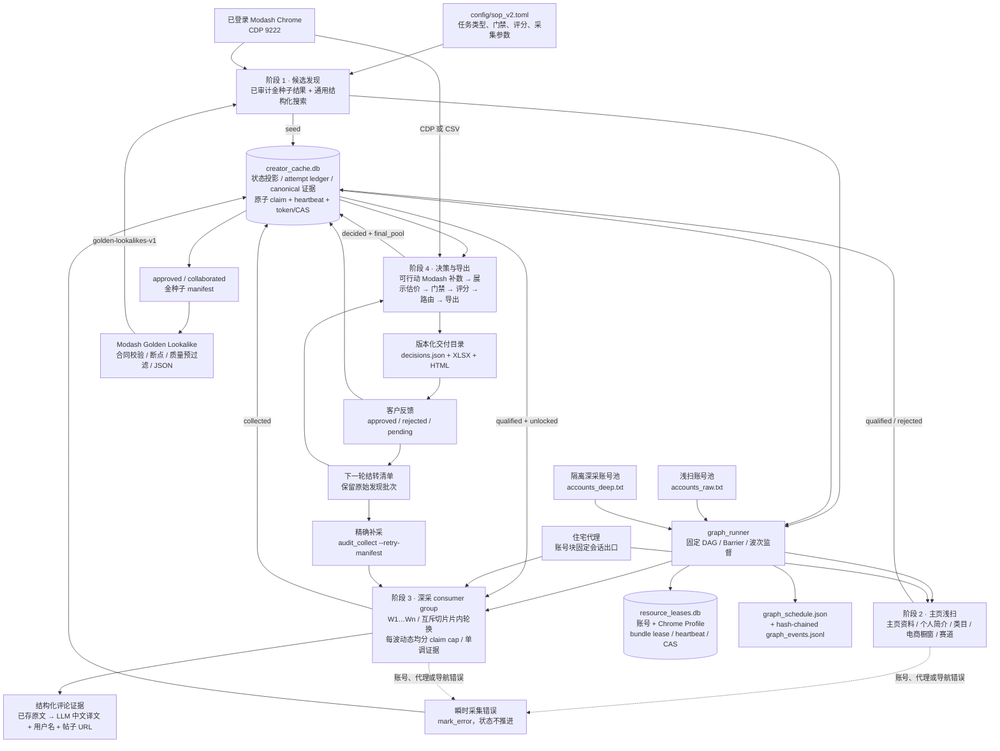
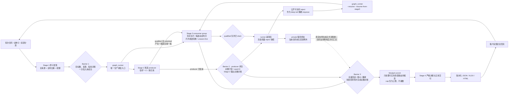
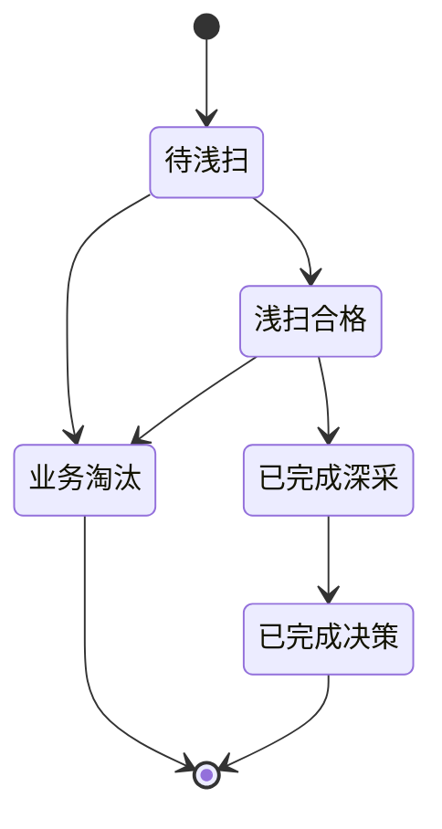

# Instagram 红人筛选、采集与交付系统

这是一个面向护肤、美妆和电商导购（含 Amazon Finds）场景的 Instagram 创作者发现、
采集、审核与交付系统。

当前唯一默认生产主线是 SOP V2 四阶段流水线；Instagram 生产调度固定从
`extensions.sop_v2.pipeline.graph_runner` 进入，执行拓扑是带硬 Barrier 的固定 DAG，
不是把四阶段全部串行跑完：

```text
Stage 1 原子完成 → graph_runner 校验 B1
                  → 1 个 Stage 2 浅采 producer ∥ Stage 3 深采 consumer group（W1…Wn）
                  → B2 + drain → reject deep tail → graph_runner Stage 3 resume
                  → B3 全量证据 Barrier → Modash enrich → Stage 4 交付
```

Instagram 侧只使用 Playwright 驱动的登录态 Chrome profile。`discover.py`、
`discover_graph.py`、`account_pool.py` 和 `instagram_session.py` 属于历史兼容
instagrapi 链路，仅为历史复现保留，不是新批次的默认入口。

> 当前规则以 [`config/sop_v2.toml`](config/sop_v2.toml) 和实际代码为准；
> 状态机与模块边界见 [`docs/sop_v2/PIPELINE_SPEC.md`](docs/sop_v2/PIPELINE_SPEC.md)，
> 操作命令见 [`docs/sop_v2/RUNBOOK.md`](docs/sop_v2/RUNBOOK.md)。

## 系统范围

系统负责：

- 从 Modash 结构化搜索产生候选 Handle；
- 浏览器读取 Instagram Profile、Bio、外链、帖子和评论；
- 识别品牌号、私密号、赛道、通用电商橱窗、推广内容和评论购买意图；
- 从帖子赞评计算真实互动率，并与第三方受众数据合并；
- 从最近 10 条非置顶 Reels 的平均播放量生成展示型预估报价；
- 执行硬门禁、A-F 可解释评分、固定 Review 和五池互斥路由；
- 输出 `decisions.json`、客户 XLSX 和可选 HTML；
- 回收客户批准/拒绝结果，沉淀金种子和负向标签。

系统不发送邮件或 DM，也不执行 Gift、Campaign、Payment。缺失数据使用
`unknown`/`N/A`/`Review` 表达，不伪造、不把缺失静默当作 0。

## 架构图



详细组件设计见 [`docs/ARCHITECTURE.md`](docs/ARCHITECTURE.md)，账号、会话、
代理和轮换细节见
[`docs/ACCOUNT_POOL_ARCHITECTURE.md`](docs/ACCOUNT_POOL_ARCHITECTURE.md)。

## 流程图



这是唯一正式调度规范。Stage 1 未越过 Barrier 1 时不得启动 Instagram；越过后只能由
`graph_runner` 启动恰好一个 Stage 2 producer 和 Stage 3 consumer group，不能为了省事临时
改成全串行或手工多终端。runner 会把深采池确定性切成互斥账号/Profile 切片；每个切片归属
固定 worker，但每一 consumer 波按波次序号在片内轮换起点，不跨片抢账号。候选领取采用
unseen-first：先处理从未深采失败的 `qualified`，再按最旧更新时间公平重试错误项。Stage 2
仍存活时的瞬时空队列只表示等待；后续自动追加有限 consumer 波次，而不是误判生产端完成。

每波启动前，runner 都以一次只读的 `qualified_unlocked_count=Q` 快照生成并冻结
`claim_plan`，再把本波可领取量确定性均分给全部 worker，单个 cap 不超过配置上限且相差最多
1。两个 worker、每 worker 上限 24 时，`Q=20` 分成 `10/10`，`Q=45` 分成 `23/22`，避免
仍可并行的尾批被第一个大 cap worker 全部抢走而退化为单 worker。若 `0<Q<worker 数`，全部
冻结切片仍以正数 `cap=1` 启动，由 SQLite 原子 claim 决定谁实际取得候选，同时保持整套
账号/Profile 池的 bundle lease 互斥；`Q=0` 不创建 consumer 波次，`limit=0` 作为可能被
worker 解释为无限量的危险值已禁用。

### 四阶段职责

| 阶段 | 输入 | 主要职责 | 状态输出 | 是否需要 IG 账号 |
|---|---|---|---|---|
| 阶段 1（发现） | 客户批准/已合作金种子结果、Modash CDP、SOP 配置 | 在内存完成全部来源、分页、全局去重、配额与指纹对账；全部满足后一次性写入，失败不留部分 seed | `seed` + Barrier 1 | 否 |
| 阶段 2（浅扫 producer） | `seed`、浅扫账号池 | 持续产出主页资料、品牌/私密、个人简介、通用电商橱窗和赛道；每个成功项解锁后立即可交给 Stage 3 | `qualified` / `rejected` | 是 |
| 阶段 3（深采 consumer group） | 已 `qualified` 且 unlocked 的候选、按 worker 互斥切分的隔离深采账号池；Stage 2 完成后再接公开 reject tail | 刷新主页最近 N 帖、逐帖核验评论；把最多 120 条已存原文交给本机 LLM 统一译成中文并重算意图/低质指标；计算真实互动率与内容信号；另取最近 10 条非置顶短视频播放证据 | `collected`；错误保持原态 | 是 |
| 阶段 4（决策） | 已通过全量证据 Barrier 且完成 Modash/人工补数的 cohort | 展示型报价派生、硬门禁、A-F 评分、不适用项归一化、固定待复核、五池、导出 | `decided + final_pool` | 否 |

阶段 1 有两条明确区分的来源：经客户 approved/collaborated 金种子驱动的 Modash
Lookalike，以及默认调用 `/api/search/v2/instagram` 的通用结构化搜索。2026-08-10 已在
marketer UI 真机确认同源 Lookalike 请求
`POST /api/discovery/search/v2/multi-creator-lookalikes`；
[`modash_golden_lookalikes.py`](scripts/extensions/sop_v2/pipeline/modash_golden_lookalikes.py)
在轮次合同校验后调用它，断点写入 `golden-lookalikes-v1`，并按 Track 粉丝范围、ER、
品牌/私密和赛道做本地预过滤。旧 AI Search DOM 抽取只作为 `--ai-search` 兜底；
普通结构化搜索仍不能冒充 Golden Lookalike 来源。

阶段 4 支持 Modash CSV 或 CDP 报告补数；缺少第三方核心字段时，候选诚实进入待复核池，
不视为流水线故障。CDP 模式在消耗 Profile credit 前，只用 Modash 负责的缺失字段构造乐观
投影，并分别执行当前路由与补数后路由；只有最终池级别确实可以提升的候选才进入 shortlist。
已有非空值不会被乐观值覆盖，评论、Storefront、实算 ER 等 Instagram 侧固定阻断也不能靠
Modash 修复。`--modash-cap` 是最多可买的报告数，不是必须凑满的配额；可行动候选少于 cap
时只处理实际人数，`0` 才表示不设上限。

当前 CDP 兼容契约以 `https://marketer.modash.io/discovery/instagram` 的登录态页面为准。
Profile 补数先用 Creator 模式的 `filters.username` 做精确 Handle 查询，并校验精确用户名；
当前响应主键为 `serviceSdId`，同时兼容历史 `servicePlatformId`。瞬时空响应会做有限重试，
旧 bulk discovery 只作为 fallback，不能把模糊结果误配给候选。

电商橱窗是通用购物入口，不是 Amazon 专属白名单。Amazon、LTK、ShopMy、明确
自营店和已识别的购物聚合入口都可以构成 `confirmed_yes`；确认没有任何电商橱窗的
`confirmed_no` 也继续深采，并可进入 `Include-Without-Storefront`；只有证据不足的
`unknown` 进入待复核池。阶段 2 不得再以 `no_amazon_storefront` 或
`confirmed_no` 提前淘汰。

### 状态机



数据库中的三类状态彼此正交：

- `status`：候选走到哪一阶段；
- `tier`：数据资产等级，客户批准者可晋升 Tier 2；
- `client_status`：客户侧 `approved/rejected/pending`。

`locked_at` 用于候选软锁，`stage_error` 保存最后一次瞬时错误，`stage_json`
累积各阶段事实。业务不合格进入 `rejected`；登录墙、challenge、代理和导航错误只写
`stage_error`，不应被误判为业务淘汰。

## 决策与交付

阶段 4 的决策顺序为：

```text
多源字段合并 → 硬门禁 → 固定待复核 → A-F 评分 → 不适用项归一化 → 五池路由
```

A-F 分别覆盖内容赛道、专业表达、社区信任、商业基础、受众质量和经济性。
当前配置将 F 模块整体延期为 N/A；N/A 从适用分母移除，而不是记 0 分。

最终路由定义五个互斥池：

1. `Include-With-Storefront`
2. `Include-Without-Storefront`
3. `Priority-Review`
4. `Review`
5. `Exclude`

Storefront 分流采用统一三态：`confirmed_yes` 和 `confirmed_no` 都通过 Gate，最终
Include 时分别进入 With/Without 两池；`unknown` 才进入 Review。Amazon 只是可识别的
Storefront 类型之一，不是候选资格白名单。

### 展示型预估报价

客户在 2026-07-28 确认，本轮交付增加 `pricing_estimate`，按以下固定顺序计算：

1. 先识别并排除置顶 Reels；不能先取主页前 10 条再删置顶；
2. 通过登录态浏览器会话调用 Instagram 同源 media info，逐条读取播放指标；
3. 对剩余 Reels 按发布时间倒序取最近 10 条，并计算播放量平均值；
4. 定价只采用 Instagram 原生 `ig_play_count`；总 `play_count` 和 `fb_play_count`
   仅作审计证据，不得进入均播或抬高报价；
5. 默认报价 = `平均播放量 × 35 / 1000` 美元；
6. 参考区间 = `平均播放量 × 35 / 1000` 至 `平均播放量 × 40 / 1000` 美元。

若账号实际不足 10 条 Reels，不能把“滚了固定次数”当成完整。浏览器必须在目标
`/<handle>/reels/` 页面同时证明：账号身份和 Reels 路由匹配、页面健康、无登录墙/挑战/
私密错误、已经到达底部，并在两次真实滚动后保持引用数与 `scrollHeight` 均不增长。
1–9 条还要求发现的每条 Reel 都来自同源 media-info `200`：`pinned_source` 必须是
`ig_media_info_pin_lists`，响应 code 必须回证请求或可信 canonical 身份。已确认置顶的 Reel
作为排除项无需播放量；已确认非置顶的 Reel 才必须有原生 `ig_play_count`。旧数据里单独写
一个 `pinned=false` 不能通过。0 条有两种互斥的严格证据：
（a）健康 Reels Tab 到底、连续两轮无增长并出现明确 `No Reels Yet/No posts yet` 空态；
（b）`reels_surface_absent`：两次独立访问精确 `/reels/` 都重定向同账号健康主页，主页有
普通 `/p/` 内容，但没有 Reels Tab 链接或任何 Reel 链接，且两次均无加载中/登录墙/挑战/
私密状态。两次导航各自保存健康状态、当前页 `/p/` 身份集合/数量/哈希；不得把第一次页面
的帖子累计给第二次空页。后者是“Reels 入口不存在”，不会冒充“Tab 已穷尽”。空 DOM、
错误页、一次重定向或仅达到最大滚动次数都不能形成完整总体。

报价窗口独立于主页最近 N 帖的核心深采窗口：Stage 3 另行进入 Reels Tab 取样，
不得用报价样本覆盖或替代主页帖子、互动指标和评论完整性证据。

协作帖的 Grid 链接有时会把真实 shortcode 与超长访问 token 连在一起。这里禁止截断、猜测
或按固定长度取前缀：只有当前媒体页声明的 Instagram HTTPS canonical 与原链接同为
`/reel/` 或同为 `/p/`，canonical shortcode 又是原 token 的精确值或前缀，并且随后同源
media-info 的 `200` 响应以 `code` 回证同一身份，才可使用 canonical 取指标。回证通过后，
`original_shortcode` 还必须与当前报价行的 `code/url` 精确一致，禁止把 B 媒体的 provenance
复制给 A；canonical 必须是 HTTPS Instagram、同媒体类型且与 original 保持前缀绑定。
播放量及状态/来源、IG/总/Facebook 播放审计值、赞评数、置顶状态、发布时间、计数隐藏标记和
`media_identity_provenance` 必须作为一个报价证据 bundle 一次性整体替换；禁止只补某个字段，
也禁止覆盖已经观测成功的普通样本。

交付必须同时显示样本数、平均播放量、排除的置顶数、数据源和状态：

- `complete`：取得 10 条 Instagram 原生非置顶 Reels；
- `complete_available`：Reels Tab 已按上述证据穷尽，账号只有 1–9 条可用原生非置顶
  Reels；使用全部可用样本估价，并公开实际样本数与穷尽证据；
- `not_applicable_no_reels`：Reels Tab 已严格穷尽且明确为空，或严格证明该健康主页没有
  Reels surface，报价为 `null`；两种证明分别保留，不能互相冒充；
- `partial`：取得 1–9 条原生样本，但总体穷尽或逐媒体分类尚未证明；金额只作暂估，B3
  不能通过；
- `missing`：没有可用原生样本且无法证明“账号确实无 Reels”，报价留空。

Modash `avg_reels_plays`、总 `play_count` 和 `fb_play_count` 不再是报价 fallback；历史
`fallback_modash` 只能透明展示为旧数据并在 B3 阻断。所有状态必须原样写入
JSON/XLSX/HTML，不得伪装成完整 10 条原生窗口。这只是给客户决策用的展示估算，不是红人或代理的实际报价。它不得
回填任何实际报价证据或 `paid_cpm`，不得触发 Gate、F 模块计分、固定 Review 或五池
路由；实际报价和 Paid CPM 仍是另一套独立证据口径。

主要产物：

```text
data/creator_cache.db
data/runs/<batch_id>/decisions.json
data/runs/<batch_id>/deliverable.xlsx
data/runs/<batch_id>/deliverable.html
data/evidence/<batch_id>/<handle>/
reports/deliveries/<batch_id>/formal-<YYYYMMDD>-r<N>/
```

当前评论证据以“用户名 + 简体中文译文 + 源语言 + 评论原话 + 意图级别 + 帖子 URL”为主。
本机 Ollama 默认使用 `qwen3.5:4b` 翻译 Stage 3 保存范围内的全部评论（新采默认每个候选
最多 120 条），按评论身份去重后回写 C3 意图与低质评论指标。XLSX 的“评论证据”工作表
逐行导出 `comment_translations` 中的全部结构化记录；旧批没有翻译结构时才透明回退
`comment_records`，不会再按意图只截 6 条。HTML 卡片和五池摘要单元格可以按高→中→低展示
少量代表样本，但不影响语义计算，也不削减 XLSX 证据表。
任一翻译失败会保留原文和失败状态，正式 Stage 4 的严格翻译门禁会在 Modash 消耗、数据库
推进和交付写盘前中止。翻译必须在 Stage 3 的 canonical attempt 落库前完成，并在 B3 计数中
闭环；正式 Stage 4 的 `--strict-comment-translations` 只调用已存翻译的只读验收，不调用 LLM、
不应用 source limit、不截断评论，也不重算或改写 candidate/attempt ledger。`--translate-comments`
只保留给显式草稿/补译，带 round contract、`--strict-completeness` 或
`--full-deep-all-candidates` 的正式模式会直接拒绝它。历史文档中的评论截图不是当前主流程的稳定承诺。

正式交付采用不可覆盖的版本目录：发给客户后的 `formal-...-rN` 视为冻结，新修订必须递增
`rN`，并保留对应 `decisions.json` 基线和 SHA-256。当前审计基线是
`SKIN4-20260723/formal-20260729-r2`：157 人，严格等于 89 个上一轮未终判账号加 68 个
本轮新账号，`retry_pending_count=0`；上一版 `formal-20260728-r1` 保持冻结。r2 当时的历史定价
状态为 156 个 `complete`、1 个 `fallback_modash`；后者按当前合同属于 B3 未闭合，历史目录
仍保持不可覆盖。

正式发布顺序固定为：严格深采审计、只读报价审计和翻译覆盖复核分别得到新鲜失败计数，
再调用 `barriers.evaluate_b3` 对同一 Stage 1 cohort 做总数、Handle 指纹、状态、错误、锁和
`audit/pricing/translation` 全量对账。B3 结果应保存为本地 `b3_barrier.json` 并记录 SHA-256；
只有 `passed=true` 才能启动可能消耗 credit 的 Modash CDP 补数和 Stage 4。最终 JSON、XLSX、
HTML 必须来自同一 `decisions.json` 基线，一起复制到新的 `formal-<YYYYMMDD>-r<N>`，生成
`SHA256SUMS` 后再交付；任何代码、配置、合同或导出修复都使用新 revision，不覆盖旧目录。

## V2 账号、会话、租约与代理

当前 V2 不调用 `AccountPool` 类。所谓账号池实际是账号文件加顺序轮询：

```text
浅扫账号文件 → 每号默认 8 个候选 → 换 Context / Sticky 通道
深采账号文件 → 每号默认 3 个候选 → 换 Context / Sticky 通道
error         → 当前候选 mark_error → 关闭 Context → 下一账号处理下一候选
```

每个账号使用独立 persistent Chrome profile；运行时只解析并注入
`sessionid + ds_user_id`，不执行密码/TOTP 登录。每个账号处理块使用一条 Sticky 代理通道，
同时屏蔽图片、视频和字体以降低带宽与请求压力。同一次账号块内出口保持固定；每次重新启动
流水线都会加入新的匿名运行 nonce，避免 `--resume` 继续复用上次已被限流的 Sticky 出口。
导航失败会保留脱敏后的 Chromium 网络错误码（例如 `ERR_TUNNEL_CONNECTION_FAILED`），
便于区分代理隧道故障与 Instagram 页面限流。

正式运行时，`graph_runner` 在上述浏览器轮询外再加两层互斥保护：候选行由
`BEGIN IMMEDIATE` 原子 claim、token/CAS 终态写入和运行中 heartbeat 防止重复处理；每个
worker 使用的 Instagram 账号与 Chrome Profile 则作为一个 bundle 写入独立的
`data/resource_leases.db`，按 token/CAS 续租和释放。Stage 2 还有批次级 singleton lease，
第二个符合规范的 producer 会在启动前失败。直接运行阶段脚本不会获得这层跨进程资源保护，
所以只允许作为历史复现或诊断。

深采池的 offset/count 切片在一个 graph 合同内固定互斥。`GraphConfig.account_rotation_base` /
CLI `--account-rotation-base` 默认 `0`、只接受非负整数并冻结进 run contract；本 schedule 中
第 N 个（从 0 起）持久 consumer intent 的实际轮换序号为 `base + N`，只改变各切片内部的账号
起点。intent 在 spawn 前写入不可变 schedule/event 审计链，因此即使该波随后失败，同
schedule 的 resume 也会前进而不会重用序号。候选队列先 claim 没有 `stage_error` 的未尝试项，
再处理最旧失败项，避免少数反复失败候选长期占满 worker。收到 `SIGTERM` 时，worker 会转为
可展开的终止异常，进入 `finally` 释放当前/待处理候选 claim；runner 随后按所有权 token 释放
账号/Profile bundle lease，并把非正常退出写入事件链。

需要注意：

- 尚无按单账号健康度驱动的持久 cooldown 和连续错误自动停用；`graph_runner` 的波次 cooldown
  是防止 consumer 紧密重试的调度背压，不等同于账号健康池；
- 错误后不会在本轮用下一账号重试同一候选；
- 代理缺失时当前代码会静默直连；
- 深采阶段脚本单独运行时可回退浅扫池，但 `graph_runner` 正式预检要求浅/深池及 Profile
  集合互斥，缺失、重叠、别名或活动中的 Profile 均会失败停机；
- 健康检查报告尚未接入调度；
- 完整 Cookie/UA 实现存在于 `session_v2.py`，但主流程尚未使用。

不要把 Legacy `account_pool.py` 的账号健康 cooldown、暖 Session 和一次性冷登录能力与
`graph_runner` 的波次 cooldown/资源 lease 混为一谈。完整分析和目标状态机见
[`docs/ACCOUNT_POOL_ARCHITECTURE.md`](docs/ACCOUNT_POOL_ARCHITECTURE.md)。

## 凭据边界

账号、密码、TOTP、Cookie、代理凭据和 Chrome profile 均不得进入 Git。它们只保留在
操作机 `.secrets/`，该目录已被 `.gitignore` 整体排除。数据库、客户输入、评论证据、
截图、日志和交付物同样只保留在本地忽略目录。

仓库只记录账号文件的格式、池角色和操作流程，不保存真实账号值。需要向另一台操作机
迁移凭据时，应使用团队密码管理器或仓库外的加密传输渠道。

## 安装

要求 Python 3.11+、Google Chrome 和 GnuPG：

```bash
python3 -m venv .venv
.venv/bin/python -m pip install -r requirements.txt
.venv/bin/python -m playwright install chromium
```

首次运行前需要：

1. 恢复或准备浅扫账号文件、深采账号文件和代理配置；
2. 确保敏感文件权限为 `0600`；
3. 使用独立的 Instagram Chrome profile，不与 Modash Chrome 混用；
4. 启动并登录用于 Modash 的 Chrome CDP 9222；
5. 人工排除已登出、challenge 或 suspended 的账号。

项目不会自动处理验证码或真人验证。

## 正确运行方式

正式批次必须按上面的固定 DAG 调度。Stage 1 是唯一单独执行的写入阶段；从 B1 到 B2、
以及 deep tail 的后续 drain，都只能由 `graph_runner` 调度。以下命令从 `scripts/` 运行：

```bash
cd scripts
BID=SKIN-YYYYMMDD
ROUND_CONTRACT="../data/batches/$BID/round_contract.json"

# Barrier 1 前：Stage 1 独占运行。正式轮次还应传入已完成的 Golden Lookalike 文件。
PYTHONPATH=. ../.venv/bin/python -m extensions.sop_v2.pipeline.stage1_discover \
  --batch-id "$BID" --track paid \
  --round-contract "$ROUND_CONTRACT" --require-round-contract

# 只有 Stage 1 报告全部来源/配额/全局去重对账成功，且数据库 seed 数等于本轮目标数，
# 才具备 B1 条件；Stage 1 运行期间禁止启动任何 Instagram worker。
```

Stage 1 成功后启动唯一正式编排入口。这里显式写出默认安全参数，便于轮次审计：

```bash
cd scripts
BID=SKIN-YYYYMMDD
ROUND_CONTRACT="../data/batches/$BID/round_contract.json"
STAGE1_ARTIFACT="../data/runs/$BID/stage1_barrier_artifact.json"
ROTATION_BASE=0  # 全新 schedule 默认 0；跨 schedule 续接必须改为审计得出的下一个未用序号

PYTHONPATH=. ../.venv/bin/python -m extensions.sop_v2.pipeline.graph_runner \
  --batch-id "$BID" \
  --stage1-artifact "$STAGE1_ARTIFACT" \
  --round-contract "$ROUND_CONTRACT" \
  --schedule "../data/runs/$BID/graph_schedule.json" \
  --event-log "../data/runs/$BID/graph_events.jsonl" \
  --workers 2 --worker-limit 24 --posts 10 \
  --account-rotation-base "$ROTATION_BASE" \
  --translation-provider ollama --translation-model qwen3.5:4b \
  --max-consumer-waves 100 --wave-cooldown 120 --max-no-progress-waves 3 \
  --lease-ttl 120 --heartbeat-interval 30
```

runner 会先只读验证 B1，再完成以下动作；任一步不满足即在启动浏览器进程前或当波边界失败：

1. 解析浅/深账号文件，只读取用户名与 Cookie 名存在性，不把 Cookie 值、密码、TOTP 或代理
   凭据写入工件；验证两池账号/Profile 无交集、无别名、Profile 未被其他 Chrome 占用；
2. 自动把深采池按 `--workers` 确定性均分为互斥切片；每波在各自片内按 consumer wave 序号
   轮换账号起点；实际序号为冻结的 `account_rotation_base + 本 schedule consumer intent ordinal`。
   同时按启动前的 `qualified_unlocked_count` 快照动态均分有限正数 claim cap。
   `Q=20` 时两个 worker 为 `10/10`，`Q=45` 时为 `23/22`；`0<Q<workers` 时全切片为
   `cap=1`，`Q=0` 不启动波次，`--worker-limit 0` 会直接失败；
3. 为唯一 Stage 2 producer、每个 Stage 3 worker 的账号/Profile bundle 获取独立跨进程 lease，
   运行中按 token/CAS heartbeat，丢失所有权就终止对应进程组；
4. 候选本身仍由 SQLite `BEGIN IMMEDIATE` 原子 claim：同状态下先未尝试、再最旧失败项，并由
   candidate heartbeat + token/CAS 保护最终写入；账号/Profile lease 与候选 lease 是两层
   不同的互斥；
5. 每波完整 `claim_plan`（快照数、计划领取量、各 worker cap）连同命令写入 append-only
   `graph_schedule.json`；分片策略、worker 上限、账号顺序及代码/配置/合同指纹属于冻结
   run contract，非负 `account_rotation_base` 也在其中。波次意图的摘要与 SHA、资源获取、
   spawn、完成/失败、释放和 `collected_delta` 都追加到 fsync 的 hash-chained
   `graph_events.jsonl`；历史波次和事件不覆盖；
6. Stage 2 存活时的暂时空队列只进入轮询等待。每个未 drain 的 consumer 波次后默认 cooldown
   120 秒；连续 3 波 `collected_delta=0` 或达到最大波数会失败停机，不会无限烧账号。

`graph_schedule.json`、`graph_events.jsonl` 与 `resource_leases.db` 都是本地运行工件，已在数据
边界内排除 Git。进程异常退出后，将上面的**同一命令原样重跑并追加 `--resume`**；不能改
worker 数、账号顺序、代码、配置、合同或其他冻结参数来“续跑”。如果事故处理中确实修改了
`graph_runner.py` 或 run contract 覆盖的任一 worker/调度代码或配置发生变化时，旧 hash 链
必须明确结束；使用新的版本化
`graph_schedule.r<N>.json` 与 `graph_events.r<N>.jsonl` 建立新运行合同，绝不能改写旧 schedule
或用旧链 `--resume`。新 schedule 不得让 rotation 默认回到 0：必须从旧 schedule/event 审计链
读取每个持久 consumer intent 的实际 rotation，取历史最大值加 1 作为新的
`--account-rotation-base`；重复使用过的较小序号不重复累计。resume 会把持久 `claim_plan`、
schedule、完整 event hash 链和 run
contract 重新交叉校验；cap、快照、worker 集合、分片策略或指纹任一被篡改/漂移，都在新
worker spawn 前 fail-closed。旧的终端 A/B/C 手工启动
`stage2_qualify`、`stage3_collect` 以及人工维护 `stage3_worker_schedule.json` 的清单，现已降级为
历史复现/诊断方式：它会绕过资源 lease、自动波次、事件链、cooldown/no-progress 和 B1/B2
监督，不能作为正式批次的完成证明。

当前 `SKIN6-20260810` 的 r4 continuation 使用 `--account-rotation-base 4`：r2 的四个 durable
consumer intents 已占用 `0–3`；r3 是重用 `0` 的验证性中止，没有提高历史最大 rotation，
因此不把它重复累计成 `5`。

`graph_runner` 观察到 Stage 2 进程实际退出后会立即只读计算 B2；B2 不通过则整图失败，
不会靠退出码继续。B2 只证明浅采 producer 闭合：本轮总数仍等于 Stage 1
合同目标，`seed=0`，`qualified + collected + rejected` 等于目标数，并且仅对
`status='seed'` 的 Stage 2 工作集要求 `stage_error=0`、`locked_at IS NULL`。此时 Stage 3
consumer 仍可持有 `qualified` 锁或写入 `deep_incomplete` 等 `stage_error`，这些不属于 B2
失败条件，必须留到 B3 清零。runner 只有在 B2 已通过且本轮现有 `qualified` 队列 drain 后
才返回；Stage 2 退出码和“某一刻队列为空”都不能单独证明 B2。随后先冻结机器淘汰快照，
再生成**明确公开可访问**的 deep-tail 白名单：

```bash
cd scripts
BID=SKIN-YYYYMMDD
mkdir -p "../data/runs/$BID"

sqlite3 -header -column ../data/creator_cache.db \
  "SELECT COUNT(*) AS total,
          SUM(status='seed') AS seed,
          SUM(status='qualified') AS qualified,
          SUM(status='collected') AS collected,
          SUM(status='rejected') AS rejected,
          SUM(status IN ('qualified','collected','rejected')) AS stage2_output_total,
          SUM(status='seed' AND stage_error IS NOT NULL) AS seed_errors,
          SUM(status='seed' AND locked_at IS NOT NULL) AS seed_locked,
          SUM(status='qualified' AND stage_error IS NOT NULL) AS deep_errors_observed,
          SUM(status='qualified' AND locked_at IS NOT NULL) AS deep_locked_observed
   FROM creator_profiles WHERE discovery_batch='$BID'"

sqlite3 -json ../data/creator_cache.db \
  "SELECT handle,reject_reason,json_extract(stage_json,'$.is_private') AS is_private \
   FROM creator_profiles WHERE discovery_batch='$BID' AND status='rejected' \
   ORDER BY lower(handle)" \
  > "../data/runs/$BID/stage2_reject_snapshot.json"

sqlite3 ../data/creator_cache.db \
  "SELECT handle FROM creator_profiles \
   WHERE discovery_batch='$BID' AND status='rejected' \
     AND json_extract(stage_json,'$.is_private')=0 \
   ORDER BY lower(handle)" \
  > "../data/runs/$BID/public_reject_deep_tail.txt"

if [[ -s "../data/runs/$BID/public_reject_deep_tail.txt" ]]; then
  PYTHONPATH=. ../.venv/bin/python -m extensions.sop_v2.pipeline.audit_collect \
    --batch-id "$BID" \
    --handles-file "../data/runs/$BID/public_reject_deep_tail.txt" \
    --strict --full-deep-all-candidates --target-posts 10 --requeue
fi
```

`audit_collect --requeue` 会清机器 `reject_reason`，因此快照必须先写；不得把 private 放入
deep tail。当前严格合同尚未表达“private 已核验但不可深采”的终态例外：本轮若存在 private，
必须停在此处等待合同/实现支持，不能删行、伪造深采完成或偷偷去掉正式 Stage 4 的
`--full-deep-all-candidates`。

公开 reject tail 入队后，使用同一冻结合同和同一调度/事件工件显式从 Stage 3 恢复；该模式
会先重新验证持久 B2，不会再启动 Stage 2：

```bash
ROTATION_BASE=0  # 必须填写该 schedule 的 run contract 已冻结值
PYTHONPATH=. ../.venv/bin/python -m extensions.sop_v2.pipeline.graph_runner \
  --batch-id "$BID" \
  --stage1-artifact "../data/runs/$BID/stage1_barrier_artifact.json" \
  --round-contract "../data/batches/$BID/round_contract.json" \
  --schedule "../data/runs/$BID/graph_schedule.json" \
  --event-log "../data/runs/$BID/graph_events.jsonl" \
  --workers 2 --worker-limit 24 --posts 10 \
  --account-rotation-base "$ROTATION_BASE" \
  --translation-provider ollama --translation-model qwen3.5:4b \
  --max-consumer-waves 100 --wave-cooldown 120 --max-no-progress-waves 3 \
  --lease-ttl 120 --heartbeat-interval 30 \
  --resume --resume-from-stage3
```

Stage 3 严格失败本来就保持 `qualified` 并保存部分证据，runner 会按新不可变波次直接重跑；
不要每轮再次统一
`audit_collect --requeue`，否则会清掉低量评论的跨轮重试历史。

每次 Stage 3 都在隔离工作副本中采集，完成后把本次证据作为不可变事件追加到
`deep_collection_attempts`，再由确定性质量元组选择 `deep_canonical_attempt_id`。新尝试较差
时不会覆盖较好的 canonical。只有两个尝试都有**完整、有效且完全相同的有序目标窗口**时，
才允许按 media identity 合并互补帖子/评论并生成带 provenance 的 synthetic attempt；窗口
顺序、长度、identity 或完整性任一不一致时，只能整次择优，禁止跨窗口拼字段。

评论重试按 media identity 保存 `resolved → retry_pending → terminal_unavailable` 状态机：只有
真实评论抽取失败才累计连续失败，帖子导航失败不计数，成功采到评论或核验为 0 会立即复位。
其中 `verified_empty_thread` 不是 `verified_zero`：帖子仍保留 media-info/OG 报告的正数
`comment_count`，并且只有页面可见叶节点与英文精确文案 `No comments yet.` 匹配、登录态
comments endpoint 同时返回 HTTP 200/`status=ok`、IG/FB 评论数组和 `comment_count` 全为 0、
所有 `has_more*` 均为 false 时才算完成。帖子证据与 `comment_unavailable_posts` 必须同时保留
一致的 `reported_count`、`source=instagram_visible_dom+comments_endpoint`、marker 和 endpoint
summary，并保证 media identity 一致；任一 provenance 缺失或冲突都 fail-closed。普通
`reported_count>2`
的空抽即使重复发生也仍是失败，不能自动进入 terminal；只有既有合同中的 1–2 条评论媒体才可在
连续真实失败后记为 `unavailable_after_retry`。
Reels 报价窗口由独立的 `pricing_canonical_attempt_id` 单调择优，报价质量不会反向决定主页/
评论 canonical。以上 ledger、canonical 指针和重试状态只供内部审计；Stage 4 客户 JSON 会
在交付边界剥离它们，只输出最终 canonical 业务证据。

### 深采证据事故恢复

`recover_deep_evidence` 只用于已确认“当前库与事故前备份包含同一窗口互补证据”的离线修复，
不是常规重试入口。先停止全部 graph/worker、确认批次无活动锁并另做数据库备份；命令默认
只读 dry-run，必须逐个显式指定 Handle 并审阅输出的 `plan_sha256`：

```bash
PYTHONPATH=.:scripts .venv/bin/python \
  -m extensions.sop_v2.pipeline.recover_deep_evidence \
  --db data/creator_cache.db \
  --backup-db data/creator_cache.db.pre-recovery.bak \
  --batch-id "$BID" \
  --handle HANDLE_A --handle HANDLE_B \
  --audit-output "data/runs/$BID/deep_evidence_recovery.dry-run.json"

# 仅在 dry-run 已人工核对后执行；PLAN_SHA 必须来自上一步输出。
PYTHONPATH=.:scripts .venv/bin/python \
  -m extensions.sop_v2.pipeline.recover_deep_evidence \
  --db data/creator_cache.db \
  --backup-db data/creator_cache.db.pre-recovery.bak \
  --batch-id "$BID" \
  --handle HANDLE_A --handle HANDLE_B \
  --apply --expected-plan-sha256 "$PLAN_SHA" \
  --audit-output "data/runs/$BID/deep_evidence_recovery.applied.json"
```

apply 会重新校验配置 SHA、计划 SHA、精确 `stage_json`/错误/受保护列 CAS 和零活动锁，随后
在单个 `BEGIN IMMEDIATE` 事务中全量校验、写入并复核；任一行漂移则整批回滚。恢复仍遵守
“完整 ordered same-window 才按 media identity 合并、跨窗 whole-attempt”的正式策略。

```bash
# Barrier 3 只读门禁；此处不得带 --requeue
PYTHONPATH=. ../.venv/bin/python -m extensions.sop_v2.pipeline.audit_collect \
  --batch-id "$BID" --strict --full-deep-all-candidates --target-posts 10
```

`barriers.evaluate_b3` 对缺失的外部计数采用 fail-closed：`audit`、`pricing`、`translation`
任一未提供或非零都不能算 B3。只有以下条件全部满足，才允许连接 Modash enrich：本轮总数
与 Stage 1 一致；无 seed、
qualified、错误或锁（包括 B2 时允许暂存的深采错误和 qualified 锁）；公开候选全部通过严格深采；
报价样本/状态逐项对账且没有未处理缺口；
全部已存评论翻译为 `complete/not_needed`，不存在 failed、source-unavailable 或覆盖不足。
Modash enrich 不能越过此 Barrier 提前烧 Profile credit。

报价外部失败计数必须来自本轮只读审计，不能凭补采命令退出码猜测：

```bash
PYTHONPATH=. ../.venv/bin/python \
  -m extensions.sop_v2.pipeline.stage3_pricing_backfill \
  --batch-id "$BID" --audit-only
```

该命令不加锁、不启动浏览器、不写数据库；只有 `complete`、证据闭合的
`complete_available` 和证据闭合的 `not_applicable_no_reels` 计为 `pricing=0`。
审计会把 raw evidence 重新派生为 canonical estimate，并逐项核对 schema、币种、算法、窗口、
样本、置顶排除数、CPM、金额、总体摘要、Reels 明细与采集时间；手改交付字段不能过 B3。
历史 10/10 schema v1 仅兼容当时尚未存在的 population 摘要，其余旧字段仍逐项严格核对。

pricing-only 回填不是裸覆盖四个字段：每次尝试都追加独立 full ledger event，按严格证据质量
单调选择报价 owner，并原子更新 pricing canonical pointer/quality。瞬时 `missing`、伪造空态
或更差样本不能覆盖已有 `partial5`；deep canonical 窗口与评论 retry state 保持不变。

翻译已在 Stage 3 和 B3 前完成。通过 B3 后，下面的正式 Stage 4 先对已存翻译执行纯只读
验收，再运行 Modash enrich 和决策：

```bash
cd scripts
BID=SKIN-YYYYMMDD
ROUND_CONTRACT="../data/batches/$BID/round_contract.json"

# 4A. 使用 Modash CDP 补数并交付
PYTHONPATH=. ../.venv/bin/python -m extensions.sop_v2.pipeline.stage4_decide \
  --batch-id "$BID" --track paid \
  --round-contract "$ROUND_CONTRACT" --require-round-contract \
  --strict-completeness --full-deep-all-candidates --deep-target-posts 10 \
  --strict-comment-translations \
  --out "../data/runs/$BID/decisions.json" \
  --xlsx "../data/runs/$BID/deliverable.xlsx" \
  --modash-cdp --modash-cap 20

# 4B. 或使用已导出的 CSV
PYTHONPATH=. ../.venv/bin/python -m extensions.sop_v2.pipeline.stage4_decide \
  --batch-id "$BID" --track paid \
  --round-contract "$ROUND_CONTRACT" --require-round-contract \
  --strict-completeness --full-deep-all-candidates --deep-target-posts 10 \
  --strict-comment-translations \
  --out "../data/runs/$BID/decisions.json" \
  --modash-csv "../data/source/$BID-modash.csv"
```

只有人工补数文件真实存在时，才在 4A/4B 额外添加
`--manual-csv "../data/source/$BID-manual.csv"`；不要为了满足示例传入不存在的占位路径。

正式 Stage 4 不传 `--translation-provider/model/api-url/batch-size/source-limit`：这些参数只对
显式 `--translate-comments` 生效，而后者仅允许草稿/补译模式。若只读验收失败，应回到
Stage 3 或独立恢复流程补齐并持久化翻译，重新完成 B3；不得让 Stage 4 临场修复、截断或重写
已经冻结的翻译/深采 ledger。

旧的全串行入口只允许开发诊断：

```bash
PYTHONPATH=. ../.venv/bin/python -m extensions.sop_v2.pipeline.run_pipeline \
  --batch-id "$BID" --track paid --resume
```

它不具备 `graph_runner` 的 B1/B2 断言、账号/Profile lease、事件链、自动波次和
cooldown/no-progress。正式批次禁止使用它，也禁止临时把默认生产流程改成“Stage 2 全跑完
再启动 Stage 3”的全串行拓扑；若因
事故必须降级串行，应停止当前正式轮次并另开有记录的诊断运行，不能沿用正式完成标记。

查看状态：

```bash
cd ..
PYTHONPATH=scripts .venv/bin/python -m extensions.sop_v2.creator_cache stats
```

## 客户反馈回流与下一轮准备

以下流程把“轮次合同、反馈入库、策略提案、历史回放、下一轮发现”拆成可审计步骤。完整规范见
[`FEEDBACK_GOVERNANCE.md`](docs/sop_v2/FEEDBACK_GOVERNANCE.md)。拒绝原因和结构化标签都可为空；
空原因只更新账号结果，不参与策略学习。

### 0. 冻结轮次合同

```bash
NEXT_BID=SKIN5-20260810
ROUND_CONTRACT="data/batches/${NEXT_BID}/round_contract.json"
CARRYOVER_MODE=new_only

PYTHONPATH=scripts .venv/bin/python \
  -m extensions.sop_v2.round_contract \
  --batch-id "$NEXT_BID" --track paid --carryover-mode "$CARRYOVER_MODE" \
  --out "$ROUND_CONTRACT"
```

`new_only` 表示只发现新账号；另有 `unresolved` 和 `retry_only`。合同冻结国家、通用电商口径、
报价、全语言翻译、来源配额以及配置/代码 SHA，正式 Stage 1 使用
`--round-contract "$ROUND_CONTRACT" --require-round-contract` 校验漂移。

### 1. 安全导入客户反馈

真实写入必须同时提供客户导出的 JSON 和当时生成 HTML 所使用的原始
`decisions*.json`。`--source-decisions` 用于核对批次和交付白名单，不是可选参数：

```bash
OLD_BID=SKIN3-20260717
FEEDBACK_JSON="/absolute/path/client_decisions_${OLD_BID}.json"
SOURCE_DECISIONS="reports/deliveries/${OLD_BID}/decisions_interim.json"

# 先校验文件、白名单和数据库状态；不写业务数据或 ledger
PYTHONPATH=scripts .venv/bin/python \
  -m extensions.sop_v2.pipeline.ingest_client_decisions \
  --file "$FEEDBACK_JSON" \
  --source-decisions "$SOURCE_DECISIONS" \
  --dry-run

# 校验通过后执行真实写入
PYTHONPATH=scripts .venv/bin/python \
  -m extensions.sop_v2.pipeline.ingest_client_decisions \
  --file "$FEEDBACK_JSON" \
  --source-decisions "$SOURCE_DECISIONS"
```

导入器会在单个 SQLite 事务内写入客户状态、不可变逐条事件，并在
`client_feedback_imports` 保存反馈文件 SHA-256、原交付基线 SHA-256、批次和计数。
同一反馈文件再次导入会命中 SHA ledger 并幂等跳过，不会刷新 `approved_at` 或重复写入。
同一评审批次的增量导出可以重复包含此前已选账号：已批准时间保持不变，只处理新增或明确
改判的行。组合交付中的账号可以来自多个不可变 `discovery_batch`；导入器会把
`manifest.batch_id` 视为本轮评审批次，并逐行核对 `_discovery_batch` 来源，不会为了结转
改写候选的首次发现批次。反馈冗余携带的 pool/score 也会与基线核对，防止拿错 HTML 版本。

`--adopt-existing` 只用于一种迁移场景：旧版导入器已经写入客户业务状态，但当时还没有
SHA ledger。使用前必须人工核对现有状态与原反馈完全一致，并同时提供
`--source-decisions`；它不是普通重试、幂等重跑或客户改判的开关。客户明确改判时应另行
审查后使用专用的 `--allow-status-change`，不能用 `--adopt-existing` 绕过冲突保护。

状态含义：

- `approved` / `collaborated`：晋升 Tier 2 金种子；
- `rejected`：进入客户负向库并保留原因；
- `pending`：不改变资产等级，只保留待定备注；
- 客户反馈不会自动改写 SOP 配置。

历史文件已有 ledger 但没有逐条事件时，使用显式 `--backfill-events --dry-run` 核对后再去掉
`--dry-run`；该模式不改账号投影和原 ledger。随后生成反馈报告：

```bash
PYTHONPATH=scripts .venv/bin/python \
  -m extensions.sop_v2.pipeline.analyze_client_feedback \
  --db data/creator_cache.db \
  --batch-id "$OLD_BID" \
  --out-json "data/batches/${OLD_BID}-feedback-analysis.json" \
  --out-md "data/batches/${OLD_BID}-feedback-analysis.md"
```

报告会输出原因覆盖、来源批准率、金种子效果和 proposed 策略；pending 不进入批准率分母，
历史自由文本在人工结构化前只进入待标注队列。

### 2. 按合同决定是否生成 carryover manifest

`carryover_mode=new_only` 时跳过本节：历史账号不进入新一轮，也不重新采集。只有
`unresolved` 或 `retry_only` 才生成并使用 carryover。

`discovery_batch` 是候选首次发现批次，不应为了“结转”而改写。使用
`prepare_next_round` 把上一轮未终判、待定和需要补采的候选写入独立 manifest：

```bash
NEXT_BID=SKIN4-20260723
CARRYOVER="data/batches/${NEXT_BID}/carryover_manifest.json"

PYTHONPATH=scripts .venv/bin/python \
  -m extensions.sop_v2.pipeline.prepare_next_round \
  --source-decisions "$SOURCE_DECISIONS" \
  --feedback "$FEEDBACK_JSON" \
  --next-batch "$NEXT_BID" \
  --round-contract "$ROUND_CONTRACT" \
  --require-round-contract \
  --out "$CARRYOVER"
```

manifest 保存源文件 SHA-256、评审批次、每个账号的不可变来源批次、下一轮 ID、结转集合
指纹、未决原因和 `retry_handles`。补采判定不仅检查 `seed/qualified/collected` 等非终态，
还会按严格完整性契约检查主页帖子覆盖、互动指标与逐帖评论核验；三类失败 URL
`deep_failed_posts`、`deep_metric_missing_posts`、`comment_failed_posts` 会明确指出
导航失败、指标缺失和评论核验失败。已经客户终判的账号不会重新进入结转。

历史记录可能没有新版本显式 contract 字段。此时只允许走严格 legacy-evidence 边界：
至少 10 个结构化 `sampled_posts`、`comments_analyzed > 0`、`valid_comments >= 20`、
`real_er` 非空，并且存在可观察互动指标；这不是放宽或跳过深采，任一证据不足仍必须补采。

manifest 不会自行改库。代理与账号健康后，先精确审计并只退回 manifest 中的补采集合，
再按账号原始批次续跑 Stage 3。下例是为缺少新版 Stage 1/B1 工件的**历史批次修复诊断**保留的
单 consumer 有限 drain，不是新批次的生产编排入口；它运行时必须独占完整深采池，不得并发
启动第二个 Stage 3、报价补采或外部 Chrome。具备完整 Stage 1 artifact 和 graph schedule 的
批次应使用前述 `graph_runner --resume --resume-from-stage3`：

```bash
# 只读确认补采范围
PYTHONPATH=scripts .venv/bin/python \
  -m extensions.sop_v2.pipeline.audit_collect \
  --batch-id "$OLD_BID" \
  --retry-manifest "$CARRYOVER" \
  --strict --full-deep-all-candidates --target-posts 10

# 确认代理可用后再退回；不会把已客户终判但证据不完整的资产误退回
PYTHONPATH=scripts .venv/bin/python \
  -m extensions.sop_v2.pipeline.audit_collect \
  --batch-id "$OLD_BID" \
  --retry-manifest "$CARRYOVER" \
  --strict --full-deep-all-candidates --target-posts 10 \
  --requeue

PYTHONPATH=scripts .venv/bin/python \
  -m extensions.sop_v2.pipeline.stage3_collect \
  --batch-id "$OLD_BID" \
  --limit 24 \
  --posts 10 \
  --strict-completeness \
  --resume \
  --translate-comments --translation-provider ollama --translation-model qwen3.5:4b
```

Stage 3 的进程退出码不能单独证明每个账号采集成功；结束后必须再次运行同一条只读
`audit_collect --retry-manifest --strict --full-deep-all-candidates --target-posts 10`，
确认补采集合已清空。

### 3. approved 金种子进入下一轮发现

先只导出本轮可用的 `approved/collaborated` 金种子。该命令不连接 Modash，也不写新候选：

```bash
STAGE1_CARRYOVER_ARGS=()
if [[ "$CARRYOVER_MODE" != "new_only" ]]; then
  STAGE1_CARRYOVER_ARGS=(--carryover-manifest "$CARRYOVER")
fi

PYTHONPATH=scripts .venv/bin/python \
  -m extensions.sop_v2.pipeline.stage1_discover \
  --batch-id "$NEXT_BID" \
  --track paid \
  --round-contract "$ROUND_CONTRACT" \
  --require-round-contract \
  "${STAGE1_CARRYOVER_ARGS[@]}" \
  --export-golden-only
```

默认产物是：

```text
data/runs/<next_batch_id>/golden_lookalike_seeds.json
```

manifest 已带种子集合 SHA-256，并为每个种子生成
`results[].candidates`。在**正确登录 Modash 的 CDP Chrome 会话**中运行已验证的
Golden Lookalike 步骤；它会按种子轮询、全局去重、保存多种子归因，并在每个请求后原子
写断点：

```bash
PYTHONPATH=scripts .venv/bin/python \
  -m extensions.sop_v2.pipeline.modash_golden_lookalikes \
  --manifest "data/runs/${NEXT_BID}/golden_lookalike_seeds.json" \
  --out "data/runs/${NEXT_BID}/golden_lookalikes_completed.json" \
  --track paid --target 60 \
  --round-contract "$ROUND_CONTRACT" --require-round-contract \
  --cdp http://127.0.0.1:9222
```

产物是：

```text
data/runs/<next_batch_id>/golden_lookalikes_completed.json
```

接口的 `engagement_rate` 已确认直接使用百分数（`3.33` 即 3.33%），工具不会套用普通
Search 的小数换算。它只读取 Discovery 列表，不打开 Profile Report、Save 或 Bulk Save。
不同 batch/种子指纹/合同/Track 的旧断点会被拒绝。若 UI 契约变化导致自动步骤阻断，仍可
人工填写同一模板作为显式 fallback，但不得从不透明 `lookalikesToken` 猜候选。

完成取数后，用严格模式回导，并按轮次合同运行多来源结构化搜索：

```bash
cd scripts
STAGE1_CARRYOVER_ARGS=()
if [[ "$CARRYOVER_MODE" != "new_only" ]]; then
  STAGE1_CARRYOVER_ARGS=(--carryover-manifest "../${CARRYOVER}")
fi
PYTHONPATH=. ../.venv/bin/python \
  -m extensions.sop_v2.pipeline.stage1_discover \
  --batch-id "$NEXT_BID" \
  --track paid \
  --round-contract "../${ROUND_CONTRACT}" \
  --require-round-contract \
  "${STAGE1_CARRYOVER_ARGS[@]}" \
  --golden-lookalikes-json "../data/runs/${NEXT_BID}/golden_lookalikes_completed.json" \
  --require-golden-lookalikes \
  --cdp http://127.0.0.1:9222
cd ..
```

严格导入会核对 batch、种子集合 SHA-256 和每个 `seed_handle` 是否仍属于当前
approved/collaborated 金种子。默认总目标按 50% 金种子 Lookalike、30% 通用电商、20% 主题探索
分配；金种子不足时按 30:20 重分配缺口。新候选在 `stage_json` 中记录 `discovered_via`、
`discovery_sources` 和 `golden_seed_handles`；多种子或通用搜索重复命中会合并来源。
直接回导尚未填写、`results[].candidates` 全空的模板会被严格模式拒绝。

如果显式省略 `--golden-lookalikes-json` 和 `--require-golden-lookalikes`，Stage 1 会打印
“金种子 Lookalike 通道未完成”的警告并继续普通搜索。这是可用的降级路径，但不是完整反馈闭环。

### 4. 按合同模式生成下一轮交付

`new_only` 完成新批 Stage 1–3 后直接交付当前批，不传 carryover 文件：

```bash
PYTHONPATH=scripts .venv/bin/python \
  -m extensions.sop_v2.pipeline.stage4_decide \
  --batch-id "$NEXT_BID" \
  --track paid \
  --round-contract "$ROUND_CONTRACT" --require-round-contract \
  --strict-completeness --full-deep-all-candidates --deep-target-posts 10 \
  --strict-comment-translations \
  --modash-cdp --cdp http://127.0.0.1:9222 --modash-cap 20 \
  --out "data/runs/${NEXT_BID}/decisions.json" \
  --xlsx "data/runs/${NEXT_BID}/deliverable.xlsx"

.venv/bin/python scripts/export_v2_html.py \
  --decisions "data/runs/${NEXT_BID}/decisions.json" \
  --out "data/runs/${NEXT_BID}/deliverable.html"
```

`unresolved` / `retry_only` 在完成旧批补采以及新批 Stage 1–3 后，使用同一条
Stage 4 命令，但必须额外传入 `--carryover-manifest "$CARRYOVER"`，以精确组合
“合同允许的旧账号 + 本轮新候选”。不要使用 `--all-batches`，它会带入无关历史批次。

Stage 4 会严格核对清单 SHA、来源批次、人数和 handle 集合，只纳入清单旧账号与当前新批账号；
输出仍保留每人的 `_discovery_batch`。清单中还有待补采账号时，正式交付默认中止。
`--allow-incomplete-carryover` 只用于显式生成内部草稿，产物 manifest 会记录该状态。
使用 `--modash-cdp` 时，只有“仍缺 Modash 报告字段，且乐观补齐缺失字段后最终池级别会提升”
的候选进入 shortlist；已有完整报告、已有值不会被覆盖，或仍受评论/Storefront/实算 ER 等
非 Modash 条件阻断的账号不会消耗额度。`--modash-cap 20` 只允许最多 20 份，不会为凑配额
抓取无效报告。

Carryover 复跑是幂等的：`needs_pipeline_retry=true` 的历史 `collected/rejected` 可以继续处理；
已经是 `decided` 的记录，仅在当前 `_stage_error` 为空且 `strict_deep_reasons` 通过时才可复用。
旧的、不完整的 `decided` 不得穿过正式门禁。同一 manifest 成功复跑后应稳定保持
`retry_pending_count=0`，否则不得发布正式版本。

## 项目结构

```text
config/
  sop_v2.toml                         当前 V2 规则
  seeds.toml                          Legacy 发现配置
scripts/
  browser_collect_v2.py               V2 浏览器采集器
  export_v2_xlsx.py                   V2 XLSX
  export_v2_html.py                   V2 HTML
  extensions/sop_v2/
    creator_cache.py                  SQLite 状态、缓存、软锁、客户反馈
    feedback_taxonomy.py              可选客户反馈原因与作用范围合同
    round_contract.py                 每轮业务口径和运行时 SHA 合同
    discovery_strategy.py             50/30/20 多来源计划与缺口重分配
    policy_changes.py                 append-only 策略状态机
    gates.py / scoring.py / routing.py
    pipeline/
      stage1_discover.py
      modash_golden_lookalikes.py       金种子 Lookalike 断点采集
      graph_runner.py                   正式 Stage 2/3 DAG 编排入口
      barriers.py                       B1/B2/B3 只读断言
      resource_leases.py                账号/Profile bundle lease
      stage2_qualify.py
      stage3_collect.py
      deep_attempts.py                   Stage 3 attempt ledger 与 canonical 选择
      deep_evidence_merge.py             同窗口 media identity 合并策略
      recover_deep_evidence.py           dry-run + CAS 离线证据恢复
      stage4_decide.py
      audit_collect.py
      ingest_client_decisions.py
      analyze_client_feedback.py
      replay_policy.py
      prepare_next_round.py
      run_pipeline.py
  discover.py / discover_graph.py     Legacy
  account_pool.py                     Legacy instagrapi 账号池
docs/
  ARCHITECTURE.md                     当前完整架构
  ACCOUNT_POOL_ARCHITECTURE.md        账号、会话、代理与轮换专项设计
  sop_v2/PIPELINE_SPEC.md             状态机和模块边界
  sop_v2/RUNBOOK.md                   操作手册
data/
  creator_cache.db                    本地状态库，不入 Git
  resource_leases.db                  本地跨进程资源租约，不入 Git
  runs/ / evidence/                   本地批次、graph 工件与证据，不入 Git
pytest.ini                             测试只发现 tests/，不执行联网 dev 脚本
```

## 测试

```bash
PYTHONPATH=.:scripts .venv/bin/python -m pytest -q
```

`pytest.ini` 将发现范围固定在 `tests/`。不要把 `scripts/dev/test_*.py` 当作单元测试收集；
这些文件是会读取真实账号或启动浏览器的人工诊断脚本。

## 历史兼容边界

以下组件可能调用 Instagram 私有 API，甚至回退到密码/TOTP 冷登录：

- `scripts/discover.py`
- `scripts/discover_graph.py`
- `scripts/account_pool.py`
- `scripts/instagram_session.py`
- `config/seeds.toml`
- `docs/INSTAGRAM_LOGIN_SESSION_SOP.md`

除非明确进行历史复现，不要将它们作为 V2 新批次入口。历史账号池具有请求级轮换、
持久 cooldown 和一次性冷登录纪律，但没有接入当前浏览器流水线。

## 已知设计债务

- V2 账号池仍没有统一健康状态、按账号错误驱动的持久 cooldown 和同候选换号重试；
- `graph_runner` 已提供账号/Profile lease 与波次 cooldown，但尚未把人工登录健康检查变成
  自动停用/恢复策略；
- Sticky 代理 TTL、真实出口和失败归因缺少可观测性；
- `FieldEvidence` 与正式 Batch Manifest 尚未贯通全部 Gate/Score 输出；
- `run_pipeline` 的 track 传递、阶段退出码和补数参数仍需收口；
- 当前评论证据以结构化文本为主，历史截图承诺已经过期；
- 历史结转候选可能没有 10 条原生非置顶 Reels 播放证据；只有严格闭合的短总体可升级为
  `complete_available/not_applicable_no_reels`，其余保持 `partial/missing`（历史 fallback 也
  视为未闭合），不能用第三方或零值伪装；
- 同一创作者跨批次/跨 Track 仍由全局 Handle 主键限制。

这些问题不妨碍受 Barrier 约束的“一个浅采 producer + 可水平扩展的深采 consumer group”
流水并发；`graph_runner` 已自动冻结调度、校验 Profile 互斥并持有跨进程 lease。不得绕过它
退回全串行或手工多终端作为正式默认。

## 文档导航

| 文档 | 定位 |
|---|---|
| [`docs/ARCHITECTURE.md`](docs/ARCHITECTURE.md) | 当前系统完整架构与细节设计 |
| [`docs/ACCOUNT_POOL_ARCHITECTURE.md`](docs/ACCOUNT_POOL_ARCHITECTURE.md) | 账号、Cookie、Profile、代理、轮换与错误恢复 |
| [`docs/sop_v2/PIPELINE_SPEC.md`](docs/sop_v2/PIPELINE_SPEC.md) | 四阶段状态机和数据库 API |
| [`docs/sop_v2/RUNBOOK.md`](docs/sop_v2/RUNBOOK.md) | 实际运行命令 |
| [`docs/sop_v2/FEEDBACK_GOVERNANCE.md`](docs/sop_v2/FEEDBACK_GOVERNANCE.md) | 客户反馈、策略提案、回放和变更审计 |
| [`docs/sop_v2/STRATEGY_LOCK.md`](docs/sop_v2/STRATEGY_LOCK.md) | 经实测锁定的采集策略 |
| [`docs/sop_v2/SYSTEM_STATUS.md`](docs/sop_v2/SYSTEM_STATUS.md) | 截至文档日期的完成度与延后项 |
| [`docs/sop_v2/FINAL_DELIVERABLES.md`](docs/sop_v2/FINAL_DELIVERABLES.md) | 交付字段与目标结构 |

`REQUIREMENTS_CHECKLIST.md`、根目录旧 `FLOWCHART/PIPELINE_LOGIC/EXECUTION_PLAN` 等文档
记录的是需求 Baseline 或历史设计，不应覆盖当前代码事实。
