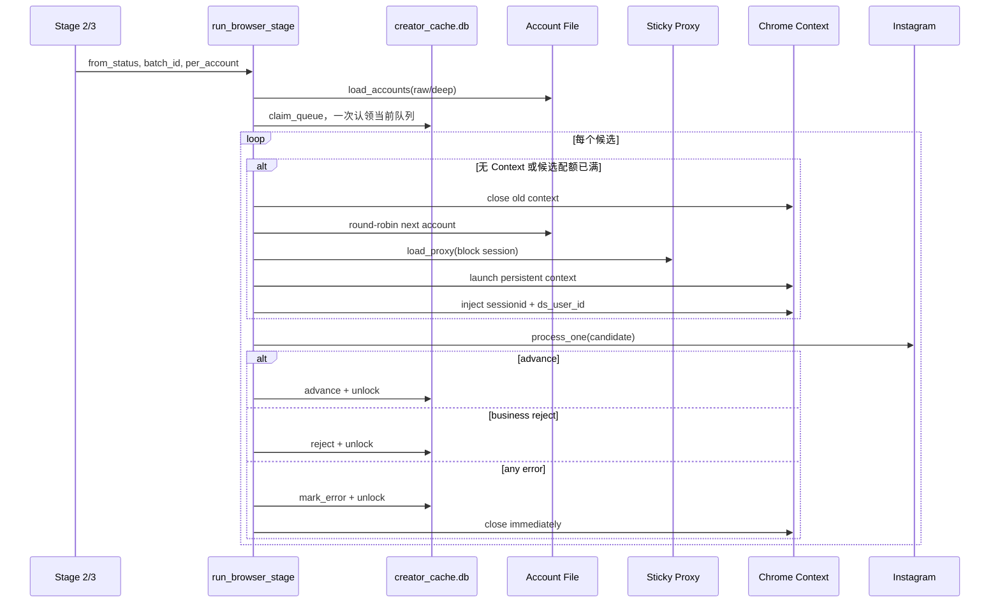
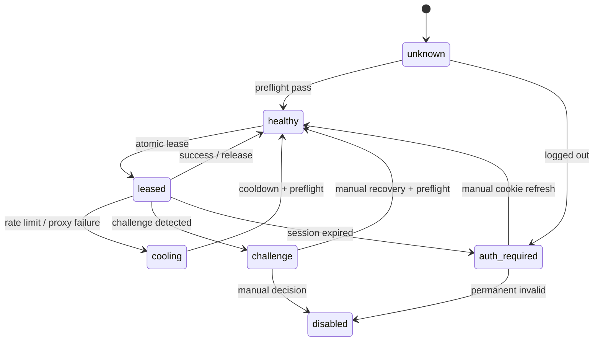

# 账号池、会话、代理与轮换设计

更新日期：2026-07-22

## 1. 关键结论

当前 SOP V2 的 Instagram 生产通道是 Playwright 浏览器，不是 instagrapi。

V2 账号轮换由
[`pipeline/_base.py`](../scripts/extensions/sop_v2/pipeline/_base.py) 和
[`browser_collect_v2.py`](../scripts/browser_collect_v2.py) 实现，本质是：

```text
静态账号文件
    → 按候选数 round-robin
    → 每账号块一个 persistent Chrome context
    → 每账号块一条 sticky proxy session
```

[`account_pool.py`](../scripts/account_pool.py) 是旧私有 API 账号池。它虽有暖 Session、
请求级轮换、持久 cooldown 和一次性冷登录，但 V2 完全没有调用它。

目标不是重新启用 instagrapi，而是把旧池中有价值的健康状态、租约、冷却和错误隔离，
重构成浏览器专用账号调度层。

## 2. 术语

| 术语 | 含义 |
|---|---|
| Browser account | 一个 Instagram 网页账号及其本地 Cookie |
| Persistent profile | `.secrets/chrome-instagram-profiles/<username>` |
| Shallow pool | Stage 2 使用的浅扫账号集合 |
| Deep pool | Stage 3 优先使用的隔离深采账号集合 |
| Account block | 同一账号和 Context 连续处理的一组候选 |
| Proxy session | 代理供应商 Sticky 通道标识 |
| Candidate lease | `creator_cache.locked_at` 对候选的软锁 |
| Account lease | 目标能力；防止同一账号/profile 并发使用 |
| Legacy AccountPool | `scripts/account_pool.py` 的 instagrapi 池 |

真实账号值、密码、TOTP、Cookie、代理凭据和 Profile 只存在于本机 `.secrets/`，
不得进入 Git 或文档。

## 3. 当前组件地图

| 组件 | 当前职责 |
|---|---|
| [`pipeline/_base.py`](../scripts/extensions/sop_v2/pipeline/_base.py) | 队列认领、账号轮询、Context 生命周期、verdict 落库 |
| [`browser_collect_v2.py`](../scripts/browser_collect_v2.py) | 账号解析、代理、Chrome Context、导航与深采 |
| [`stage2_qualify.py`](../scripts/extensions/sop_v2/pipeline/stage2_qualify.py) | 浅扫账号池和便宜业务筛选 |
| [`stage3_collect.py`](../scripts/extensions/sop_v2/pipeline/stage3_collect.py) | 隔离深采池、帖子和评论采集 |
| [`creator_cache.py`](../scripts/extensions/sop_v2/creator_cache.py) | 候选状态、软锁、最后错误和恢复 |
| [`pool_health.py`](../scripts/pool_health.py) | 独立人工预检，结果未接 Pipeline |
| [`session_v2.py`](../scripts/extensions/sop_v2/session_v2.py) | 完整 Cookie/UA 实验实现，未接主链 |
| [`account_pool.py`](../scripts/account_pool.py) | Legacy instagrapi 轮换/cooldown |
| [`sop_v2.toml`](../config/sop_v2.toml) | Stage 配额、深采池、陈旧锁参数 |

## 4. 当前执行序列



### 4.1 账号选择

账号按文件原始顺序轮询：

```python
acct = accts[ai % len(accts)]
```

调度器没有随机化、最近最少使用、健康权重或失败惩罚。每次进程启动 `ai=0`，所以小批次
总是优先消耗文件头部账号。

### 4.2 主动轮换

- Stage 2：每账号默认 8 个候选；
- Stage 3：每账号默认 3 个候选；
- 达到配额后关闭 Context，切下一账号并建立新的代理 session。

配额统计的是候选数量，不是页面导航或网络请求。Stage 3 一个候选可能打开 10 个帖子、
多轮加载评论，因此同样的 `used += 1` 可能代表几十倍不同的实际负载。

### 4.3 被动轮换

`process_one` 返回 error 或抛出任意异常时：

1. 当前候选 `mark_error`；
2. 当前候选保持 `seed` 或 `qualified`；
3. 清除候选锁；
4. 关闭 Context；
5. 下一个账号处理下一个候选。

这不是同候选换号重试。失败候选只能等下次运行重新进入队列。因为候选排序和账号顺序
都很稳定，它可能在下一次运行再次分配给同一个坏账号。

## 5. 账号来源与加载合同

[`load_accounts`](../scripts/browser_collect_v2.py) 当前行为：

- 默认读取本地浅扫账号文件；
- 每行使用 `|` 分段，至少需要第 4 段 Cookie；
- 只提取 `sessionid` 和 `ds_user_id`；
- 对 `sessionid` 做 URL decode；
- 两个字段均非空即加入账号列表；
- 其他密码、TOTP、邮箱和时间字段全部忽略。

当前没有：

- username 空值和规范化校验；
- `sessionid` 与 `ds_user_id` 同属校验；
- Cookie 所属用户名在线核对；
- 重复账号检测；
- enabled/disabled 或池标签；
- 最近健康状态和 cooldown；
- 文件权限强制检查。

默认账号文件不存在会直接抛 `FileNotFoundError`。Stage 3 只根据深采文件“是否存在”决定
是否回退；文件存在但为空或所有行无效时，不会再回退浅扫池。

## 6. Stage 2 与 Stage 3

| 维度 | Stage 2 Qualify | Stage 3 Collect |
|---|---|---|
| 来源状态 | `seed` | `qualified` |
| 账号角色 | 浅扫池 | 优先隔离深采池 |
| 默认配额 | 每号 8 个候选 | 每号 3 个候选 |
| 典型负载 | Profile + 可选聚合页 | 最多 N 帖 + 多轮评论 |
| 登录检测 | Profile challenge/login wall | 仅无缓存 codes 时检查 Grid |
| 业务淘汰 | 私密、品牌、宽粉丝、无 Amazon、非赛道 | 深采后不按质量早淘汰 |
| 瞬时错误 | Profile/登录墙/异常 | Grid、logged out、proxy throttled、零产出 |
| 错误后状态 | 保持 `seed` | 保持 `qualified` |

### 6.1 Stage 2 边界

Profile 导航失败和纯登录墙被正确当作瞬时错误；私密、品牌和宽粉丝范围等属于业务判断。

Storefront 目前有错误归因风险：代码在真正成功打开聚合页前就将 `penetrated=True`。
如果代理或聚合站导航失败，最终仍可能写 `confirmed_no`，Stage 2 随后永久 reject 候选。

### 6.2 Stage 3 边界

正常候选会复用 Stage 2 写入的帖子 codes，因此跳过 Grid 页登录检测。帖子页本身没有独立
登录墙判断；只要 URL 导航返回成功，就会写一个 `sampled_posts` 条目，即使赞评均为空。

`comments_read=True` 表示深采函数走到尾部，不等于实际读到了评论。一个帖子成功、后续帖子
大量失败时，当前逻辑仍可能接受 partial collected。

## 7. Chrome Context 与认证

[`open_ctx`](../scripts/browser_collect_v2.py) 为每个 username 使用独立 persistent profile：

```text
.secrets/chrome-instagram-profiles/<username>/
```

当前 Context 配置：

- 系统 Chrome channel；
- headless；
- 1000×1300 viewport；
- `en-US` locale 和 Accept-Language；
- 阻止 Service Worker；
- 禁止图片、视频和字体；
- 保留 CSS 和脚本，支持 Instagram React 与评论列布局；
- 注入 `sessionid`、`ds_user_id`。

Persistent profile 能保留本地设备状态，是合理的稳定性设计。但主流程只刷新两个 Cookie，
其他设备 Cookie 可能来自旧 Profile；同一 username 的 Profile 被并行进程打开时也会发生锁冲突。

[`session_v2.py`](../scripts/extensions/sop_v2/session_v2.py) 已实现完整 Cookie 和原 UA，
但 Pipeline 没有引用它。当前文档不能把完整 Cookie/UA 描述成已投入生产的能力。

## 8. Sticky Proxy

[`load_proxy`](../scripts/browser_collect_v2.py) 从本地代理配置读取 URL。对支持的认证代理，
它将 username 改写为：

```text
<proxy-user>-S-<session>-T-<ttl>
```

当前默认 TTL 为 900 秒。每个账号块的 session 近似：

```text
b<block-index><username-prefix>
```

设计目的：避免浏览器单个页面的几十条并发连接分别使用不同出口 IP，使一个 Instagram
Session 在同一 Context 内保持相对稳定的出口。

当前限制：

- 900 秒硬编码，可能短于深采 Context 生命周期；
- 进程重启后 block index 从 1 开始，可能复用仍未过期的旧 session；
- username 只取短前缀，理论上可能碰撞；
- 供应商 session 语法硬编码在采集器；
- 没有出口 IP 验证、Region、TTL 续租或不可逆 IP 指纹记录；
- 账号循环回来时使用新 session，账号跨块主动换 IP；
- 代理文件缺失时允许直连；
- 无代理时公共循环仍会打印 Sticky 代理提示。

## 9. 导航与错误分类

### 9.1 当前导航重试

`_goto` 默认尝试两次：

- 每次显式超时 45 秒；
- HTTP 4xx/5xx 视为失败；
- 两次间暂停 2–4 秒；
- 最近错误只保存在进程全局 `LAST_NAV_ERR`。

公共循环虽然将 Page 默认导航超时设为 20 秒，但 `_goto` 显式传入 45 秒会覆盖它。
配置中的 `retry_max` 和 `retry_cooldown_seconds` 没有接入调度器。

### 9.2 当前错误矩阵

| 事件 | 当前分类 | DB 动作 | 换号 | 本轮重试同候选 |
|---|---|---|---|---|
| 私密、品牌等 | Candidate reject | `status=rejected` | 否 | 否 |
| login wall/profile fail | Account/network error | `mark_error` | 是 | 否 |
| proxy throttled | Proxy error | `mark_error` | 是 | 否 |
| 任意 Python Exception | 一律当账号错误 | `mark_error` | 是 | 否 |
| Context 启动异常 | 未捕获阶段异常 | 整批可能留锁 | 阶段终止 | 否 |

解析器 bug、SQLite 错误和数据合同错误不应触发账号轮换，但当前异常边界无法区分它们。

## 10. 候选锁与恢复

[`claim_queue`](../scripts/extensions/sop_v2/creator_cache.py) 当前：

1. SELECT 所有符合状态、批次和锁条件的候选；
2. 在同一事务中逐行 UPDATE `locked_at`；
3. 一次返回整个内存队列；
4. 逐候选处理并在 advance/reject/error 时清锁。

进程中断时，尚未处理的候选保留锁。`--resume` 使用配置的 30 分钟陈旧期；不传
`--resume` 时公共循环传 0，旧锁几乎可立即复领，语义容易误解。

锁没有 worker owner、lease token、heartbeat 或带条件的原子 `UPDATE ... RETURNING`。
多个 worker 可能重复领取候选，也可能同时打开同一个账号 Profile。

`stage_error` 只保存最后一次 120 字符错误，没有：

- attempt count；
- account ID；
- proxy session；
- first/last failure time；
- typed error；
- redacted stack；
- retry_after。

## 11. 健康检查现状

[`pool_health.py`](../scripts/pool_health.py) 和 `scripts/dev/test_login_state.py` 是独立诊断工具，
Pipeline 不读取它们的输出，也不会自动过滤 challenge 或 logged-out 账号。

健康检查的网络模型与生产不一致：

- `pool_health.py` 不使用生产代理；
- `test_login_state.py` 使用代理但不创建账号块 Sticky session；
- 生产 Stage 2/3 使用账号块 Sticky 代理。

因此预检结果只能辅助人工判断，不能作为严格的生产健康证明。

## 12. Legacy AccountPool

[`account_pool.py`](../scripts/account_pool.py) 的旧设计：

```text
warm instagrapi session
  → full browser cookie
  → one-time password/TOTP cold login
  → request-level rotation
  → block marker cooldown
```

可借鉴能力：

- `pool_state.json` 持久 cooldown；
- `cold_attempted.json` 防重复冷登录；
- 达到请求阈值主动轮换；
- login/challenge 后被动轮换同一调用；
- 池耗尽等待和统计。

不能直接复用的原因：

- 创建 instagrapi Client 并调用私有 API；
- 包含密码/TOTP 自动冷登录；
- 错误关键字属于私有 API；
- 不管理 Chrome Profile、Browser Context 或 Proxy Lease；
- 无账号租约和并发文件锁；
- 与 V2 浏览器唯一决策冲突。

旧池自身还存在非原子状态文件、无并发锁、漏识别直接 429、身份核对不严格和旧 CLI
无法正确启用代理等问题，所以只应借鉴概念，不应原样接回。

## 13. 当前风险清单

### P0

1. Stage 3 登录墙或空帖子可能被接受为 collected；
2. 无账号健康状态和持久 cooldown，坏号会循环复用；
3. 失败候选本轮不换号重试，固定顺序可能形成重复失败；
4. Context 创建位于候选 try 外，失败后整批可能留锁；
5. 候选软锁非原子，多 worker 可能重复采集；
6. 任意程序异常都当账号错误，可能无意义轮换整个池；
7. Storefront 网络失败可能变成业务永久淘汰。

### P1

8. Sticky TTL 可能短于 Context 生命周期；
9. Proxy session 跨重启复用且短用户名键可能碰撞；
10. 主链只注入两个 Cookie，与完整 Cookie/UA 设计断层；
11. 健康预检未接 Pipeline，且出口模型不一致；
12. 配额按候选而不是加权请求成本；
13. 无账号/Account Block/Proxy 维度的 Attempt 审计；
14. 重试配置未接线，失败候选可无限停留；
15. Stage 4 不向客户展示真实 `stage_error`；
16. 阶段退出码无法可靠表达无账号或采集失败。

## 14. 目标浏览器账号架构

### 14.1 不变量

- Instagram 仍是浏览器唯一通道；
- 不重新启用 instagrapi 或自动密码/TOTP 登录；
- 数据库只存运行状态，不保存 Cookie、密码或代理密码；
- 一个 Profile 同时最多被一个 worker 租用；
- 一个 Context 生命周期内出口 IP 不变化；
- 账号、代理、候选、解析器和持久化错误必须分型；
- Candidate reject 与基础设施错误严格分离；
- 重试、冷却和最终降级由配置控制；
- 日志只记录内部 account ID 和不可逆网络指纹。

### 14.2 目标状态机



### 14.3 目标组件

`BrowserAccountRepository`

- 读取唯一标准账号源；
- 校验 username、Cookie 同属关系、完整 Cookie 和 UA；
- 输出 `account_id/profile_dir/pool_tags`；
- 不保存运行状态。

`AccountStateStore`

- `health_state`、`cooldown_until`；
- `lease_owner`、`lease_until`；
- `last_checked_at`、`last_success_at`；
- 连续认证/代理错误；
- 最近错误类型和代理指纹。

`BrowserAccountScheduler`

- 按 Stage capability 和池标签选号；
- 原子 Account Lease；
- 加权请求预算；
- 同候选有界换号重试；
- 账号失败隔离、冷却和池耗尽结果。

`ProxyLeaseManager`

- 封装供应商语法；
- 生成随机且不碰撞的 session ID；
- 保证 TTL 大于最大 Context 生命周期；
- 启动前验证出口，Context 内保持不变；
- 记录 IP hash/Region，不记录密码和完整 IP。

`BrowserContextFactory`

- 完整 Cookie + UA；
- Profile 文件锁；
- 登录态预检和资源阻断；
- Context Manager 保证异常时关闭；
- 返回关联 account/proxy lease 的 Context。

## 15. 目标错误类型

```text
CandidateRejected
AccountAuthError
AccountChallengeError
ProxyConnectError
ProxyRateLimited
NavigationTransientError
ExtractionIncomplete
ExtractorBug
PersistenceError
```

| 类型 | 账号动作 | 候选动作 | 阶段动作 |
|---|---|---|---|
| CandidateRejected | 不处罚 | rejected | 继续 |
| AccountAuth/Challenge | 隔离账号 | 换健康账号重试 | 继续 |
| ProxyRateLimited | 关闭 Context、换 Proxy Lease | 有界重试 | 继续 |
| NavigationTransient | 短退避 | 有界重试 | 继续 |
| ExtractionIncomplete | 换号验证一次 | 有界重试 | 继续 |
| ExtractorBug | 不轮换账号 | 保留候选 | fail fast |
| PersistenceError | 不轮换账号 | 保持有效 lease | fail fast |

重试耗尽后应形成明确的 reviewable 采集失败状态，不能无限停留在 seed/qualified，亦不能
误写业务 Exclude。

## 16. 目标 Attempt 与锁模型

候选认领建议采用带条件的原子更新：

```text
UPDATE ...
SET worker_id=?, lease_token=?, lease_until=?
WHERE candidate_id=? AND (lease_until IS NULL OR lease_until < now)
RETURNING ...
```

小批量或逐候选 claim，并支持 heartbeat。完成时必须校验 lease token。

建议增加 `stage_attempts`：

```text
attempt_id
batch_id
handle
stage
attempt_no
worker_id
account_id
proxy_session_id
started_at / finished_at
outcome
error_class / error_code
detail_redacted
```

## 17. 建议配置

```toml
[account_pool]
shallow_accounts_file = ".secrets/accounts_raw.txt"
deep_accounts_file = ".secrets/accounts_deep.txt"
health_max_age_minutes = 60
require_preflight = true
account_lease_minutes = 30
auth_cooldown_minutes = 720
proxy_cooldown_minutes = 30

[account_pool.stage2]
candidate_weight = 1
max_weight_per_context = 8
max_attempts_per_candidate = 2

[account_pool.stage3]
candidate_weight = 10
max_weight_per_context = 30
max_attempts_per_candidate = 2

[proxy]
required = true
provider = "qg"
sticky_ttl_seconds = 3600
max_context_seconds = 3000
verify_exit = true
```

现有 `[collectability]` 和 `[pipeline].*_per_account` 应迁移或真正接线，避免两套参数。

## 18. 迁移顺序

1. 文档纠偏：区分 V2 浏览器池与 Legacy AccountPool；
2. 观测优先：记录 account ID、block、proxy session 和 typed error；
3. 统一账号合同：完整 Cookie/UA、登录预检、Profile 文件锁；
4. 引入 AccountStateStore、Account Lease 和持久 cooldown；
5. 同候选有界换号重试和错误分型；
6. 原子候选 lease、加权配额和 ProxyLeaseManager；
7. 最后删除静态 round-robin 和重复会话实现。

每一步先对单账号和小批次 canary，再扩大范围。

## 19. 验收用例

- 缺 Cookie 的账号不会进入池；
- `sessionid` 与 `ds_user_id` 不一致时 fail closed；
- challenge 账号被隔离，候选自动换健康账号重试；
- Proxy 429 后关闭旧 Context，再获得不同 Proxy Lease；
- ExtractorBug 不轮换整池并立即暴露阶段失败；
- Stage 3 登录墙不会写 collected；
- 单帖成功、九帖失败按完整性阈值重试；
- Context 生命周期不得超过 Proxy TTL；
- 两个 worker 不会租到同一账号或候选；
- kill 后 Lease 到期可恢复，不重复活跃任务；
- Stage 2/3 Pool Tag 正确隔离；
- 日志、SQLite 和交付物不出现 Cookie、代理密码或完整 IP。
