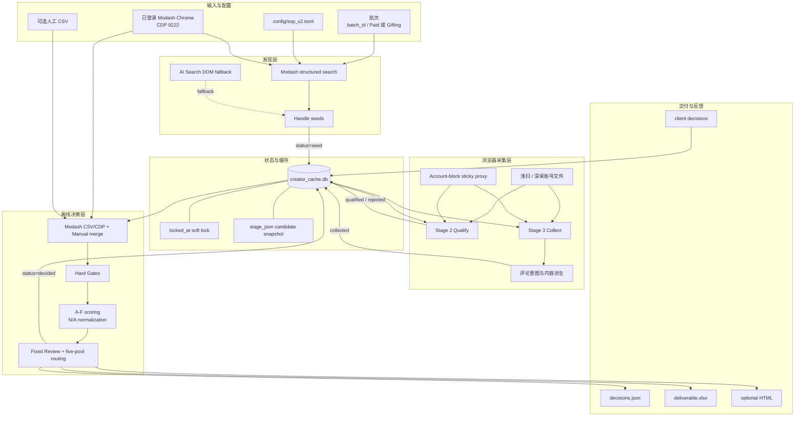

# 当前系统架构与细节设计

更新日期：2026-07-22

## 1. 架构结论

当前系统是一个单机、串行、操作者驱动的批处理 ETL 与规则决策系统，不是 Web 服务。
生产主线为：

```text
Modash-first discovery
    → Playwright browser-only Instagram collection
    → SQLite candidate state machine
    → offline gates/scoring/routing
    → JSON/XLSX/HTML delivery
    → client feedback
```

仓库同时保留旧 `discover.py + account_pool.py + instagrapi` 管道，但它属于 Legacy。
旧管道的账号 cooldown、暖 Session 和请求级轮换没有接入当前 V2 浏览器主线。

当前事实源优先级：

1. [`config/sop_v2.toml`](../config/sop_v2.toml)：业务与流水线配置；
2. [`scripts/extensions/sop_v2/pipeline/`](../scripts/extensions/sop_v2/pipeline/)：实际阶段编排；
3. [`scripts/browser_collect_v2.py`](../scripts/browser_collect_v2.py)：实际 Instagram 采集行为；
4. [`docs/sop_v2/PIPELINE_SPEC.md`](sop_v2/PIPELINE_SPEC.md)：状态机与数据库边界；
5. [`docs/sop_v2/RUNBOOK.md`](sop_v2/RUNBOOK.md)：人工运行流程。

若文档、配置、测试和代码冲突，应先停止扩大批次，明确业务口径，再同步四者。

## 2. 系统边界

系统内：

- Modash 发现、受众数据补充和缓存；
- Instagram Profile、帖子、评论、Bio 外链和 Storefront 浏览器采集；
- 候选状态、阶段缓存、业务淘汰和客户反馈；
- 硬门禁、A-F 评分、五池路由和交付导出。

系统外：

- 邮件、DM 和达人联络；
- Gift、Campaign、Payment 执行；
- 自动通过验证码、challenge 或真人验证；
- TikTok 和全网内容监控；
- 第三方平台余额购买与审批。

## 3. 端到端组件图



## 4. 四阶段职责

### 4.1 Stage 1：Discover

入口：[`stage1_discover.py`](../scripts/extensions/sop_v2/pipeline/stage1_discover.py)

默认使用 Modash 内部结构化搜索接口：

- 根据 Track 选择粉丝范围；
- 传入创作者国家、受众可信度、ER 参考值等条件；
- 按 `skip` 分页；
- 过滤品牌号、私密号和无效 Handle；
- 调用 `creator_cache.seed_handles()` 去重并写 `status=seed`。

旧 AI Search 页面 DOM 抽取保留为显式兜底，不是默认发现器。Stage 1 不消耗
Instagram 账号。

当前顶层 `run_pipeline` 没有把 `--track` 传给 Stage 1，因此 Gifting 一键运行可能仍用
Paid 搜索范围；完整批次优先分阶段执行。

### 4.2 Stage 2：Qualify

入口：[`stage2_qualify.py`](../scripts/extensions/sop_v2/pipeline/stage2_qualify.py)

使用登录态浏览器做一次低成本 Profile 浅扫：

- OG/DOM 提取粉丝、全名、Bio、帖子 codes 和外链；
- 判断 challenge、登录墙、私密账号和品牌账号；
- 执行与 Track 无关的宽粉丝粗筛；
- 展开 Bio 多链接并穿透聚合页；
- 派生 Storefront、赛道和品牌类型；
- 业务合格进入 `qualified`，明确业务不合格进入 `rejected`。

登录墙、导航失败和未分类异常写 `stage_error`，不改变 `status`。

当前实现把 `storefront_status=confirmed_no` 直接淘汰，与路由支持
`Include-Without-Storefront` 的规则冲突；聚合页导航失败也可能被误作 confirmed_no。

### 4.3 Stage 3：Collect

入口：[`stage3_collect.py`](../scripts/extensions/sop_v2/pipeline/stage3_collect.py)

使用隔离深采池逐帖采集：

- 最多打开前 N 个帖子或 Reels；
- 从 OG 解析 Caption、点赞数和评论数；
- 对推广帖或高评论帖加载评论；
- 抽取 `{username, text}`，识别多语言高/中/低购买意图；
- 计算有效评论数、低质比例、真实 ER 均值和中位数；
- 派生赞助饱和、Amazon Finds 比例、产品/品牌/场景/专业词信号；
- 完整性检查通过后写 `status=collected`。

当前证据以结构化评论原话和帖子 URL 为主。代码保留截图工具，但主深采已将
`comment_shots` 固定为空。

Stage 3 通常复用 Stage 2 保存的帖子 codes，因此可能跳过 Grid 登录检查；帖子登录墙
也缺少独立检测，一个空帖子结果可能被接受为 partial collected。这是账号与完整性审计的
高优先级缺口。

### 4.4 Stage 4：Decide

入口：[`stage4_decide.py`](../scripts/extensions/sop_v2/pipeline/stage4_decide.py)

Stage 4 不再访问 Instagram：

1. 导出同批次的 `qualified/collected/decided/rejected`；
2. 合并 Modash CSV 或 CDP 报告；
3. 合并人工 Raw Skin、VO、报价和品牌合作证据；
4. 对机器 rejected 直接生成 Exclude 决策；
5. 对其余候选执行 Gates、A-F Scoring 和 Routing；
6. 写 `decisions.json`、XLSX，并推进 `collected → decided`。

补数采用“已有非空值不被低优先级来源静默覆盖”的原则；人工 CSV 为最高优先级。
Modash 原始报告会做本地缓存，缓存命中时不重复消耗 Profile credit。

## 5. 数据与状态设计

当前 [`creator_cache.py`](../scripts/extensions/sop_v2/creator_cache.py) 使用一张
`creator_profiles` 表同时承担：

- 创作者浅扫缓存；
- 当前候选事实快照；
- 阶段队列；
- 候选软锁；
- 业务淘汰；
- 客户反馈与资产等级。

### 5.1 关键字段组

| 字段组 | 代表字段 | 用途 |
|---|---|---|
| 身份与浅扫 | `handle`、`follower_count`、`biography`、`storefront_status` | 快速查询和去重 |
| 流水线 | `status`、`stage_updated_at`、`locked_at`、`stage_error` | 阶段推进和恢复 |
| 批次 | `discovery_batch`、`reject_reason`、`final_pool` | 批次交付与机器决策 |
| 完整快照 | `stage_json` | 逐阶段累积候选事实 |
| 资产与客户 | `tier`、`client_status`、`approved_at`、`rejected_reason` | 飞轮和客户反馈 |

### 5.2 三列正交

`status`、`tier` 和 `client_status` 不能互相替代：

- 候选可以已经 `decided`，但仍是 Tier 1；
- 客户批准后 Tier 单调晋升到 2，不倒退流水线状态；
- 客户拒绝与机器 `status=rejected` 使用不同字段和原因。

### 5.3 数据库 API

- `seed_handles`：新 Handle 写入 seed，已存在者增加来源次数；
- `claim_queue`：按状态、批次和软锁领取；
- `advance`：写 stage_json、热列、状态并清锁/错误；
- `reject`：保存业务淘汰原因和已采数据；
- `mark_error`：只写最后错误并清锁；
- `audit_collect_completeness` / `requeue_incomplete_collects`：完整性补采；
- `import_feedback`：写客户状态和 Tier 2。

这种单表设计适合单机 MVP，但无法完整表示同一 Handle 跨批次/跨 Track 的不同候选身份，
也没有阶段事件历史、重试次数和每次采集 Attempt。

## 6. 门禁、评分与路由

### 6.1 Hard Gates

[`gates.py`](../scripts/extensions/sop_v2/gates.py) 处理：

- Paid/Gifting 粉丝范围；
- 可采集性；
- 创作者国家与 Top Audience Country；
- 假粉比例；
- General ER 参考和真实 ER；
- 赞助饱和；
- SHEIN/Temu 合作；
- 品牌、医疗工作室和私密账号；
- Storefront 和图谱来源完整性。

Gate 结果为 Pass、Review 或 Exclude，业务原因使用稳定 reason code。

### 6.2 A-F Scoring

[`scoring.py`](../scripts/extensions/sop_v2/scoring.py) 按模块产出 earned/applicable：

- A：赛道与内容；
- B：专业表达与真实感；
- C：社区信任；
- D：商业基础；
- E：受众质量；
- F：经济性和联系方式。

最终分数为 `earned / applicable × 100`。不适用项从分母移除；字段已适用但证据不足时
才按规则计 0 或进入 Review。当前 F 模块整体延期为 N/A。

### 6.3 Routing

[`routing.py`](../scripts/extensions/sop_v2/routing.py) 的优先级：

1. 任一 Exclude Gate；
2. 固定 Review；
3. Gifting 30K–50K Priority Review；
4. Lifestyle 封顶；
5. 其他 Gate Review；
6. 分数阈值；
7. Include 再按 Storefront 拆分。

当前实现中低于 Priority 阈值的候选全部进入 Review，配置里的低分 Exclude 阈值没有接入。

## 7. 浏览器、账号与代理

V2 账号调度由
[`pipeline/_base.py`](../scripts/extensions/sop_v2/pipeline/_base.py) 与
[`browser_collect_v2.py`](../scripts/browser_collect_v2.py) 共同实现：

- Stage 2 使用浅扫池，默认每账号 8 个候选；
- Stage 3 优先使用隔离深采池，默认每账号 3 个候选；
- 每个 username 对应一个 persistent Chrome profile；
- 每个账号处理块生成独立 Sticky 代理 session；
- 成功、业务淘汰和瞬时错误分别落库；
- 任意 error 关闭当前 Context，下一候选切下一账号。

它不是带账号健康状态的完整池管理器。持久 cooldown、账号租约、同候选换号重试、
完整 Cookie/UA 和代理出口审计尚未实现。详见
[`ACCOUNT_POOL_ARCHITECTURE.md`](ACCOUNT_POOL_ARCHITECTURE.md)。

## 8. 交付与反馈

[`export_v2_xlsx.py`](../scripts/export_v2_xlsx.py) 生成批次总览、五池和评论证据等
工作表；[`export_v2_html.py`](../scripts/export_v2_html.py) 可生成自包含交互页面。

客户选择通过
[`ingest_client_decisions.py`](../scripts/extensions/sop_v2/pipeline/ingest_client_decisions.py)
回流：

- approved/collaborated → Tier 2；
- rejected → 客户负向状态和原因；
- pending → 保留等待。

反馈不会自动修改配置。`golden_seeds()` 已能读取 Tier 2，但 Stage 1 自动用金种子发起
下一轮 Modash Lookalike 尚未接线。

## 9. 安全与数据边界

以下内容永不进入 Git：

- 账号、密码、TOTP、Cookie 和代理凭据；
- Chrome profile 和暖 Session；
- SQLite 数据库、候选池、评论证据和截图；
- 客户输入、人工证据、日志和交付文件；
- Modash 原始受众报告。

`.gitignore` 已覆盖这些目录。代码和文档不得回显凭据。对 challenge、验证码和真人验证
只能人工处理，脚本不得绕过。

当前 `redaction.py` 仍未接入导出或 Git 提交流程，且不扫描 XLSX；提交前需额外执行文本
和二进制文件清单检查。

## 10. 运行拓扑与并发边界

当前推荐拓扑：

```text
1 台操作机
1 个 Stage 进程
1 个顺序浏览器 worker
N 个本地账号 profile
1 个 SQLite WAL 数据库
```

候选 `claim_queue` 是先 SELECT 再逐行 UPDATE，不是原子 lease；账号 profile 也没有锁。
因此不应并行启动多个 Stage 2/3 worker，也不应让其他 Chrome 同时打开同一个 profile。

## 11. Legacy 组件

| 组件 | 旧职责 | 当前状态 |
|---|---|---|
| `discover.py` | 私有 API 六阶段线性发现 | Legacy |
| `discover_graph.py` | 私有 API 图谱扩散和 PageRank | Legacy |
| `account_pool.py` | instagrapi 请求级轮换和 cooldown | Legacy |
| `instagram_session.py` | 完整 Cookie 转暖 Session | Legacy |
| `discovery.db` | runs/candidates/creator graph/pod 数据 | Legacy 本地资产 |
| `config/seeds.toml` | 品牌、Hashtag、关键词和旧漏斗 | Legacy 配置 |

旧池可借鉴健康状态、冷却和池耗尽处理，但不能直接重新接回 V2，因为它包含私有 API、
密码/TOTP 冷登录和与浏览器不同的代理身份模型。

## 12. 已知架构债务

高优先级：

- Storefront 双轨与 Stage 2 early reject 冲突；
- V2 账号池没有健康状态、cooldown、租约和同候选换号重试；
- Stage 3 登录墙与 partial output 校验不足；
- Context 启动失败可能让一次认领的整批候选留锁；
- `run_pipeline` 不完整传递 Track、补数参数和阶段退出码；
- 配置、代码、文档和测试中的 ER、报价、低分路由等规则漂移；
- `FieldEvidence`、Batch Manifest 和 ScoreItem 证据没有贯通最终结果。

中优先级：

- Handle 全局主键不能表达跨批次/Track 重评；
- 软锁非原子、无 worker owner 和 heartbeat；
- 补数和原始缓存写入缺少原子替换、TTL 和 schema version；
- 评论采样与配置不完全一致；
- 脱敏扫描未形成交付和提交门禁；
- README 之外的部分历史文档仍保留旧架构措辞。

## 13. 建议演进方向

1. 先冻结 Storefront、真实 ER、低分 Exclude 和报价的业务真值；
2. 修复顶层 runner、退出码、Track 和补数参数；
3. 引入浏览器账号 Registry、Account Lease、持久 cooldown 和 Proxy Lease；
4. 将 creator、batch、batch_candidate、stage_attempt、evidence、client_decision 拆表；
5. 贯通 FieldEvidence、Manifest、Evidence Index 和脱敏门禁；
6. 修复规则测试并增加数据库、CSV、Pipeline、导出和反馈集成测试；
7. 将 Legacy 入口移入明确命名空间或归档，避免新操作者误用。
