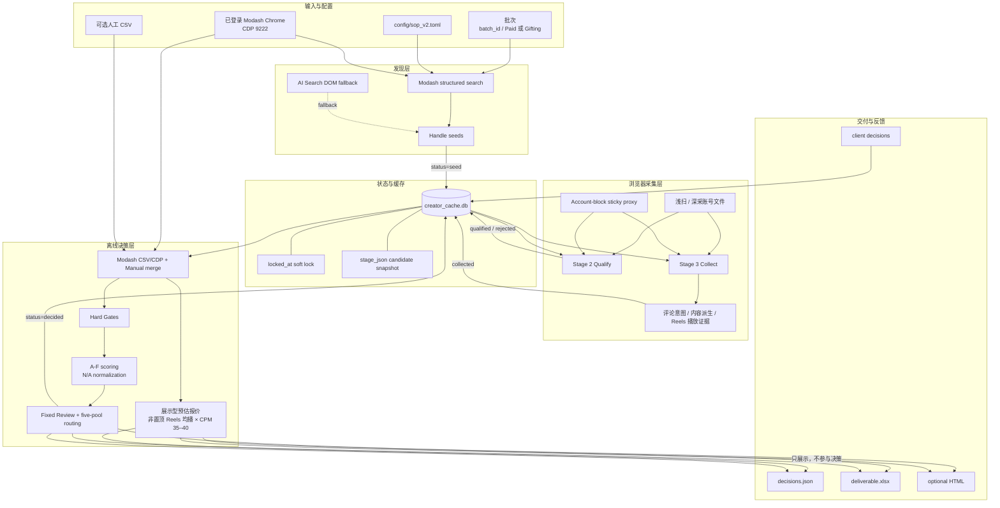

# 当前系统架构与细节设计

更新日期：2026-07-29

## 1. 架构结论

当前系统是一个单机、串行、操作者驱动的批处理 ETL 与规则决策系统，不是 Web 服务。
生产主线为：

```text
Modash-first discovery
    → Playwright browser-only Instagram collection
    → SQLite candidate state machine
    → offline gates/scoring/routing
    → JSON/XLSX/HTML delivery
    → client feedback
```

仓库同时保留旧 `discover.py + account_pool.py + instagrapi` 管道，但它属于 Legacy。
旧管道的账号 cooldown、暖 Session 和请求级轮换没有接入当前 V2 浏览器主线。

当前事实源优先级：

1. [`config/sop_v2.toml`](../config/sop_v2.toml)：业务与流水线配置；
2. [`scripts/extensions/sop_v2/pipeline/`](../scripts/extensions/sop_v2/pipeline/)：实际阶段编排；
3. [`scripts/browser_collect_v2.py`](../scripts/browser_collect_v2.py)：实际 Instagram 采集行为；
4. [`docs/sop_v2/PIPELINE_SPEC.md`](sop_v2/PIPELINE_SPEC.md)：状态机与数据库边界；
5. [`docs/sop_v2/RUNBOOK.md`](sop_v2/RUNBOOK.md)：人工运行流程。

若文档、配置、测试和代码冲突，应先停止扩大批次，明确业务口径，再同步四者。

## 2. 系统边界

系统内：

- Modash 发现、受众数据补充和缓存；
- Instagram Profile、帖子、评论、Bio 外链、通用电商 Storefront 和 Reels 播放证据采集；
- 候选状态、阶段缓存、业务淘汰和客户反馈；
- 硬门禁、A-F 评分、五池路由和交付导出。
- 最近 10 条非置顶 Reels 均播与 CPM 35–40 美元的展示型报价派生。

系统外：

- 邮件、DM 和达人联络；
- Gift、Campaign、Payment 执行；
- 自动通过验证码、challenge 或真人验证；
- TikTok 和全网内容监控；
- 第三方平台余额购买与审批。

## 3. 端到端组件图



## 4. 四阶段职责

### 4.1 Stage 1：Discover

入口：[`stage1_discover.py`](../scripts/extensions/sop_v2/pipeline/stage1_discover.py)

默认使用 Modash 内部结构化搜索接口：

- 根据 Track 选择粉丝范围；
- 传入创作者国家、受众可信度、ER 参考值等条件；
- 按 `skip` 分页；
- 过滤品牌号、私密号和无效 Handle；
- 调用 `creator_cache.seed_handles()` 去重并写 `status=seed`。

旧 AI Search 页面 DOM 抽取保留为显式兜底，不是默认发现器。Stage 1 不消耗
Instagram 账号。

当前顶层 `run_pipeline` 没有把 `--track` 传给 Stage 1，因此 Gifting 一键运行可能仍用
Paid 搜索范围；完整批次优先分阶段执行。

### 4.2 Stage 2：Qualify

入口：[`stage2_qualify.py`](../scripts/extensions/sop_v2/pipeline/stage2_qualify.py)

使用登录态浏览器做一次低成本 Profile 浅扫：

- OG/DOM 提取粉丝、全名、Bio、帖子 codes 和外链；
- 判断 challenge、登录墙、私密账号和品牌账号；
- 执行与 Track 无关的宽粉丝粗筛；
- 展开 Bio 多链接并穿透聚合页；
- 派生通用 Storefront、赛道和品牌类型；
- 业务合格进入 `qualified`，明确业务不合格进入 `rejected`。

登录墙、导航失败和未分类异常写 `stage_error`，不改变 `status`。

Storefront 不是 Amazon-only 白名单：Amazon、LTK、ShopMy、明确自营店和已识别的购物
聚合入口都算 `confirmed_yes`；`confirmed_no` 表示确认没有购物入口，但仍进入深采；
`unknown` 表示证据不足，留给 Stage 4 Review。Stage 2 不得因
`no_amazon_storefront`、`confirmed_no` 或聚合页暂时导航失败而业务淘汰。

### 4.3 Stage 3：Collect

入口：[`stage3_collect.py`](../scripts/extensions/sop_v2/pipeline/stage3_collect.py)

使用隔离深采池逐帖采集：

- 每次先刷新当前主页 Grid，以本次最新的最近 N 帖冻结核心深采窗口；Stage 2 保存的
  codes 不是本轮窗口的权威输入；
- 逐个打开核心窗口内的帖子，从 OG 解析 Caption、点赞数和评论数；
- 对每个成功打开的帖子核验评论：只有明确 `comment_count=0` 才可直接记为完成；
  评论数为正或未知时必须尝试加载评论，未能取得可配对评论则记为评论核验失败；
- 抽取 `{username, text}`，识别多语言高/中/低购买意图；
- 计算有效评论数、低质比例、真实 ER 均值和中位数；
- 派生赞助饱和、Amazon Finds 比例、产品/品牌/场景/专业词信号；
- 独立进入 Reels Tab，先识别并排除置顶 Reels，再按时间倒序采集最近 10 条的播放量与
  帖子证据；报价窗口不得覆盖主页最近 N 帖的核心深采窗口；
- 写入 `pricing_reel_samples`，并保留样本 URL、发布时间、播放量、置顶状态、来源和采集时间；
- 完整性检查通过后写 `status=collected`。

当前证据以结构化评论原话和帖子 URL 为主。代码保留截图工具，但主深采已将
`comment_shots` 固定为空。

Stage 3 将完整性契约同时落入 `deep_target_posts`、`deep_available_posts`、
`deep_successful_posts`、`comment_attempted_posts`、`comment_completed_posts` 和
`deep_collection_status`。三类失败 URL 分别保存在 `deep_failed_posts`（导航失败）、
`deep_metric_missing_posts`（互动指标缺失）和 `comment_failed_posts`（评论核验失败）；
严格模式下任一缺口都会保持原状态等待补采，而不是把 partial 当作完整采集。

对于新 contract 字段落库前的历史记录，正式门禁只接受可验证的 legacy evidence：
`sampled_posts >= 10`、`comments_analyzed > 0`、`valid_comments >= 20`、`real_er`
非空，且至少有一个可观察互动指标。该边界用于证明旧记录已做过等价深采，不是降低标准；
任一条件不满足仍进入精确补采。

### 4.4 Stage 4：Decide

入口：[`stage4_decide.py`](../scripts/extensions/sop_v2/pipeline/stage4_decide.py)

Stage 4 不再访问 Instagram：

1. 导出同批次的 `qualified/collected/decided/rejected`；
2. 合并 Modash CSV 或 CDP 报告；
3. 合并人工 Raw Skin、VO、报价和品牌合作证据；
4. 派生展示型 `pricing_estimate`，缺原生样本时才使用带来源标记的 Modash 均播 fallback；
5. 对机器 rejected 直接生成 Exclude 决策；
6. 对其余候选执行 Gates、A-F Scoring 和 Routing；
7. 写 `decisions.json`、XLSX，并推进 `collected → decided`。

补数采用“已有非空值不被低优先级来源静默覆盖”的原则；人工 CSV 为最高优先级。
Modash 原始报告会做本地缓存，缓存命中时不重复消耗 Profile credit。

当前 Modash CDP 兼容层绑定已登录的
`https://marketer.modash.io/discovery/instagram`：先以 Creator 模式
`filters.username` 精确查找并核对 Handle，解析当前 `serviceSdId`，同时兼容旧
`servicePlatformId`。短暂空响应做有限重试；旧 bulk discovery 只是兜底，不能用于模糊配对。

正式交付必须使用
`--strict-completeness --full-deep-all-candidates --deep-target-posts 10`；Stage 4 会在
补数、决策和导出前复核全部候选的核心深采契约，任一缺口都会阻断正式产物。内部草稿需
显式采用相应的放宽开关，不能冒充正式交付。

Carryover 的 Stage 4 复跑按当前证据幂等判断：`needs_pipeline_retry=true` 的历史
`collected/rejected` 可继续处理；历史行即使已是 `decided`，也只有在 `_stage_error`
为空且 `strict_deep_reasons` 通过时才能复用。这样既允许已完成记录安全续跑，也防止旧的
不完整 `decided` 穿门；相同 manifest 成功复跑后必须保持 `retry_pending_count=0`。

## 5. 数据与状态设计

当前 [`creator_cache.py`](../scripts/extensions/sop_v2/creator_cache.py) 使用一张
`creator_profiles` 表同时承担：

- 创作者浅扫缓存；
- 当前候选事实快照；
- 阶段队列；
- 候选软锁；
- 业务淘汰；
- 客户反馈与资产等级。

### 5.1 关键字段组

| 字段组 | 代表字段 | 用途 |
|---|---|---|
| 身份与浅扫 | `handle`、`follower_count`、`biography`、`storefront_status`、`storefront_type`、`storefront_url` | 快速查询和去重 |
| 流水线 | `status`、`stage_updated_at`、`locked_at`、`stage_error` | 阶段推进和恢复 |
| 批次 | `discovery_batch`、`reject_reason`、`final_pool` | 批次交付与机器决策 |
| 展示估价 | `pricing_reel_samples`、`pricing_estimate`、`pricing_captured_at` | 保存原生样本、公式结果和来源状态 |
| 完整快照 | `stage_json` | 逐阶段累积候选事实 |
| 资产与客户 | `tier`、`client_status`、`approved_at`、`rejected_reason` | 飞轮和客户反馈 |

### 5.2 三列正交

`status`、`tier` 和 `client_status` 不能互相替代：

- 候选可以已经 `decided`，但仍是 Tier 1；
- 客户批准后 Tier 单调晋升到 2，不倒退流水线状态；
- 客户拒绝与机器 `status=rejected` 使用不同字段和原因。

### 5.3 数据库 API

- `seed_handles`：新 Handle 写入 seed，已存在者增加来源次数；
- `claim_queue`：按状态、批次和软锁领取；
- `advance`：写 stage_json、热列、状态并清锁/错误；
- `reject`：保存业务淘汰原因和已采数据；
- `mark_error`：只写最后错误并清锁；
- `audit_collect_completeness` / `requeue_incomplete_collects`：完整性补采；
- `import_feedback`：写客户状态和 Tier 2。

这种单表设计适合单机 MVP，但无法完整表示同一 Handle 跨批次/跨 Track 的不同候选身份，
也没有阶段事件历史、重试次数和每次采集 Attempt。

## 6. 门禁、评分与路由

### 6.1 Hard Gates

[`gates.py`](../scripts/extensions/sop_v2/gates.py) 处理：

- Paid/Gifting 粉丝范围；
- 可采集性；
- 创作者国家与 Top Audience Country；
- 假粉比例；
- General ER 参考和真实 ER；
- 赞助饱和；
- SHEIN/Temu 合作；
- 品牌、医疗工作室和私密账号；
- Storefront 三态和图谱来源完整性。

Gate 结果为 Pass、Review 或 Exclude，业务原因使用稳定 reason code。
Storefront 的 `confirmed_yes` 与 `confirmed_no` 都是 Pass；只有 `unknown` 是 Review。

### 6.2 A-F Scoring

[`scoring.py`](../scripts/extensions/sop_v2/scoring.py) 按模块产出 earned/applicable：

- A：赛道与内容；
- B：专业表达与真实感；
- C：社区信任；
- D：商业基础；
- E：受众质量；
- F：经济性和联系方式。

最终分数为 `earned / applicable × 100`。不适用项从分母移除；字段已适用但证据不足时
才按规则计 0 或进入 Review。当前 F 模块整体延期为 N/A。

### 6.3 Routing

[`routing.py`](../scripts/extensions/sop_v2/routing.py) 的优先级：

1. 任一 Exclude Gate；
2. 固定 Review；
3. Gifting 30K–50K Priority Review；
4. Lifestyle 封顶；
5. 其他 Gate Review；
6. 分数阈值；
7. Include 再按 Storefront 拆分。

当前实现中低于 Priority 阈值的候选全部进入 Review，配置里的低分 Exclude 阈值没有接入。

### 6.4 展示型报价与实际 CPM 的边界

`pricing.py` 负责客户在 2026-07-28 新增的展示型报价。顺序必须是“先排置顶，再取最近
10 条”，不能从主页前 10 条中删除置顶后直接用不足 10 条的结果冒充完整窗口。

```text
average_plays = 最近 10 条非置顶 Reels 播放量之和 / 样本数
default_quote_usd = average_plays × 35 / 1000
quote_range_usd = [average_plays × 35 / 1000, average_plays × 40 / 1000]
```

`pricing_estimate` 保存 `sample_count/requested_reels`、`average_plays`、
`pinned_excluded`、`source`、`cpm_usd`、`quote_usd` 和逐 Reel 证据。状态语义：

- `complete`：10 条 Instagram 原生、已确认非置顶且有播放量的 Reels；
- `partial`：只有 1–9 条合格原生样本，按实际样本计算并显式警告；
- `fallback_modash`：没有合格原生样本，使用 Modash Profile 均播，只能称第三方 fallback；
- `missing`：两类数据都没有，报价为空。

该对象只进入 JSON/XLSX/HTML 展示。它不是红人/代理的实际报价，不写 `paid_cpm`，也不作为
Gate observed 值、F 模块评分输入、固定 Review 原因或路由条件。未来若恢复实际 Paid CPM，
仍必须使用真实报价证据 ÷ 原生曝光 × 1000 的独立口径。

## 7. 浏览器、账号与代理

V2 账号调度由
[`pipeline/_base.py`](../scripts/extensions/sop_v2/pipeline/_base.py) 与
[`browser_collect_v2.py`](../scripts/browser_collect_v2.py) 共同实现：

- Stage 2 使用浅扫池，默认每账号 8 个候选；
- Stage 3 优先使用隔离深采池，默认每账号 3 个候选；
- 每个 username 对应一个 persistent Chrome profile；
- 每个账号处理块生成独立 Sticky 代理 session；同次块内固定出口，跨次运行使用新 nonce 换出口；
- 成功、业务淘汰和瞬时错误分别落库；
- 任意 error 关闭当前 Context，下一候选切下一账号。

它不是带账号健康状态的完整池管理器。持久 cooldown、账号租约、同候选换号重试、
完整 Cookie/UA 和代理出口审计尚未实现。浏览器导航错误会保留脱敏后的网络错误码，
用于区分隧道故障、超时和 HTTP 限流。详见
[`ACCOUNT_POOL_ARCHITECTURE.md`](ACCOUNT_POOL_ARCHITECTURE.md)。

## 8. 交付与反馈

[`export_v2_xlsx.py`](../scripts/export_v2_xlsx.py) 生成批次总览、五池和评论证据等
工作表；[`export_v2_html.py`](../scripts/export_v2_html.py) 生成自包含交互页面，客户可逐人
选择“合适/不合适/待定”、填写原因并导出回传 JSON。

客户选择通过
[`ingest_client_decisions.py`](../scripts/extensions/sop_v2/pipeline/ingest_client_decisions.py)
回流。真实写入必须同时提供客户 JSON 与生成该 HTML 的 `decisions*.json` 基线；导入器会
校验评审批次、逐行不可变来源批次、白名单、pool/score 和数据库状态，并在单事务中写入
SHA-256 ledger：

- approved/collaborated → Tier 2；
- rejected → 客户负向状态和原因；
- pending → 保留等待。

反馈不会自动修改配置。`prepare_next_round.py` 将未终判和采集不完整项写入 carryover
manifest，不改写原始 `discovery_batch`；`audit_collect --retry-manifest --strict
--full-deep-all-candidates --target-posts 10` 可精确补采，`stage4_decide
--carryover-manifest --strict-completeness --full-deep-all-candidates
--deep-target-posts 10` 只组合清单旧账号与当前新批账号并执行正式完整性门禁。

`golden_seeds()` 只返回客户 approved/collaborated 的 Tier 2。现有 Modash 缓存没有可离线
抽取的 Lookalike 列表，因此 Stage 1 会先导出带种子集合指纹的人工模板，再严格回导
`golden-lookalikes-v1`；普通结构化搜索只是补充来源，不冒充金种子自动闭环。

正式产物写入
`reports/deliveries/<batch_id>/formal-<YYYYMMDD>-r<N>/`。客户收到的版本立即冻结，不得原地
覆盖；任何修复都递增 `rN`，同时保留该版本 `decisions.json` 基线、XLSX、HTML、原始第三方
报告缓存和 SHA-256。当前 `SKIN4-20260723/formal-20260729-r2` 的审计快照为：

- 157 个唯一 Handle，精确由 89 个 carryover 与 68 个本轮新账号组成；
- `retry_pending_count=0`，严格深采门禁通过；
- 五池为 Priority-Review 2、Review 96、Exclude 59；
- 定价 156 个原生 `complete`、1 个显式 `fallback_modash`；
- `formal-20260728-r1` 保持冻结，未被 r2 覆盖。

## 9. 安全与数据边界

以下内容永不进入 Git：

- 账号、密码、TOTP、Cookie 和代理凭据；
- Chrome profile 和暖 Session；
- SQLite 数据库、候选池、评论证据和截图；
- 客户输入、人工证据、日志和交付文件；
- Modash 原始受众报告。

`.gitignore` 已覆盖这些目录。代码和文档不得回显凭据。对 challenge、验证码和真人验证
只能人工处理，脚本不得绕过。

当前 `redaction.py` 仍未接入导出或 Git 提交流程，且不扫描 XLSX；提交前需额外执行文本
和二进制文件清单检查。

## 10. 运行拓扑与并发边界

当前推荐拓扑：

```text
1 台操作机
1 个 Stage 进程
1 个顺序浏览器 worker
N 个本地账号 profile
1 个 SQLite WAL 数据库
```

候选 `claim_queue` 是先 SELECT 再逐行 UPDATE，不是原子 lease；账号 profile 也没有锁。
因此不应并行启动多个 Stage 2/3 worker，也不应让其他 Chrome 同时打开同一个 profile。

## 11. Legacy 组件

| 组件 | 旧职责 | 当前状态 |
|---|---|---|
| `discover.py` | 私有 API 六阶段线性发现 | Legacy |
| `discover_graph.py` | 私有 API 图谱扩散和 PageRank | Legacy |
| `account_pool.py` | instagrapi 请求级轮换和 cooldown | Legacy |
| `instagram_session.py` | 完整 Cookie 转暖 Session | Legacy |
| `discovery.db` | runs/candidates/creator graph/pod 数据 | Legacy 本地资产 |
| `config/seeds.toml` | 品牌、Hashtag、关键词和旧漏斗 | Legacy 配置 |

旧池可借鉴健康状态、冷却和池耗尽处理，但不能直接重新接回 V2，因为它包含私有 API、
密码/TOTP 冷登录和与浏览器不同的代理身份模型。

## 12. 已知架构债务

高优先级：

- V2 账号池没有健康状态、cooldown、租约和同候选换号重试；
- 历史结转候选缺少原生 Reels 播放或置顶证据时只能降级为
  `partial/fallback_modash/missing`，不能回填为完整窗口；
- Context 启动失败可能让一次认领的整批候选留锁；
- `run_pipeline` 不完整传递 Track、补数参数和阶段退出码；
- 配置、代码、文档和测试中的 ER、报价、低分路由等规则漂移；
- `FieldEvidence`、Batch Manifest 和 ScoreItem 证据没有贯通最终结果。

中优先级：

- Handle 全局主键不能表达跨批次/Track 重评；
- 软锁非原子、无 worker owner 和 heartbeat；
- 补数和原始缓存写入缺少原子替换、TTL 和 schema version；
- 脱敏扫描未形成交付和提交门禁；
- README 之外的部分历史文档仍保留旧架构措辞。

## 13. 建议演进方向

1. 持续用配置、规则模块和测试守住 Storefront 三态、真实 ER、低分路由以及
   “展示估价/实际 CPM”两条独立口径；
2. 修复顶层 runner、退出码、Track 和补数参数；
3. 引入浏览器账号 Registry、Account Lease、持久 cooldown 和 Proxy Lease；
4. 将 creator、batch、batch_candidate、stage_attempt、evidence、client_decision 拆表；
5. 贯通 FieldEvidence、Manifest、Evidence Index 和脱敏门禁；
6. 修复规则测试并增加数据库、CSV、Pipeline、导出和反馈集成测试；
7. 将 Legacy 入口移入明确命名空间或归档，避免新操作者误用。
