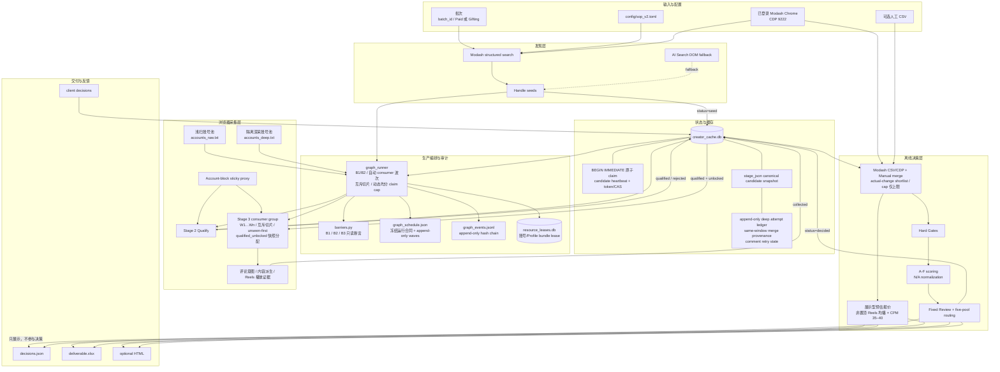
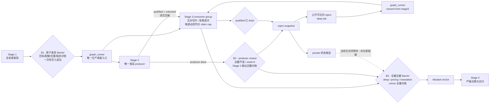

# 当前系统架构与细节设计

更新日期：2026-08-11

## 1. 架构结论

当前系统是一个单机、Barrier 驱动、阶段级流水并发的批处理 ETL 与规则决策系统，不是
Web 服务。唯一正式生产调度入口是 `extensions.sop_v2.pipeline.graph_runner`：它在 Stage 2/3
之间维护一个浅采 producer 加一个可水平扩展的深采 consumer group；Stage 3 只有在候选原子
队列、账号/Profile 跨进程 lease 和冻结运行合同同时成立时才能扩 worker。
生产主线为：

```text
Stage 1 atomic discovery → graph_runner verifies B1
    → 1× Stage 2 shallow producer ∥ Stage 3 deep consumer group (W1…Wn)
    → graph_runner verifies B2 + drains qualified
    → public reject tail → graph_runner Stage 3 resume
    → explicit B3 full deep/pricing/translation barrier
    → Modash enrich → offline gates/scoring/routing
    → JSON/XLSX/HTML delivery → client feedback
```

仓库同时保留旧 `discover.py + account_pool.py + instagrapi` 管道，但它属于 Legacy。
旧管道的账号 cooldown、暖 Session 和请求级轮换没有接入当前 V2 浏览器主线。

当前事实源优先级：

1. [`config/sop_v2.toml`](../config/sop_v2.toml)：业务与流水线配置；
2. [`graph_runner.py`](../scripts/extensions/sop_v2/pipeline/graph_runner.py)：正式 Stage 2/3 DAG 编排；
3. [`scripts/browser_collect_v2.py`](../scripts/browser_collect_v2.py)：实际 Instagram 采集行为；
4. [`docs/sop_v2/PIPELINE_SPEC.md`](sop_v2/PIPELINE_SPEC.md)：状态机与数据库边界；
5. [`docs/sop_v2/RUNBOOK.md`](sop_v2/RUNBOOK.md)：人工运行流程。

若文档、配置、测试和代码冲突，应先停止扩大批次，明确业务口径，再同步四者。

## 2. 系统边界

系统内：

- Modash 发现、受众数据补充和缓存；
- Instagram Profile、帖子、评论、Bio 外链、通用电商 Storefront 和 Reels 播放证据采集；
- 候选状态、阶段缓存、业务淘汰和客户反馈；
- 硬门禁、A-F 评分、五池路由和交付导出。
- 最近 10 条非置顶 Reels 均播与 CPM 35–40 美元的展示型报价派生。

系统外：

- 邮件、DM 和达人联络；
- Gift、Campaign、Payment 执行；
- 自动通过验证码、challenge 或真人验证；
- TikTok 和全网内容监控；
- 第三方平台余额购买与审批。

## 3. 端到端组件图



### 3.1 固定执行 DAG 与 Barrier

上图描述组件依赖；生产时序只能采用下面的 DAG：



Barrier 是持久状态与工件的断言，不是进程先后顺序，也不是退出码：

- **B1**：Stage 1 必须先在内存完成全部来源、配额、全局去重和来源归因；只有完整集合满足
  合同才一次性落 seed。任何来源短缺或指纹不一致都不得留下可供 Stage 2 消费的部分批次。
- **B1→B2**：`graph_runner` 只读验证 B1 后，启动恰好一个 Stage 2 producer 与一个 Stage 3
  consumer group 并发。consumer group 可有一个或多个 worker；runner 自动生成有限
  `limit`、确定性互斥账号切片、独立 sticky session，并在启动前获取账号/Profile bundle
  lease。每波以启动前的 `qualified_unlocked_count=Q` 快照冻结 `claim_plan`，在全部 worker
  间确定性均分有限正数 claim cap；瞬时队列为空只表示 consumer 暂时追上 producer。
- **B2**：Stage 2 进程实际退出后，数据库必须证明候选总数等于 B1、`seed=0`、
  `qualified + collected + rejected` 等于 B1 目标，并且 `status='seed'` 工作集的错误和锁均为
  零。B2 只关闭浅采 producer；并发 Stage 3 此时仍可持有 `qualified` 锁，或在严格失败后给
  `qualified` 写入 `deep_incomplete` 等 `stage_error`，不得用全批 `error=0/lock=0` 错误阻塞
  B2。这些深采状态统一由 B3 清零。此后先保存机器 reject 快照，再把明确公开可访问的 reject
  精确转入 deep tail。
- **private 边界**：private 保持机器终态，不得伪造帖子证据。当前轮次合同/严格深采门禁还
  没有 private 终态例外；存在 private 时正式流必须在 B3 前停住，等待合同和实现共同支持。
- **B3**：`graph_runner` 在 B2 与队列 drain 后返回，但不会把返回值冒充 B3。公开 reject tail
  精确 requeue 后，必须用同一冻结合同执行 `--resume --resume-from-stage3`；随后显式 B3 要求
  生产端已闭合、公开 cohort 全部严格深采完成、报价状态逐项对账、全部已存评论
  翻译完成或明确不需要，且包括 B2 时允许存在的深采错误和锁在内，失败/覆盖不足/锁/漏数
  均为零。`audit/pricing/translation` 外部计数缺失也按失败处理。越过 B3 后才能消耗 Modash
  Profile credit，随后才能做 Stage 4。

禁止跨 Barrier，禁止把默认拓扑临时改成全串行，禁止同账号/Profile 的并发访问。手工多终端
Stage 2/3 清单与全串行 `run_pipeline` 都只能用于另行标记的历史复现/开发诊断，不能继承正式
轮次完成状态。

## 4. 四阶段职责

### 4.1 Stage 1：Discover

入口：[`stage1_discover.py`](../scripts/extensions/sop_v2/pipeline/stage1_discover.py)

默认使用 Modash 内部结构化搜索接口：

- 按 50% 金种子 Lookalike、30% 通用电商、20% 主题探索规划总目标；
- 金种子不足时将缺口按 30:20 重分配给两类结构化搜索；
- 根据 Track 选择粉丝范围；
- 传入创作者国家、受众可信度、ER 参考值等条件；
- 按 `skip` 分页；
- 过滤品牌号、私密号和无效 Handle；
- 调用 `creator_cache.seed_handles()` 去重并写 `status=seed`。

旧 AI Search 页面 DOM 抽取保留为显式兜底，不是默认发现器。Stage 1 不消耗
Instagram 账号。

当前顶层 `run_pipeline` 没有把 `--track`、轮次合同和严格门禁完整传递给各阶段，也不实现
上述 producer/consumer 调度；正式批次禁止使用该全串行入口。

### 4.2 Stage 2：Qualify

生产编排入口：[`graph_runner.py`](../scripts/extensions/sop_v2/pipeline/graph_runner.py)；worker：
[`stage2_qualify.py`](../scripts/extensions/sop_v2/pipeline/stage2_qualify.py)

使用登录态浏览器做一次低成本 Profile 浅扫，并作为唯一浅采 producer 持续向 Stage 3
交接已提交、已解锁的 `qualified`：

- OG/DOM 提取粉丝、全名、Bio、帖子 codes 和外链；
- 判断 challenge、登录墙、私密账号和品牌账号；
- 执行与 Track 无关的宽粉丝粗筛；
- 展开 Bio 多链接并穿透聚合页；
- 派生通用 Storefront、赛道和品牌类型；
- 业务合格进入 `qualified`，明确业务不合格进入 `rejected`。

登录墙、导航失败和未分类异常写 `stage_error`，不改变 `status`。

Storefront 不是 Amazon-only 白名单：Amazon、LTK、ShopMy、明确自营店和已识别的购物
聚合入口都算 `confirmed_yes`；`confirmed_no` 表示确认没有购物入口，但仍进入深采；
`unknown` 表示证据不足，留给 Stage 4 Review。Stage 2 不得因
`no_amazon_storefront`、`confirmed_no` 或聚合页暂时导航失败而业务淘汰。

### 4.3 Stage 3：Collect

生产编排入口：[`graph_runner.py`](../scripts/extensions/sop_v2/pipeline/graph_runner.py)；worker：
[`stage3_collect.py`](../scripts/extensions/sop_v2/pipeline/stage3_collect.py)

使用与浅扫池账号集合完全隔离的深采池，由一个或多个 worker 组成 consumer group 逐帖采集。
每个 worker 只能认领已经 `qualified` 且 unlocked 的候选；Stage 2 尚未结束时一次 drain
暂时取空，不代表 B2 已完成。同阶段扩容的安全边界由候选队列原子认领和账号/Profile bundle
lease 共同构成，详见 §10：

worker 的账号/Profile 切片在整个 run contract 内固定，但候选 cap 按波动态均分。两个 worker
且配置上限为 24 时，`Q=20` 的 `claim_plan` 为 `10/10`，`Q=45` 为 `23/22`；这使仍有足够
候选的尾批继续并发，避免固定大上限让先运行的 worker 抢完队列。若 `0<Q<worker 数`，仍让
全部冻结切片以 `cap=1` 参与，实际候选由原子 claim 唯一领取，同时维持整池账号/Profile
lease 的跨 run 互斥；`Q=0` 不创建波次，任何 `limit=0` 都因可能表示无限量而被拒绝。

- 每次先刷新当前主页 Grid，以本次最新的最近 N 帖冻结核心深采窗口；Stage 2 保存的
  codes 不是本轮窗口的权威输入；
- 逐个打开核心窗口内的帖子，从 OG 解析 Caption、点赞数和评论数；
- 对每个成功打开的帖子核验评论：只有媒体指标明确 `comment_count=0` 才可直接记为
  `verified_zero`；评论数为正或未知时必须尝试加载评论，未能取得可配对评论默认记为评论
  核验失败；
- 正数评论计数与当前可见空评论线程并不等价。只有 DOM 可见叶节点精确匹配英文
  `No comments yet.`，且登录态 comments endpoint 同时以 HTTP 200/`status=ok` 回报 IG/FB
  评论数组和 `comment_count` 均为 0、全部 `has_more*` 为 false，才可记为独立状态
  `verified_empty_thread`；必须原样保留正数 `reported_count` 和双源 provenance，不得改写成
  `verified_zero`；
- 抽取并保存最多 120 条 `{username, text, post_url}` 原文；本机 Ollama 将全部已存评论从
  任意语言翻成简体中文，原文、源语言、译文、模型和失败状态逐条保留；
- 按评论身份去重后，用统一中文语义重算高/中/低购买意图、有效评论数与低质比例；XLSX
  “评论证据”表导出本轮 `comment_translations` 的全部结构化行，旧批才回退
  `comment_records`；HTML 卡片和五池摘要可截取代表样本，但不影响语义计算或 XLSX 全量证据；
- 计算真实 ER 均值和中位数；
- 派生赞助饱和、通用电商导购内容比例、产品/品牌/场景/专业词信号；
  代码中 `amazon_finds_ratio` / `amazon_finds_bands` 为兼容历史交付保留的字段名，
  当前语义已包含 Amazon、LTK、ShopMy、link-in-bio 和自营店等通用导购信号；
- 独立进入 Reels Tab，先识别并排除置顶 Reels，再按时间倒序采集最近 10 条的播放量与
  帖子证据；报价窗口不得覆盖主页最近 N 帖的核心深采窗口；
- 协作帖若带超长 access token，禁止截断猜 shortcode；只有媒体页 Instagram HTTPS canonical
  与原链接媒体类型一致、canonical code 是原 token 的精确值或前缀，并由同源 media-info
  `200` 响应 `code` 回证身份后才可取别名指标；
- 写入 `pricing_reel_samples`，并保留样本 URL、发布时间、播放量、置顶状态、来源和采集时间；
- 完整性检查通过后写 `status=collected`。

候选领取遵循 unseen-first 公平策略：`qualified` 队列中先领取从未写过 `stage_error` 的新项，
再按最旧 `stage_updated_at` 领取失败项。这样新的 producer 输出不会被少数反复失败账号饿死，
失败项也会按年龄稳定回到后续波次；领取、heartbeat 与终态提交仍分别受事务和 token/CAS
约束。

当前证据以结构化评论原话和帖子 URL 为主。代码保留截图工具，但主深采已将
`comment_shots` 固定为空。

Stage 3 将完整性契约同时落入 `deep_target_posts`、`deep_available_posts`、
`deep_successful_posts`、`comment_attempted_posts`、`comment_completed_posts` 和
`deep_collection_status`。三类失败 URL 分别保存在 `deep_failed_posts`（导航失败）、
`deep_metric_missing_posts`（互动指标缺失）和 `comment_failed_posts`（评论核验失败）；
严格模式下任一缺口都会保持原状态等待补采，而不是把 partial 当作完整采集。

#### 4.3.1 Attempt ledger 与单调 canonical

Stage 3 不在旧 `stage_json` 上原地覆盖深采字段。worker 先建立隔离工作副本，清除会伪装成
本次结果的旧深采输出，只保留稳定浅采输入、目标 refs/codes 和独立报价输入；结束时将本次
结果作为不可变 entry 追加到 `deep_collection_attempts`。每个 entry 保存内容 SHA、结果/
错误、确定性质量元组和完整证据（完全重复的 payload 只向前引用已有完整 owner），随后由
`deep_canonical_attempt_id` 指向当前最优的完整证据。质量较差的新尝试只能留下审计事件，
不能让顶层 canonical 回退。

合并策略 fail-closed。只有新旧双方都能给出完整、有效、顺序一致的目标窗口描述，且
target/available、描述类型和每个 media identity 全部相同时，才按 media identity 合并互补的
帖子、评论与已缓存译文，重算派生指标，并把 synthetic attempt 与双源 provenance 追加到
同一 ledger。窗口短缺、顺序不同、identity 不同、描述不完整或缓存译文不闭合时不做局部
field merge，只在两个 whole attempt 之间择优，杜绝跨时间窗口拼出不存在的快照。

评论连续失败是独立的 per-media 状态机 `stage3_comment_retry_state`：真实评论抽取失败进入
`retry_pending` 并累加连续次数；帖子导航失败是 no-op；采集成功或明确核验为 0 进入
`resolved` 并清零；符合终止合同的低评论量媒体进入 `terminal_unavailable`，直到真实成功/
零值将其复位。`verified_empty_thread` 只有在帖子内证据与 `comment_unavailable_posts` 的 media
identity、`reported_count`、DOM marker、endpoint summary 和双源 provenance 完整一致时也可
进入 `resolved`；它仍保留正数报告值，绝不降格成 `verified_zero`。普通 `reported_count>2` 的
空抽不论重复次数都保持 `retry_pending`/严格失败；只有 1–2 条的既有低量合同允许连续真实失败后
进入 `terminal_unavailable`。它避免把非连续失败或页面文案误判成终态，也避免已确认终态的
低量媒体每波无限重试。

报价取自另一套 Reels-only 窗口，以 `pricing_canonical_attempt_id` 和
`pricing_canonical_quality` 独立单调选择。报价质量不能参与主页/评论 attempt 胜负，主页
窗口质量也不能覆盖更好的报价 bundle。Stage 4 在客户交付边界移除 attempt ledger、两个
canonical 指针/质量对象和评论重试状态；客户 JSON/XLSX/HTML 只看到最终 canonical 业务
字段，不暴露内部重试历史。

对于新 contract 字段落库前的历史记录，正式门禁只接受可验证的 legacy evidence：
`sampled_posts >= 10`、`comments_analyzed > 0`、`valid_comments >= 20`、`real_er`
非空，且至少有一个可观察互动指标。该边界用于证明旧记录已做过等价深采，不是降低标准；
任一条件不满足仍进入精确补采。

### 4.4 Stage 4：Decide

入口：[`stage4_decide.py`](../scripts/extensions/sop_v2/pipeline/stage4_decide.py)

Stage 4 不再访问 Instagram：

1. 导出同批次的 `qualified/collected/decided/rejected`；
2. 合并 Modash CSV，或仅为可实际改变最终路由的 shortlist 获取 CDP Profile Report；
3. 合并人工 Raw Skin、VO、报价和品牌合作证据；
4. 从严格原生 Reels 证据派生展示型 `pricing_estimate`；Modash 均播不作报价 fallback；
5. 对机器 rejected 直接生成 Exclude 决策；
6. 对其余候选执行 Gates、A-F Scoring 和 Routing；
7. 写 `decisions.json`、XLSX，并推进 `collected → decided`。

补数采用“已有非空值不被低优先级来源静默覆盖”的原则；人工 CSV 为最高优先级。
Modash 原始报告会做本地缓存，缓存命中时不重复消耗 Profile credit。

CDP shortlist 是路由差分，而不是“缺字段就抓”或固定人数配额。系统先以当前事实执行一次
决策，再只对缺失的 Modash-owned 报告字段填入最乐观的合同内值执行第二次决策；只有
`final_pool` 严格晋级的候选才可购买报告。已有 `fake_pct`、国家、地区或 ER 等非空观测值
不会在投影中被覆盖，评论完整性、Storefront unknown、低实算 ER、赞助饱和、图谱审计和
Lifestyle 封顶等非 Modash blocker 也保持原状。因此 `--modash-cap=N` 只是 shortlist 截断上限，
不会为了达到 N 而消费无行动价值的 credit；`N=0` 表示不设上限。排序和截断均为确定性的。

当前 Modash CDP 兼容层绑定已登录的
`https://marketer.modash.io/discovery/instagram`：先以 Creator 模式
`filters.username` 精确查找并核对 Handle，解析当前 `serviceSdId`，同时兼容旧
`servicePlatformId`。短暂空响应做有限重试；旧 bulk discovery 只是兜底，不能用于模糊配对。

正式交付必须使用
`--strict-completeness --full-deep-all-candidates --deep-target-posts 10`；Stage 4 会在
补数、决策和导出前复核全部候选的核心深采契约，任一缺口都会阻断正式产物。内部草稿需
显式采用相应的放宽开关，不能冒充正式交付。

评论翻译的生产 owner 是 Stage 3：LLM 只处理已采原文，结果在 strict deep 检查和 canonical
attempt finalizer 之前进入同一候选快照，并由 B3 对覆盖/失败计数闭环。正式 Stage 4 的
`--strict-comment-translations` 只调用 `validate_translation_cohort`/
`validate_candidate_translations` 验收持久快照；验证器不调用 LLM、不接受展示上限来裁剪
集合、不重算语义，也不修改 candidate、翻译字段或 attempt ledger。翻译参数
`--translation-provider/model/api-url/batch-size/source-limit` 在这条正式路径上无效且不应传入。
`--translate-comments` 只兼容显式草稿/补译；只要提供 round contract，或启用 strict/full-deep
正式门禁，Stage 4 就会在任何 Modash 消耗和写盘前拒绝它。验收失败必须回到 Stage 3 或独立
恢复流程持久化完整翻译并重做 B3，不能在交付阶段原地修复冻结 ledger。

Carryover 的 Stage 4 复跑按当前证据幂等判断：`needs_pipeline_retry=true` 的历史
`collected/rejected` 可继续处理；历史行即使已是 `decided`，也只有在 `_stage_error`
为空且 `strict_deep_reasons` 通过时才能复用。这样既允许已完成记录安全续跑，也防止旧的
不完整 `decided` 穿门；相同 manifest 成功复跑后必须保持 `retry_pending_count=0`。

## 5. 数据与状态设计

当前 [`creator_cache.py`](../scripts/extensions/sop_v2/creator_cache.py) 仍以
`creator_profiles` 作为账号“当前状态投影”，同时增加了三类治理表；Stage 3 attempt ledger
则内嵌在 `stage_json`，用于保持当前单行状态机与历史兼容：

- `client_feedback_imports`：反馈文件与原交付基线 SHA ledger；
- `client_feedback_events`：逐账号 append-only 反馈事件；
- `policy_change_log`：append-only 策略提案、批准、拒绝和回滚链。

`creator_profiles` 继续承担：

- 创作者浅扫缓存；
- 当前候选事实快照；
- 阶段队列；
- 候选软锁；
- 业务淘汰；
- 客户反馈与资产等级。

编排状态不塞进候选业务表：`resource_leases.db` 保存跨批次账号/Profile bundle lease；
`data/runs/<batch_id>/graph_schedule.json` 以原子替换追加不可变波次，并冻结账号顺序、worker
切片、代码/配置/合同 SHA；同目录 `graph_events.jsonl` 逐行 append + fsync，每条带
`prev_hash/event_hash`，可验证 intent、资源获取、spawn、结果和释放的完整链。这些都是本地
运行工件，不含 Cookie 值、密码、TOTP 或代理凭据，也不进入 Git。

### 5.1 关键字段组

| 字段组 | 代表字段 | 用途 |
|---|---|---|
| 身份与浅扫 | `handle`、`follower_count`、`biography`、`storefront_status`、`storefront_type`、`storefront_url` | 快速查询和去重 |
| 流水线 | `status`、`stage_updated_at`、`locked_at`、`stage_error` | 阶段推进和恢复 |
| 批次 | `discovery_batch`、`reject_reason`、`final_pool` | 批次交付与机器决策 |
| 展示估价 | `pricing_reel_samples`、`pricing_estimate`、`pricing_captured_at` | 保存原生样本、公式结果和来源状态 |
| 深采重试 | `deep_collection_attempts`、`deep_canonical_attempt_id`、`pricing_canonical_attempt_id`、`stage3_comment_retry_state` | append-only 尝试、单调 canonical 与逐媒体连续失败状态 |
| 完整快照 | `stage_json` | 逐阶段累积候选事实 |
| 资产与客户 | `tier`、`client_status`、`approved_at`、`rejected_reason` | 飞轮和客户反馈 |

### 5.2 三列正交

`status`、`tier` 和 `client_status` 不能互相替代：

- 候选可以已经 `decided`，但仍是 Tier 1；
- 客户批准后 Tier 单调晋升到 2，不倒退流水线状态；
- 客户拒绝与机器 `status=rejected` 使用不同字段和原因。

### 5.3 数据库 API

- `seed_handles`：新 Handle 写入 seed，已存在者增加来源次数；
- `claim_queue`：以 `BEGIN IMMEDIATE` 按状态、批次和软锁原子领取并注入 token；深采队列先
  unseen、再按最旧失败时间公平排序；
- `renew_queue_claims`：candidate heartbeat 以 token/CAS 续租，失去所有权即停止提交；
- `advance`：写 stage_json、热列、状态并清锁/错误；
- `reject`：保存业务淘汰原因和已采数据；
- `mark_error`：只写最后错误并清锁；
- `audit_collect_completeness` / `requeue_incomplete_collects`：完整性补采；
- `apply_client_decisions`：单事务写客户状态投影、SHA ledger 和不可变反馈事件；
- `import_feedback`：Legacy 简化入口，不作为正式反馈回收命令。

当前仍无法完整表示同一 Handle 跨批次/跨 Track 的不同候选身份；Stage 3 已有 JSON 内嵌的
append-only attempt 历史，但还没有拆成关系型 `stage_attempt/evidence` 表。客户改判和策略
变更也已不再只依赖最后状态。

### 5.4 离线证据恢复边界

[`recover_deep_evidence.py`](../scripts/extensions/sop_v2/pipeline/recover_deep_evidence.py) 是事故
恢复工具，不参与常规 graph 消费。它以只读连接检查当前库和指定备份，只接受显式 Handle，
默认 dry-run 并输出脱敏计划与 `plan_sha256`。apply 必须带已人工审阅的
`--expected-plan-sha256`，并在写入前后重验配置 SHA、精确 `stage_json`/错误/受保护列 CAS、
批次归属、`qualified` 状态和零活动锁。

实际写入先 `BEGIN IMMEDIATE`，在第一条 UPDATE 前验证完整目标集合；仅更新 `stage_json` 与
对应深采热列，任一行漂移或写后校验失败则整批回滚。恢复与在线 ledger 共用同一 fail-closed
策略：只有完整 ordered same-window 才能按 media identity 合并，跨窗只做 whole-attempt
选择。恢复前必须停止 graph/worker 并另做数据库备份，生成的 dry-run/applied 审计工件只留
本地运行目录。

## 6. 门禁、评分与路由

### 6.1 Hard Gates

[`gates.py`](../scripts/extensions/sop_v2/gates.py) 处理：

- Paid/Gifting 粉丝范围；
- 可采集性；
- 创作者国家与 Top Audience Country；
- 假粉比例；
- General ER 参考和真实 ER；
- 赞助饱和；
- SHEIN/Temu 合作；
- 品牌、医疗工作室和私密账号；
- Storefront 三态和图谱来源完整性。

Gate 结果为 Pass、Review 或 Exclude，业务原因使用稳定 reason code。
Storefront 的 `confirmed_yes` 与 `confirmed_no` 都是 Pass；只有 `unknown` 是 Review。

### 6.2 A-F Scoring

[`scoring.py`](../scripts/extensions/sop_v2/scoring.py) 按模块产出 earned/applicable：

- A：赛道与内容；
- B：专业表达与真实感；
- C：社区信任；
- D：商业基础；
- E：受众质量；
- F：经济性和联系方式。

最终分数为 `earned / applicable × 100`。不适用项从分母移除；字段已适用但证据不足时
才按规则计 0 或进入 Review。当前 F 模块整体延期为 N/A。

### 6.3 Routing

[`routing.py`](../scripts/extensions/sop_v2/routing.py) 的优先级：

1. 任一 Exclude Gate；
2. 固定 Review；
3. Gifting 30K–50K Priority Review；
4. Lifestyle 封顶；
5. 其他 Gate Review；
6. 分数阈值；
7. Include 再按 Storefront 拆分。

当前实现中低于 Priority 阈值的候选全部进入 Review，配置里的低分 Exclude 阈值没有接入。

### 6.4 展示型报价与实际 CPM 的边界

`pricing.py` 负责客户在 2026-07-28 新增的展示型报价。顺序必须是“先排置顶，再取最近
10 条”，不能从主页前 10 条中删除置顶后直接用不足 10 条的结果冒充完整窗口。

```text
average_plays = 最近 10 条非置顶 Reels 播放量之和 / 样本数
default_quote_usd = average_plays × 35 / 1000
quote_range_usd = [average_plays × 35 / 1000, average_plays × 40 / 1000]
```

`pricing_estimate` 保存 `sample_count/requested_reels`、`average_plays`、
`pinned_excluded`、`source`、`cpm_usd`、`quote_usd`、`population_basis`、
`population_evidence` 和逐 Reel 证据。状态语义：

- `complete`：10 条 Instagram 原生、已确认非置顶且有播放量的 Reels；
- `complete_available`：只有 1–9 条，但账号 Reels 总体已严格闭合，按全部可用原生样本估价；
- `not_applicable_no_reels`：严格证明账号没有 Reels，报价为 `null`；
- `partial`：1–9 条原生样本但总体尚未闭合，只能暂估且不能越过 B3；
- `missing`：没有可用原生样本，也没有严格的“确实无 Reels”证据，报价为空。

短总体有两条严格证明路径。常规路径要求 `/<handle>/reels/` 身份/路由健康、无登录墙/
挑战/私密状态、页面到底，且两次真实滚动后引用集合与页面高度均不增长；0 条还需明确空态。
若 Instagram 根本不提供该账号的 Reels surface，则记录独立的 `reels_surface_absent`，要求两次
独立访问精确 `/reels/` 都重定向同账号健康主页，主页存在普通 `/p/` 内容，同时 exact Reels
Tab link 和 Reel link 均为 0、loading 为 false。每次导航保存独立 probe snapshot、当页
`/p/` identity 集合/计数/哈希；跨导航累计旧 DOM 不能通过。它不能冒充常规 Tab exhaustion。
1–9 条逐行还必须有 `ig_media_info_pin_lists` 置顶来源和成功的身份回证，响应 code 与请求
或可信 canonical 闭合；已确认置顶的 Reel 是排除项，不要求播放量，只有已确认非置顶的
Reel 才必须有原生 `ig_play_count`。Modash/总播放/Facebook 播放不再允许 fallback；历史
`fallback_modash` 在交付边界视为未闭合。

协作媒体的超长 token 不是可直接截短的 shortcode。别名回退必须同时满足页面 canonical
（Instagram HTTPS、同一 `/reel/`/`/p/` 类型、code 与原 token 的精确/前缀绑定）和同源
media-info 响应 code 的身份回证。只有双证据闭合，才把
`play_count/status/source/raw`、IG/总/FB 播放审计值、赞评数、置顶及来源、发布时间、隐藏计数
标记和 `media_identity_provenance` 作为一个不可拆的 bundle 整体刷新；任一身份冲突则整组
保持缺失，不能局部拼出报价样本，也不能覆盖已经 `observed` 的样本。
provenance 同时绑定当前行：row `code/url` 必须解析为同一 Reel，`original_shortcode` 必须
精确等于该行；alias 的 requested/canonical/HTTPS Instagram URL 必须同类型且前缀闭合，
所以另一媒体的有效 provenance 也不能交叉粘贴。

B3/Stage 4 对 canonical 派生报价的全部客户字段逐项核对。pricing-only 回填通过专用 ledger
finalizer 追加 full attempt owner，并单调选择 pricing pointer/quality；它不会调用普通 Stage 3
finalizer、不会推进评论 retry，也不会改变 deep canonical 窗口。

该对象只进入 JSON/XLSX/HTML 展示。它不是红人/代理的实际报价，不写 `paid_cpm`，也不作为
Gate observed 值、F 模块评分输入、固定 Review 原因或路由条件。未来若恢复实际 Paid CPM，
仍必须使用真实报价证据 ÷ 原生曝光 × 1000 的独立口径。

## 7. 浏览器、账号、租约与代理

worker 内部账号轮询由
[`pipeline/_base.py`](../scripts/extensions/sop_v2/pipeline/_base.py) 与
[`browser_collect_v2.py`](../scripts/browser_collect_v2.py) 共同实现：

- Stage 2 使用浅扫池，默认每账号 8 个候选；
- Stage 3 优先使用隔离深采池，默认每账号 3 个候选；
- graph 为每个 Stage 3 worker 固定互斥 offset/count 切片；`GraphConfig.account_rotation_base` /
  CLI `--account-rotation-base` 默认 `0` 且只接受非负整数；本 schedule 第 N 个（从 0 起）持久
  consumer intent 只在本切片内按 `base + N` 轮换账号起点，不跨 worker 切片；
- 每个 username 对应一个 persistent Chrome profile；
- 每个账号处理块生成独立 Sticky 代理 session；同次块内固定出口，跨次运行使用新 nonce 换出口；
- 成功、业务淘汰和瞬时错误分别落库；
- 任意 error 关闭当前 Context，下一候选切下一账号。

正式调度再由 `graph_runner.py` 与 `resource_leases.py` 提供跨进程保护：启动前验证浅/深账号
和 Profile 集合互斥、拒绝活动 Profile；每个 worker 对账号与 Profile 的完整集合做 bundle
原子 lease，定时 heartbeat 并以 token/CAS 释放；Stage 2 另有批次 singleton lease。租约丢失
会触发 worker 进程组终止，无法确认死亡时延长 quarantine，避免立即接管仍在运行的 Profile。

worker 把 `SIGTERM` 转成不会被普通业务异常吞掉的栈展开信号，确保 `finally` 释放当前与待
处理的候选 claim 后非零退出；runner 再按自身 token 释放资源 bundle，并记录终止事件。直接
kill -9 仍无法运行进程内清理，因此恢复前必须先确认进程确实死亡，再按 TTL/CAS 规则接管，
不能手工删除租约制造并发 Profile 所有者。

它仍不是带账号健康状态的完整池管理器。按账号错误驱动的持久 cooldown、同候选换号重试、
完整 Cookie/UA 和代理出口审计尚未实现；runner 的波次 cooldown 只是防止无进展紧密重试。
浏览器导航错误会保留脱敏后的网络错误码，用于区分隧道故障、超时和 HTTP 限流。详见
[`ACCOUNT_POOL_ARCHITECTURE.md`](ACCOUNT_POOL_ARCHITECTURE.md)。

## 8. 交付与反馈

[`export_v2_xlsx.py`](../scripts/export_v2_xlsx.py) 生成批次总览、五池和评论证据等
工作表。“评论证据”逐行写出每个候选的全部结构化 `comment_translations`（中文译文、原文、
源语言、评论者、意图级别、低质标记、翻译状态和可点击帖子 URL），只有历史数据缺少该结构
时才回退 `comment_records`；截图只是表格下方的可选附件。五池中的“评论证据”链接跳转到
该 Handle 的首行，不再用 6 条代表样本替代完整证据表。
[`export_v2_html.py`](../scripts/export_v2_html.py) 生成自包含交互页面，客户可逐人
选择“合适/不合适/待定”，可选填写文字、结构化原因和作用范围后导出 JSON。拒绝原因不必填；
没有原因的拒绝只进入账号结果，不进入策略学习。

客户选择通过
[`ingest_client_decisions.py`](../scripts/extensions/sop_v2/pipeline/ingest_client_decisions.py)
回流。真实写入必须同时提供客户 JSON 与生成该 HTML 的 `decisions*.json` 基线；导入器会
校验评审批次、逐行不可变来源批次、白名单、pool/score 和数据库状态，并在单事务中写入
SHA-256 ledger 与 append-only 逐条事件：

- approved/collaborated → Tier 2；
- rejected → 客户负向状态和原因；
- pending → 保留等待。

反馈不会自动修改配置。[`analyze_client_feedback.py`](../scripts/extensions/sop_v2/pipeline/analyze_client_feedback.py)
只生成原因分布、来源效果和 proposed；[`replay_policy.py`](../scripts/extensions/sop_v2/pipeline/replay_policy.py)
用历史正式交付验证候选配置；[`policy_changes.py`](../scripts/extensions/sop_v2/policy_changes.py)
要求确认、配置前后 SHA、回放 SHA 和测试 SHA 齐全后，才能追加 approved 状态。

`round_contract.py` 在每轮发现前冻结 `new_only/unresolved/retry_only`、国家、通用 Storefront、
CPM/Reels、翻译、来源配额以及配置/代码 SHA。Stage 1 可在连接 Modash 前强制校验合同。

`prepare_next_round.py` 将未终判和采集不完整项写入 carryover
manifest，不改写原始 `discovery_batch`；`audit_collect --retry-manifest --strict
--full-deep-all-candidates --target-posts 10` 可精确补采，`stage4_decide
--carryover-manifest --strict-completeness --full-deep-all-candidates
--deep-target-posts 10` 只组合清单旧账号与当前新批账号并执行正式完整性门禁。

`golden_seeds()` 只返回客户 approved/collaborated 的 Tier 2。Stage 1 先导出带种子集合
指纹的模板；`modash_golden_lookalikes` 在轮次合同校验通过后，通过 2026-08-10 已在
marketer UI 验证的 `multi-creator-lookalikes` 同源请求逐种子分页，按 Track/ER/身份/赛道
预过滤，并原子保存断点。完成文件仍使用 `golden-lookalikes-v1`，由 Stage 1 严格核对
batch、种子指纹和来源归因；人工填写同一模板仅作为 UI 契约变化时的 fallback。普通结构化
搜索只是补充来源，不冒充金种子自动闭环。

正式产物写入
`reports/deliveries/<batch_id>/formal-<YYYYMMDD>-r<N>/`。客户收到的版本立即冻结，不得原地
覆盖；任何修复都递增 `rN`，同时保留该版本 `decisions.json` 基线、XLSX、HTML、原始第三方
报告缓存和 SHA-256。当前 `SKIN4-20260723/formal-20260729-r2` 的审计快照为：

- 157 个唯一 Handle，精确由 89 个 carryover 与 68 个本轮新账号组成；
- `retry_pending_count=0`，严格深采门禁通过；
- 五池为 Priority-Review 2、Review 96、Exclude 59；
- 定价在当时合同下为 156 个原生 `complete`、1 个历史 `fallback_modash`；后者按当前合同
  属于 B3 未闭合，冻结旧交付不回写；
- `formal-20260728-r1` 保持冻结，未被 r2 覆盖。

发布门禁的输入必须同源且新鲜：严格 deep audit、pricing-only `--audit-only` 和全量翻译复核
分别给出失败计数，再由 `barriers.evaluate_b3` 对 Stage 1 工件对应 cohort 校验总数、唯一
Handle、指纹、全部 `collected`、零错误和零锁。缺失计数按 unknown 失败。通过结果保存为本地
`b3_barrier.json` 并记录 SHA-256；越过 B3 后才运行实际可消耗 credit 的 Modash enrich 和
Stage 4。JSON、XLSX、HTML 必须由同一决策基线生成，并和 `SHA256SUMS` 一起进入全新的 formal
revision；代码、配置、轮次合同或导出逻辑一旦变化，必须重做 B3/Stage 4 并递增 revision。

## 9. 安全与数据边界

以下内容永不进入 Git：

- 账号、密码、TOTP、Cookie 和代理凭据；
- Chrome profile 和暖 Session；
- SQLite 数据库、候选池、评论证据和截图；
- 客户输入、人工证据、日志和交付文件；
- Modash 原始受众报告。

`.gitignore` 已覆盖这些目录。代码和文档不得回显凭据。对 challenge、验证码和真人验证
只能人工处理，脚本不得绕过。

当前 `redaction.py` 仍未接入导出或 Git 提交流程，且不扫描 XLSX；提交前需额外执行文本
和二进制文件清单检查。

## 10. 运行拓扑与并发边界

唯一正式拓扑：

```text
1 台操作机 + creator_cache.db + 独立 resource_leases.db
Barrier 1 前：1 个 Stage 1 进程，Instagram worker 为 0
Barrier 1 后：1 个 graph_runner
              ├─ 1 个 Stage 2 worker（浅扫池）
              └─ Stage 3 consumer group（深采池，W1…Wn）
Barrier 2 + 初始 drain 后：reject 快照 / 公开 deep tail
                           → 同一 graph_runner run 仅恢复 Stage 3
Barrier 3 后：Instagram worker 为 0；1 个 Modash enrich / Stage 4 进程
```

Stage 2 始终只有一个 producer。Stage 3 可以水平扩为多个 consumer worker，安全边界由
`graph_runner` 固定并 fail-closed：

1. B1 在任何浏览器子进程启动前只读验证；B2 只在 runner 观察到唯一 producer 实际退出后
   计算，失败立即终止整图；
2. `.secrets/accounts_raw.txt` 与 `.secrets/accounts_deep.txt` 必须都存在；runner 验证两池
   username/Profile 无交集、无别名、Profile 无 Chrome 活动标记，并校验 worker 实际读取路径；
3. 深采池按 `--workers` 确定性均分，每个 worker 获得显式正数
   `account_offset/account_count`，不会出现默认全池或重叠切片；每个后续 consumer wave
   以 `account_rotation_base + 本 schedule 已持久化 consumer intent 数` 为序号，在本切片内
   轮换起点；base 为非负整数并冻结进 run contract，resume 不会重置轮换。每波再按启动前冻结的
   `qualified_unlocked_count=Q` 计算 `planned_claim_count=min(Q, workers × worker_limit)` 并
   确定性均分，cap 相差最多 1 且不超过配置上限：两个 worker 时 `20→10/10`、
   `45→23/22`；`0<Q<workers` 是保持整池 lease 互斥的安全例外，全切片均为正 `cap=1`；
   `Q=0` 不启动波次，`limit=0` 禁用；
4. Stage 2 singleton、浅采账号/Profile bundle、每个 Stage 3 账号/Profile bundle 都在独立
   `resource_leases.db` 原子获取；资源 heartbeat/release 使用 token/CAS，跨批次冲突也阻断；
5. 候选由 `claim_queue` 通过 `BEGIN IMMEDIATE` 原子领取，先 unseen、再最旧失败项；长候选
   执行期间 candidate heartbeat 续租，`advance/reject/mark_error` 只接受原 status + token
   的 CAS，不能覆盖新 owner；
6. `graph_schedule.json` 冻结 DB、artifact、合同、账号顺序、worker 切片、参数、相关代码/
   配置 SHA，以及每波快照数和各 worker cap 的完整 `claim_plan`，并只追加波次；分片策略和
   配置上限、rotation policy 与 `account_rotation_base` 同时写入 run contract。
   `graph_events.jsonl` 对带 wave SHA/分配摘要的 intent、lease、spawn、结果和 release 逐行
   append + fsync，以 `prev_hash/event_hash` 串联；intent 一经持久化即占用该 rotation 序号，
   不取决于该波最终成功或失败；
7. producer 活着时的空 `qualified` 只是等待。每个未 drain 波次后执行 `wave-cooldown`；连续
   `max-no-progress-waves` 波 `collected_delta=0` 或超过 `max-consumer-waves` 时失败停机；
8. `SIGTERM` 触发 worker 栈展开和候选 claim 清理，runner 负责 bundle lease 收尾；突然断电/
   kill -9 则依赖 heartbeat 过期与原 token CAS，不能无条件抢锁。

当前命令模板（从 `scripts/` 目录运行）如下；账号、Cookie、密码、TOTP 和代理凭据只放本机
`.secrets/`，不会作为命令参数或进入仓库：

```bash
BID=SKIN-YYYYMMDD
PYTHONPATH=. ../.venv/bin/python -m extensions.sop_v2.pipeline.graph_runner \
  --batch-id "$BID" \
  --stage1-artifact "../data/runs/$BID/stage1_barrier_artifact.json" \
  --round-contract "../data/batches/$BID/round_contract.json" \
  --schedule "../data/runs/$BID/graph_schedule.json" \
  --event-log "../data/runs/$BID/graph_events.jsonl" \
  --workers 2 --worker-limit 24 --posts 10 \
  --account-rotation-base 0 \
  --translation-provider ollama --translation-model qwen3.5:4b \
  --max-consumer-waves 100 --wave-cooldown 120 --max-no-progress-waves 3 \
  --lease-ttl 120 --heartbeat-interval 30
```

异常退出后只能用相同命令追加 `--resume`；公开 reject tail 入队后追加
`--resume --resume-from-stage3`，后者先验证持久 B2 且绝不重启 Stage 2。任何冻结输入变化都会
拒绝 resume。恢复会从头交叉校验 schedule、event hash 链、run contract 与每个持久
`claim_plan`；快照数、cap、worker 集合、策略或指纹不一致时在 spawn 前 fail-closed。如果
有意修改了 `graph_runner.py`、冻结 worker 代码、配置或调度语义，必须关闭旧 run，保留原
schedule/event hash 链，并使用新的版本化 `graph_schedule.r<N>.json` 与
`graph_events.r<N>.jsonl` 建立新合同；禁止修改旧 schedule 或让新代码续接旧链。新 schedule
的 base 必须从旧审计链的持久 consumer intents 计算：读取其实际 rotation，取历史最大值加 1
作为下一个未用序号；曾被其他验证 schedule 重复使用的较小序号不重复累计。这样代码漂移
换链也不会把账号轮换重置到 0。Stage 3 与
报价补采、外部 Chrome 仍不得共享 Profile；不接入 lease 的外部进程不因数据库存在而自动安全。

旧的终端 A/B/C 手工多进程清单和 `stage3_worker_schedule.json` 只保留为历史复现/故障诊断，
不再是正式互斥机制；直接启动 worker 会绕过资源 lease、hash-chained events、自动波次、
cooldown/no-progress 和 B1/B2 监督。阶段退出码也不证明已越过 B3。

## 11. Legacy 组件

| 组件 | 旧职责 | 当前状态 |
|---|---|---|
| `discover.py` | 私有 API 六阶段线性发现 | Legacy |
| `discover_graph.py` | 私有 API 图谱扩散和 PageRank | Legacy |
| `account_pool.py` | instagrapi 请求级轮换和 cooldown | Legacy |
| `instagram_session.py` | 完整 Cookie 转暖 Session | Legacy |
| `discovery.db` | runs/candidates/creator graph/pod 数据 | Legacy 本地资产 |
| `config/seeds.toml` | 品牌、Hashtag、关键词和旧漏斗 | Legacy 配置 |

旧池可借鉴健康状态、冷却和池耗尽处理，但不能直接重新接回 V2，因为它包含私有 API、
密码/TOTP 冷登录和与浏览器不同的代理身份模型。

## 12. 已知架构债务

高优先级：

- V2 账号池没有统一健康状态、按账号错误驱动的持久 cooldown 和同候选换号重试；
- 历史结转候选缺少原生 Reels 播放或置顶证据时，只有严格闭合的短总体可成为
  `complete_available/not_applicable_no_reels`；否则保持 `partial/missing`，历史 fallback
  也不能回填为完整窗口；
- `run_pipeline` 不完整传递 Track、补数参数和阶段退出码，也不实现固定并发 DAG；
- 配置、代码、文档和测试中的 ER、报价、低分路由等规则漂移；
- `FieldEvidence`、Batch Manifest 和 ScoreItem 证据没有贯通最终结果。

中优先级：

- Handle 全局主键不能表达跨批次/Track 重评；
- 历史两轮自由文本原因需要人工结构化标注后才能产生可靠策略提案；
- 已有资源 lease，但仍没有独立持久 worker registry、账号健康状态和 Proxy Lease；
- 补数和原始缓存写入缺少原子替换、TTL 和 schema version；
- 脱敏扫描未形成交付和提交门禁；
- README 之外的部分历史文档仍保留旧架构措辞。

## 13. 建议演进方向

1. 持续用配置、规则模块和测试守住 Storefront 三态、真实 ER、低分路由以及
   “展示估价/实际 CPM”两条独立口径；
2. 继续把 B3 的 audit/pricing/translation 新鲜计数和 Stage 4 补数纳入可审计编排；
3. 引入浏览器账号 Registry、按账号错误驱动的持久 cooldown 和 Proxy Lease；
4. 将 creator、batch、batch_candidate、stage_attempt、evidence 继续拆表；客户反馈事件和
   策略变更日志已经先行拆出；
5. 贯通 FieldEvidence、Manifest、Evidence Index 和脱敏门禁；
6. 修复规则测试并增加数据库、CSV、Pipeline、导出和反馈集成测试；
7. 将 Legacy 入口移入明确命名空间或归档，避免新操作者误用。
