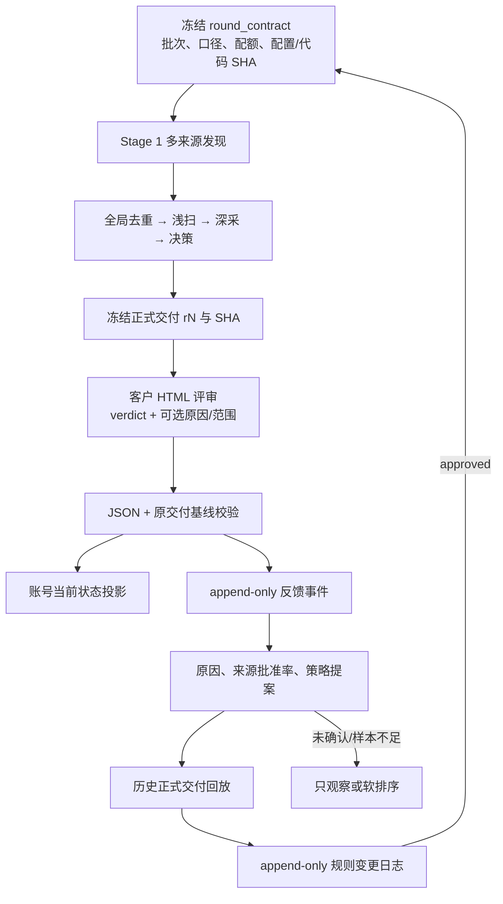

# 客户反馈治理与策略学习闭环

本规范解决两个不同问题：

1. 客户对某个账号的决定怎样安全回填；
2. 多轮反馈怎样形成可验证、可回滚的采集优化。

核心原则：一次拒绝只表示账号结果；重复同类反馈才形成策略信号；只有明确确认并通过
历史回放的提案，才能成为全局规则。客户拒绝时不必填写原因；空原因只更新账号结果，
不参与策略学习。

## 架构



## 数据分层

| 层 | 存储 | 作用 |
|---|---|---|
| 正式输入 | 交付目录、客户原始 JSON、SHA | 保证收到的反馈对应正确交付版本 |
| 当前投影 | `creator_profiles` | 查询账号当前状态、Tier 和当前客户结论 |
| 不可变事件 | `client_feedback_events` | 保存每次反馈、原始文字、可选标签、范围、改判链 |
| 文件账本 | `client_feedback_imports` | 同文件幂等、基线指纹和数量核对 |
| 策略审计 | `policy_change_log` | proposed/approved/rejected/rolled_back 的追加式状态机 |

`client_feedback_events` 和 `policy_change_log` 都有数据库触发器禁止 UPDATE/DELETE。
客户 JSON 只能提交 `account` 或 `policy_signal`；不能直接写 `confirmed_policy`。

## 每轮标准操作

### 0. 冻结轮次合同

正式发现前生成一次，之后不同内容不能覆盖：

```bash
NEXT_BID=SKIN5-20260810
ROUND_CONTRACT="data/batches/${NEXT_BID}/round_contract.json"

PYTHONPATH=scripts .venv/bin/python \
  -m extensions.sop_v2.round_contract \
  --batch-id "$NEXT_BID" \
  --track paid \
  --carryover-mode new_only \
  --out "$ROUND_CONTRACT"
```

结转模式必须明确选择：

- `new_only`：只发现全新账号，不重新采集历史账号；
- `unresolved`：结转客户未审核/待定项；
- `retry_only`：只补技术采集失败项。

合同同时冻结目标国家、通用电商口径、最近 10 条非置顶 Reels、CPM 35–40、全语言评论
翻译、50/30/20 来源配额、配置 SHA 和代码 SHA。

### 1. 冻结正式交付

正式交付放入 `reports/deliveries/<batch>/formal-<date>-r<N>/`。发出后不得覆盖；修复必须
递增 `rN`，并保留 `decisions.json`、HTML、XLSX 和 SHA。

### 2. 回收客户 JSON

新版 HTML 保留原来的 verdict/reason/pool/score，并增加：

- `reason_tags[]`：可选，多选；
- `feedback_scope`：默认 `account`，可选 `policy_signal`；
- `feedback_schema_version` 与 `taxonomy_version`。

没有原因的“不合适”是合法完整反馈。

### 3. dry-run 后原子导入

```bash
PYTHONPATH=scripts .venv/bin/python \
  -m extensions.sop_v2.pipeline.ingest_client_decisions \
  --file "$FEEDBACK_JSON" \
  --source-decisions "$SOURCE_DECISIONS" \
  --dry-run

# 人工核对预览后去掉 --dry-run
```

新反馈会在同一个事务内写账号投影、文件 ledger 和逐条事件；任一行失败整批回滚。同一文件
SHA 再次导入严格幂等，不会重复事件。

旧两轮已有 ledger、但没有逐条事件时只能显式补事件：

```bash
PYTHONPATH=scripts .venv/bin/python \
  -m extensions.sop_v2.pipeline.ingest_client_decisions \
  --file "$FEEDBACK_JSON" \
  --source-decisions "$SOURCE_DECISIONS" \
  --backfill-events \
  --dry-run
```

核对后去掉 `--dry-run`。该模式不改账号投影和原 ledger；如果只存在部分 events 会整批中止。

### 4. 生成反馈分析与策略提案

```bash
PYTHONPATH=scripts .venv/bin/python \
  -m extensions.sop_v2.pipeline.analyze_client_feedback \
  --db data/creator_cache.db \
  --batch-id SKIN3-20260717 \
  --batch-id SKIN4-20260723 \
  --out-json data/batches/feedback-analysis.json \
  --out-md data/batches/feedback-analysis.md
```

报告只用 approved/rejected 计算批准率，pending 不进分母；空原因不推断标签。旧自由文本若
没有经过结构化确认，会进入 `unstructured_reason_queue`，不会自动产生策略提案。

### 5. 登记 proposed

```bash
PYTHONPATH=scripts .venv/bin/python \
  -m extensions.sop_v2.policy_changes propose \
  --db data/creator_cache.db \
  --analysis data/batches/feedback-analysis.json \
  --reason-tag quality_video_low \
  --policy-key ranking.quality_video_low \
  --before-value 0 \
  --after-value -1
```

proposed 只表示待审建议，不会编辑 `sop_v2.toml`。

### 6. 回放候选配置

把提议修改放入候选配置副本，针对每个历史正式交付运行：

```bash
PYTHONPATH=scripts .venv/bin/python \
  -m extensions.sop_v2.pipeline.replay_policy \
  --decisions reports/deliveries/<BID>/formal-<date>-r<N>/decisions.json \
  --feedback /absolute/path/client_decisions_<BID>.json \
  --new-config /absolute/path/sop_v2.candidate.toml \
  --out data/batches/<BID>-policy-replay.json \
  --fail-on-approved-exclude
```

回放记录新旧五池分布、所有变化账号、客户批准账号是否被新规则误送
Exclude 或降级到 Review。历史机器淘汰行如果没有淘汰前快照，会明确记为
`Not-Replayable`；只要存在批准账号回归或不可回放行，就不能给出“可安全提升硬 Gate”结论。

### 7. 追加批准或拒绝状态

`policy_change_log` 不更新旧 proposal，而是新增后继记录。`approved` 和 `rolled_back`
都强制要求确认人/时间、生效批次、配置前后 SHA、回放报告 SHA 和测试报告 SHA；
字段不全会拒绝写入。状态转换也不能替换原 proposal 的来源事件或 before/after 值。

### 8. 按合同发现下一轮

```bash
PYTHONPATH=scripts .venv/bin/python \
  -m extensions.sop_v2.pipeline.stage1_discover \
  --batch-id "$NEXT_BID" \
  --track paid \
  --round-contract "$ROUND_CONTRACT" \
  --require-round-contract \
  --golden-lookalikes-json "data/runs/${NEXT_BID}/golden_lookalikes_completed.json" \
  --require-golden-lookalikes
```

默认目标配额为：50% 金种子 Lookalike、30% 通用电商、20% 主题探索。金种子不足时，缺口按
30:20 自动分配给通用电商与探索源；每个账号保留全部来源并在入 Instagram 前全库去重。

## 规则升级边界

- 可复现系统缺陷：核验一个反例即可修复，但必须补回归测试和精确重算；
- 客户明确全局口径：进入配置提案和历史回放，不能直接由客户 JSON 激活；
- 主观偏好：先进入召回/软排序；初始观察门槛为至少 20 个唯一账号，且覆盖
  2 个不同的原始发现批次；同一 carryover 账号跨评审轮重复出现只列为重复确认；
- 空原因拒绝：永远不参与原因统计和规则学习；
- LLM：只能建议标签，人工确认后才能进入结构化事件。

初始门槛是治理默认值，不是永久业务规则；修改门槛本身也必须走同一变更流程。
