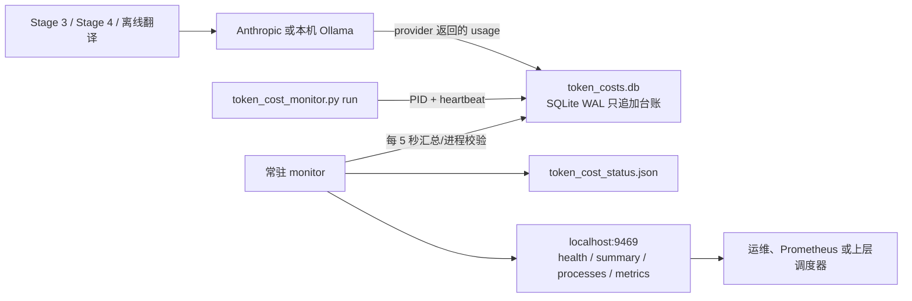

# Token 成本与后台进程监控

## 交付目标

这套监控解决四个问题：

1. 每次真实 LLM 请求用了多少 input/output/cache token；
2. 成本属于哪个进程、批次、阶段和功能；
3. 后台 worker 是否仍存活、失联或异常退出；
4. 达到日/月预算阈值时，健康检查和命令返回值能否让上层停止新任务。

监控只保存计数和运行维度，**不保存 prompt、模型回复、评论正文、API Key、Cookie
或完整命令行**。SQLite 和状态快照属于运行数据，已加入 `.gitignore`。

## 架构



关键边界：

- **调用侧是事实源**：只使用 Anthropic `usage` 或 Ollama
  `prompt_eval_count/eval_count`，不按字符数猜 token。
- **金额在写入时固化**：事件同时保存 `pricing_key` 和纳美元整数金额；以后修改单价
  不会重算历史账单。
- **未知模型不算免费**：没有匹配单价的调用标记为 `unknown_price`，金额留空并进入告警计数。
- **后台进程不拦截网络流量**：监控进程只读共享台账，因此重启不会影响采集主流程。
- **进程退出不丢账**：provider usage 在响应完成后同步写入 SQLite；后台服务只是汇总和告警。

## 已接入的调用

当前唯一 LLM 功能 `comment_translation` 已接入：

| Provider | token 来源 | 金额规则 |
|---|---|---|
| Anthropic | API 响应 `usage.input_tokens/output_tokens/cache_*` | 按模型单价 |
| Ollama | 响应 `prompt_eval_count/eval_count` | token 计数，API 费用为 0 |
| 测试注入 transport | 默认不生成 usage | 不污染生产台账 |

Claude Haiku 4.5 当前配置为 input **$1/MTok**、output **$5/MTok**、cache read
**$0.10/MTok**、5 分钟 cache write **$1.25/MTok**。来源为
[Anthropic 官方 Haiku 4.5 页面](https://www.anthropic.com/claude/haiku)和
[官方定价文档](https://docs.anthropic.com/en/docs/about-claude/pricing)，核对日期
`2026-08-10`。供应商调价或新增模型时，必须先更新
`config/token_cost_policy.toml`，再启用该模型。

## 启动

从项目根目录运行：

```bash
PYTHONPATH=scripts .venv/bin/python scripts/token_cost_monitor.py serve
```

默认只监听 `127.0.0.1:9469`。生产环境应交给 launchd/systemd/supervisord 保活，不要直接
暴露到公网。需要同时跟踪批次工作进程时，用监控包装器启动原命令：

```bash
PYTHONPATH=scripts .venv/bin/python scripts/token_cost_monitor.py run \
  --batch-id SKINCARE-20260716 --stage stage4_decide -- \
  .venv/bin/python -m extensions.sop_v2.pipeline.stage4_decide \
  --batch-id SKINCARE-20260716 --track paid --translate-comments
```

即使没有使用 `run` 包装器，已接入的真实 LLM 调用仍会自动写入台账；包装器额外提供
准确的 PID、心跳和退出码。

## 查询与接口

```bash
# 人读摘要；达到 hard limit 时返回码为 2
PYTHONPATH=scripts .venv/bin/python scripts/token_cost_monitor.py status

# 完整 JSON
PYTHONPATH=scripts .venv/bin/python scripts/token_cost_monitor.py status --json

# 仅刷新状态快照，适用于 cron
PYTHONPATH=scripts .venv/bin/python scripts/token_cost_monitor.py snapshot
```

常驻服务提供：

| Endpoint | 用途 |
|---|---|
| `GET /healthz` | `ok/warning` 返回 200；达到 hard limit 返回 503 |
| `GET /v1/summary?period=day` | 今日或本月汇总；可按 `batch_id/run_id/process_id` 过滤 |
| `GET /v1/processes` | 活跃、失联进程及各自 token/成本；加 `include_finished=1` 查看历史 |
| `GET /metrics` | Prometheus exposition format |

`data/token_cost_status.json` 是最近一次快照，供不方便访问 HTTP 的上层调度器读取。

## 预算策略

预算在 `config/token_cost_policy.toml` 配置：

- `*_warning_usd`：进入 warning，任务可继续；
- `*_hard_limit_usd`：健康检查变 503、`status/snapshot` 返回 2，让调度器停止**新任务**；
- hard limit 为 `0`：关闭硬阈值。

默认只设置 warning，hard limit 保持关闭，因为客户的日/月预算尚未在仓库中确认。正式上线
前必须由负责人填写。为避免中途破坏 SQLite/交付文件，监控不会强杀已经运行的 worker；
上层调度器应在每个新批次前检查 `/healthz`。并发调用可能让最终金额比阈值多出少量在途请求，
若未来要求“绝不超额”，需要在 provider 调用前增加数据库预算 reservation，而不是强杀进程。

## 进程状态判定

- `running`：心跳未超时；
- `stale`：PID 尚在，但超过 `stale_after_seconds` 没有心跳；
- `succeeded/failed`：包装器取得正常退出码；
- `exited`：本机 PID 已不存在，但未正常登记退出。

监控通过 SQLite WAL、15 秒 busy timeout 和短事务支持多 worker 并发写入。不要把数据库放在
不支持可靠文件锁的网络文件系统上。

## 交付验收

1. 用 `record` 子命令写入一条已知 token 的 smoke event；
2. `status --json` 中 token 和 USD 计算正确；
3. 用 `run` 包装一个短命令，进程最终为 `succeeded`；
4. 启动 `serve` 后验证四个 endpoint；
5. 临时把 warning/hard limit 调低，验证 warning、503 和返回码 2；
6. 恢复正式预算，并确认交付包不包含 `data/token_costs.db*` 或状态快照。
